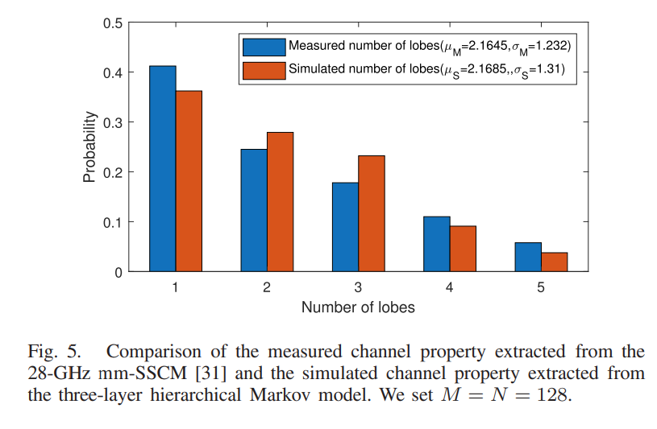
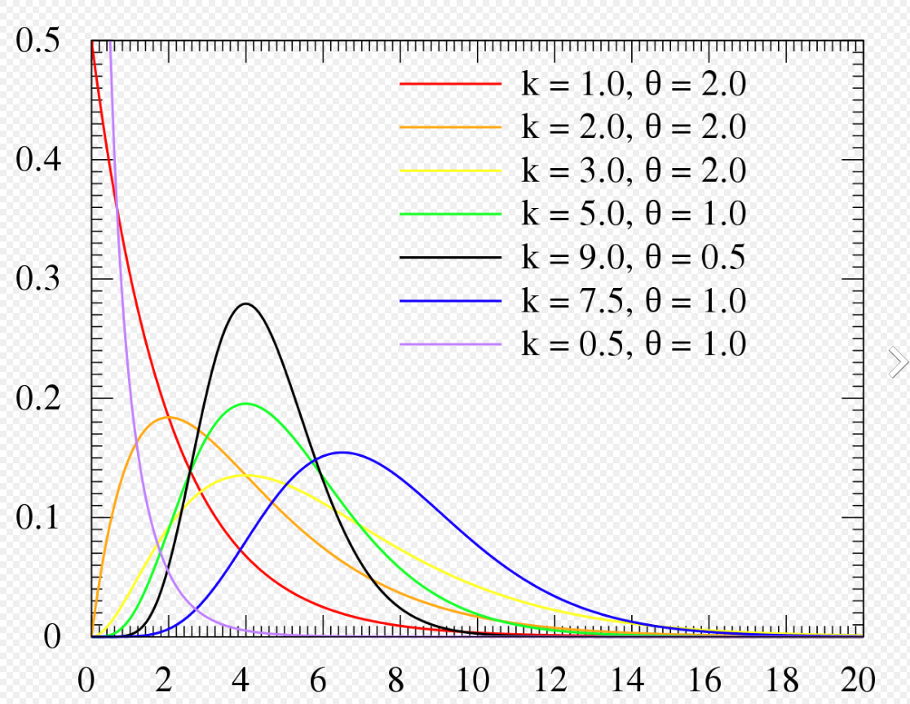

# RIS-Angular-Domain

主要参考文章[^1]，首先复现该文章的角度域解法，同时对比其他benchmark

## 研究背景：

高速移动场景下的多普勒效应和多经效应难以解决，文了解决这一挑战，文中列举了四种研究方向：

- **直接对信道进行估计或预测（direct channel estimation/ prediction）**
  - 线性时变信道模型（Linearly Time-Varying, LTV）
  - 基础扩展模型（basis expansion model, BEM）
- **正交时间空间频率调制（Orthogonal Time Frequency Space(OTFS) Modulation）**
  - 将时变多经信道转化为（time-invariant channel）时不变信道
- **角度域的DFO估计和补偿**
  - 基本思想：考虑到DFO的产生本身就是多径中AoA和AoD的不同造成的，所以直接从角度域进行DFO的估计和补偿。目前，在小规模和大规模MIMO系统中均有角度域估计的研究，但是基于最大似然（ML）的MIMO信道联合估计方法会引入较大的信道开销；而且无法获得空分增益和阵列信噪比增益。
- **基于码本的波束赋形和波束跟踪**
  - 不通过信道估计，直接尝试现有码本中的方案
  - 遍历搜索（Exhaustive Search, ES）方案
  - 分层搜索（hierarchical search，HS）方案。ES的低开销改进版
  - 问题：量化误差（quantization error）和信道老化（channel aging）；针对快衰落信道效果不佳（快速移动场景效果不好）

本文中发端和收端均采用大规模MIMO天线，在提高谱效的同时提高高速移动场景下的链路可靠性。

但是由于高维度的信道矩阵会造成高信道开销，并且现有方法（基于压缩感知 Compressive Sensing，CS ）主要应用在满衰落信道中，无法应用在快衰落的高速移动场景下。

所以提出了一种方法：

- 角度域选择性信道跟踪和多普勒效应补偿方法（Angular-domain selective channel tracking and Doppler compensation scheme）
  - 利用了mmWave大规模MIMO信道的动态稀疏性（dynamic sparsity）
  - 在上下行链路应用预编码训练（precoded training）

主要贡献：

- 角度域选择性信道跟踪
- 角度域选择性信道补偿
- 基于动态变分bayesian 接口（dynamic VBI）
  - three layer hierarchical Markov model
  - 变分贝叶斯推理（Variational Bayesian Inference, VBI）;稀疏贝叶斯学习（Sparse Bayesian Learning, SBL）无法直接应用
  - 提出新的多普勒感知的动态VBI（Doppler-aware-dynamic Variational Bayesian inference, DD-VBI）
    - 该方法将VBI和信息传递方法（message-passing approaches）相结合

## 系统模型：

### 帧结构

单用户时分系统

分为上行和下行两种subframe

每个$t$-th subframe中都有$N_p$个相同的训练向量$\bf{v}_t$，这保证了在用户端可以估计（部分的）信道特征。

- 在下行链路中，基于估计的特征，用户会使用多普勒补偿矩阵（Doppler compensation matrix）对多普勒效应作出补偿。在本质上**将快速时变信道转换为慢时变有效信道**（slow time-arying effective channel）
- 在上行链路中，在每个subframe的头和尾有两种训练向量，该向量是用于在多普勒补偿之后估计慢时变有效通道（slow time-varying effective channel）

上行链路在$t$-thsubframe中优化

下行链路在$(t-1)$-th subframe后优化

### 多普勒和多径信道模型

$$
\begin{array}{|c|c|c|c|}
\hline \text { Notation } & \text { Meaning } & \text { Notation } & \text { Meaning } \\
\hline \hline N_{p} & \text { Number of downlink training vectors } & \theta_{T, t, q}\left(\theta_{R, t, q}\right) & \text { The AoD (AoA) of the } q \text {-th path } \\
\hline \mathbf{v}_{t} & \text { Downlink training vector } & \eta_{t} & \text { Rotation angle of user's antenna array } \\
\hline M(N) & \text { Number of BS (user) antennas } & \tilde{\theta}_{T, m}\left(\tilde{\theta}_{R, m}\right) & m \text {-th AoD grid (AoA grid) } \\
\hline L_{t} & \text { Number of propagation paths } & \boldsymbol{\beta}_{T, t}\left(\boldsymbol{\beta}_{R, t}\right) & \text { The AoD(AoA) off-grid vector } \\
\hline \alpha_{t, q} & \text { The path gain of the } q \text {-th path } & N_{b} & \text { Number of RF chains at the user } \\
\hline f_{d, t} & \text { The maximum DFO } & \tilde{M}(\tilde{N}) & \text { Number of AoD (AoA) grid } \\
\hline
\end{array}
$$

基站和用户都使用半波长间隔ULA

由于系统工作在窄带，所以信道衰落为平稳衰落，用下式表示在$t-th$subframe中$i-th$ symbol的下行信道矩阵[^1-21]：
$$
\boldsymbol{H}_{t, i}=\sum_{q=1}^{L_{t}} \alpha_{t, q} e^{j 2 \pi f_{d, t} i \cos \left(\theta_{R, t, q}+\eta_{t}\right)} \boldsymbol{a}_{R}\left(\theta_{R, t, q}\right) \boldsymbol{a}_{T}^{H}\left(\theta_{T, t, q}\right)
$$

$f_{d,t}$ 泛化最大DFO

$\eta_{t}$ 用户相对于运动方向的`rotation angle`

### 角度域信道表示

由于假设每个subframe内当前symbol所有参数恒定不变，则在后文的表达式中省略所有变量中的$t$ 脚标

接下来分别对AoD和AoD在$
[-\pi / 2, \pi / 2]$上进行$\tilde{M}$和$\tilde{N}$离散化

但是离散化必然会导致量化误差，所以本文提出了[^1-24]

>  off-grid basis for the angular domain channel representation

令$\tilde{\theta}_{T, m_{q}}$和$\tilde{\theta}_{R, n_{q}}$表示距离真实角度$\theta_{T, q}$和$\theta_{R, q}$最近的离散角度，引入`off-grid vector`的概念：$\boldsymbol{\beta}_{T}=\left[\beta_{T, 1}, \beta_{T, 2}, \ldots, \beta_{T, \tilde{M}}\right]^{T}$该向量满足：

$\beta_{T, m}= \begin{cases}\theta_{T, q}-\tilde{\theta}_{T, m_{q}}, & m=m_{q}, \quad q=1,2, \ldots, L \\ 0, & \text { otherwise }\end{cases}$

$\beta_{R, n}= \begin{cases}\theta_{R, q}-\tilde{\theta}_{R, n_{q}}, & n=n_{q}, \quad q=1,2, \ldots, L \\ 0, & \text { otherwise }\end{cases}$

> # Noted
>
> $q$和$m_q$是一一对应的关系，这个关系在刚开始制定量化划分的时候就需要足够密集以保证每个$q$可以分得一个唯一的grid point

> # Noted
>
> 本质上来讲off-grid vector 是所有路径的量化误差向量，但并不代表误差，他其实代表了一种定位手段。在这种定位手段假设量化的所有grid point上均有一个对应的传播路径，至于grid point和实际的误差和grid point 上到底有没有传播路径，则是由$\bf{\beta}_T$和${\bf \beta}_R$所描述的

$$
\boldsymbol{A}_{R, i}(\boldsymbol{\varphi})=\left[\tilde{\boldsymbol{a}}_{R, i}\left(\boldsymbol{\varphi}^{1}\right), \ldots, \tilde{\boldsymbol{a}}_{R, i}\left(\boldsymbol{\varphi}^{N}\right)\right] \in \mathbb{C}^{N \times N}
$$

$$
\boldsymbol{A}_{T}\left(\boldsymbol{\beta}_{T}\right)=\left[\boldsymbol{a}_{T}\left(\tilde{\theta}_{T, 1}+\beta_{T, 1}\right), \ldots, \boldsymbol{a}_{T}\left(\tilde{\theta}_{T, \bar{M}}+\beta_{T, \bar{M}}\right)\right] \in \mathbb{C}^{M \times \bar{M}}
$$

$$
\tilde{\boldsymbol{a}}_{R, i}\left(\boldsymbol{\varphi}^{n}\right)=\boldsymbol{a}_{R}\left(\tilde{\theta}_{R, n}+\beta_{R, n}\right) \times e^{j 2 \pi f_{d} i \cos \left(\tilde{\theta}_{R, n}+\beta_{R, n}+\eta\right)}
$$

为了可以写成更加紧凑的矩阵形式，定义了矩阵$\tilde{X}$表示对应path的path loss：
$$
\tilde{x}_{n, m}= \begin{cases}\alpha_{q}, & (n, m)=\left(n_{q}, m_{q}\right), \quad q=1,2, \ldots, L \\ 0, & \text { otherwise. }\end{cases}
$$
最后的MIMO信道矩阵可以表示为：
$$
\boldsymbol{H}_{i}\left(\boldsymbol{\varphi}, \boldsymbol{\beta}_{T}\right)=\boldsymbol{A}_{R, i}(\boldsymbol{\varphi}) \tilde{\boldsymbol{X}} \boldsymbol{A}_{T}^{H}\left(\boldsymbol{\beta}_{T}\right)
$$
注意到，以上推导也可以在二维天线阵列中进行推导

> ##  个人理解
>
> 以上步骤只是将多径求和换了一种写法，在量化之后就又通过${\bf \beta}_T$和${\bf \beta}_R$ 弥补了量化误差，实际结果和直接写求和是一样的

### 角度域选择性信道跟踪和多普勒补偿

- mmWave massive MIMO 信道的动态稀疏性（dynamic sparsity）
- 利用用户端多天线阵列的高AoA分辨率

来估计：信道参数、AoA、rotation angle、maximum DFO

- 目的：
  - 将高维快速衰落信道转化为低维满衰落信道

- 关键技术：
  - 角度域选择性信道跟踪
  - 选择性多普勒补偿
  - 满衰落信道估计
  - 下行训练向量设计

> ## Star
>
> 注意以下和索引$t$ 基本无关，将其省略

#### A 用户端的角度域选择性信道跟踪

- 目的
  - 估计用于多普勒补偿的信道特征

由于信道模型中的DFO参数和AoA存在一对一的对应关系，而且用户处的大规模天线带来的空间高分辨率可以将不同DFO从不同AoA中分离出来

但是这样的代价是由于BS和用户都使用大规模天线，使得参数维度过高，需要估计的参数有：全角度域信道矩阵${\tilde{X}}$、rotation angle $\eta$、maxium DFO $f_d$。

​	为了减小信道开销和信道估计性能，本文提出了**部分估计**信道特征的方法。
$$
\begin{aligned}
\boldsymbol{H}_{i} \mathbf{v} &=\sum_{n=1}^{\bar{N}} \sum_{m=1}^{\bar{M}} \tilde{x}_{n, m} \tilde{\boldsymbol{a}}_{R, i}\left(\boldsymbol{\varphi}^{n}\right) \boldsymbol{a}_{T}^{H}\left(\tilde{\theta}_{T, m}+\beta_{T, m}\right) \mathbf{v} \\
&=\sum_{n=1}^{\bar{N}} x_{n} \tilde{\boldsymbol{a}}_{R, i}\left(\boldsymbol{\varphi}^{n}\right)=\boldsymbol{A}_{R, i}(\boldsymbol{\varphi}) \boldsymbol{x}
\end{aligned}
$$
最终估计的是部分信道信息：${\boldsymbol \varphi}\ \&\ {\boldsymbol x}$

如果每个训练向量都不一样则开销增加$N_q$倍。

在接收端收到的训练向量的信号为：
$$
\boldsymbol{y}=\left[\boldsymbol{H}_{i} \mathbf{v}+\boldsymbol{n}_{i}\right]_{i \in \mathcal{N}_{p}}
$$
被估计的量：

> the estimated partial channel coefficients $\hat{x}$, 
>
> the AoA off-grid vector $\hat{\boldsymbol{\beta}}_{R}$, 
>
> rotation angle $\hat{\eta}$ and 
>
> maximum DFO $\hat{f}_{d}$ 

#### B 用户端的角度域选择性多普勒补偿

利用A中估计得到的$\hat{\boldsymbol{x}}, \hat{\boldsymbol{\beta}}_{R}, \hat{\eta} \text { and } \hat{f}_{d}$ 对高维快速衰落信道进行降维。

1. 在$N$个AoA中选取$N_q$个能量最大的方向，将$\abs{x_n}^2$作为$n-th$ AoA上的信号能量
   - $N_d$是用来在空分复用增益和有效CSI信道开销之间作权衡的变量
   
2. 由于每一个AoA方向均有一个DFO部分：$e^{j 2 \pi f_{d} i \cos \left(\bar{\theta}_{R, n}+\beta_{R, n}+\eta\right)}$， 所以，会有DFO的补偿向量
   - $\tilde{\boldsymbol{a}}_{R, i}^{H}\left(\hat{\boldsymbol{\varphi}}^{n}\right)=\boldsymbol{a}_{R}^{H}\left(\tilde{\theta}_{R, n}+\hat{\beta}_{R, n}\right) \times e^{-j 2 \pi \hat{f}_{d} i \cos \left(\bar{\theta}_{R, n}+\hat{\beta}_{R, n}+\eta\right)}$
   - 选取部分AoA方向：$\mathbf{W}_{i}^{d}=\left[\tilde{\boldsymbol{a}}_{R, i}\left(\hat{\boldsymbol{\varphi}}^{n}\right)\right]_{n \in \mathcal{N}_{d}} \in \mathbb{C}^{N \times N_{d}}$
   - 转换为慢时变信道：$\boldsymbol{H}_{i}^{s}=\left(\mathbf{W}_{i}^{d}\right)^{H} \boldsymbol{H}_{i}$
   
3. ${\boldsymbol H}_i^s$ 是经过多普勒补偿之后的信道信息，

   - 将$\left(\mathbf{W}_{i}^{d}\right)^{H}$ 看作是一个列的向量的向量，将$H_i$ 看作是一个整体，并写为$\sum_{n=1}^{\tilde{N}} \sum_{m=1}^{\tilde{M}} \tilde{x}_{n, m} \tilde{\boldsymbol{a}}_{R, i}\left(\boldsymbol{\varphi}^{n}\right) \boldsymbol{a}_{T}^{H}\left(\tilde{\theta}_{T, m}+\beta_{T, m}\right)$，
   - 可以看作是：

   $$
   \left[\begin{array}{ccccc}
   {\bf w}_{1}  \\
   {\bf w}_{2}  \\
   \vdots  \\
   {\bf w}_{N_d} 
   \end{array}\right]\cdot {\boldsymbol H}_i=
   \left[\begin{array}{ccccc}
   {\bf w}_{1} {\boldsymbol H}_i \\
   {\bf w}_{2} {\boldsymbol H}_i \\
   \vdots  \\
   {\bf w}_{N_d} {\boldsymbol H}_i
   \end{array}\right]
   $$

   - $$
     \begin{array}{r}
     \boldsymbol{H}_{i}^{s}=\sum_{m=1}^{\tilde{M}}\left[\tilde{x}_{n, m}+\sum_{\tilde{n}=1, \tilde{n} \neq n} \tilde{x}_{\tilde{n}, m} \tilde{\boldsymbol{a}}_{R, i}^{H}\left(\boldsymbol{\varphi}^{n}\right) \tilde{\boldsymbol{a}}_{R, i}\left(\boldsymbol{\varphi}^{\tilde{n}}\right)\right]_{n \in \mathcal{N}_{d}} \\
     \times \boldsymbol{a}_{T}^{H}\left(\tilde{\theta}_{T, m}+\beta_{T, m}\right)=\boldsymbol{H}^{s}+\Delta \boldsymbol{H}_{i}
     \end{array}
     $$

   - 由此就将信道信息分为了慢时变信道和快时变信道：

   - 慢时变：$\boldsymbol{H}^{s}=\sum_{m=1}^{\tilde{M}}\left[\tilde{x}_{n, m}\right]_{n \in \mathcal{N}_{d}} \boldsymbol{a}_{T}^{H}\left(\theta_{T, m}+\beta_{T, m}\right)$，可以看到和subframe index $i$ 无关，也就是说该部分在一整个frame中保持恒定。

   - 快时变：$\Delta \boldsymbol{H}_{i}=\sum_{m=1}^{\tilde{M}}\left[\sum_{\tilde{n}=1, \tilde{n} \neq n}^{\tilde{N}} \tilde{x}_{\tilde{n}, m} \tilde{\boldsymbol{a}}_{R, i}^{H}\left(\boldsymbol{\varphi}^{n}\right) \tilde{\boldsymbol{a}}_{R, i}\left(\boldsymbol{\varphi}^{\tilde{n}}\right)\right]_{n \in \mathcal{N}_{d}}$
     $\times \boldsymbol{a}_{T}^{H}\left(\theta_{T, m}+\beta_{T, m}\right)$

4. 快时变组件$\Delta {\boldsymbol H}_i$的二阶矩（方差）大小是遵从$\mathcal{O}\left(\frac{L}{N^{2}}\right)$ 可以看到：

   - 增加接收天线的规模可以使其减小
   - 多径增加会使其增大，接收信号更不稳定。
   - 当$N$足够大，$\Delta {\boldsymbol H}_i$ 的能量可以被忽略

5. 大规模MIMO

   - 角度域方法应用了大规模MIMO中的渐变（asymptotical）特性
   - 更大规模的接收机天线会带来更高的空间分辨率，从而提取不同AoA中的多普勒特性
   - 当$N$足够大，阵列相应中的${\boldsymbol \alpha}_R(\theta)$相互正交， $\Delta {\boldsymbol H}_i$ 的能量可以被忽略

#### C BS端慢时变信道估计

在经典场景下，基站处的射频链路数量是基站天线数量的$1/2\ \text{or}\ 1/4$ 。因此在上行链路估计中，用户可以$2N_d\ \text{or}\ 4N_d$ 个正交的训练向量（pilots）。这些信号会帮助基站估计信道信息：${\boldsymbol H}_i^s$ 。BS基于估计的${\boldsymbol H}_i^s$ 设计precoding策略，这种策略可以用于both上行和下行。

1. ${\boldsymbol H}_i^s$（这里怀疑是写错了，应该是${\boldsymbol H}^s$）的相关时间比多普勒补偿之后的符号时间（symbol durations）要大得多[^1-22] 所以每一个frame的时长必须要比${\boldsymbol H}_i^s$的相干时间要短。
2. 因此，每个frame可以容纳的symbol数量远远大于$N_d$（有效AoA的数量，代表开销数量级），所以，本文提出的方案是可以在实际系统中所接受的。

#### D BS端的训练向量设计

$t-th$ frame 的训练向量${\boldsymbol v}_t$ 根据上一时刻末尾的慢时变信道信息$\hat{{\boldsymbol H}}_{t-1}^s$进行设计，其基本思想是在已知信道方向的探索和未知信道方向的探索上达到一种平衡。根据B中推导，实际上$\hat{{\boldsymbol H}}_{t-1}^s$ 给出的实际上是 most promising 的信道方向，但是由于估计误差、CSI延迟、和新的信道方向的产生等因素，其他信道方向也应该被纳入考量。

​	具体来讲，该文章引入了一种正交基$\mathbf{B}^{s}=\left[\mathbf{b}_{1}^{s}, \ldots, \mathbf{b}_{M}^{s}\right] \in \mathbb{C}^{M \times M}$ ，并且写出每个正交基上的能量分布：$\lambda_{m}^{s}=\left\|\hat{\boldsymbol{H}}_{t-1}^{s} \mathbf{b}_{m}^{s}\right\|^{2}, \forall m$ 该分布向量$\boldsymbol{\lambda}^{s}=\left[\lambda_{1}^{s}, \ldots, \lambda_{M}^{s}\right]^{T} $的设计原则是尽可能的稀疏。

​	most promissing channel direction 集合 ${\mathcal M}$ 的选择规则为，在元素个数尽量小的前提下，是的这些方向上的能量和不小于一个阈值：$\mathcal{M}^{*}=\operatorname{argmin}_{\mathcal{M}}|\mathcal{M}|$ ，$N_{s}=\left|\mathcal{M}^{*}\right|$

​	最后，训练向量被定义为：
$$
\begin{aligned}
&\mathbf{v}_{t} \\
&=\frac{\sqrt{\rho}}{\sqrt{N_{s}}} \sum_{m \in \mathcal{M}^{*}} e^{j \theta_{m}^{s}} \mathbf{b}_{m}^{s}+\frac{\sqrt{1-\rho}}{\sqrt{M-N_{s}}} \sum_{m \in\{1, \ldots, M\} \backslash \mathcal{M}^{*}} e^{j \theta_{m}^{s}} \mathbf{b}_{m}^{s}
\end{aligned}
$$
可以看到，训练向量本质上是方向域正交基底的线性组合，通过在收端进行线性分解就可以获知每个正交方向上的衰落情况，第一部分表示了对于满衰落部分的预测，第二部分则考虑到了下一个frame中会产生新的方向的衰落，所以对于上一时刻中能量集中的方向的剩余进行估计。，在该文中，使用$$
\mu=0.9 \text { and } \rho=0.5

$\mu$ 表示了对于集中能量分布的方向的能量占比阈值，$\rho$表示了旧的方向和新的方向的trade off，说人话就是，对将预算合理的分配到上一时刻能量集中的方向以及除了这个方向之外的新的方向。

$e^{j \theta_{m}^{s}}$ 中的相位随机分布

### 问题制订和角度域选择性信道跟踪

#### A 基于三层马尔科夫模型的部分角度域信道向量

首先，在大规模MIMO中，只有少数的scatter路径被利用，所以说，大规模MIMO信道是稀疏的。另外，${\boldsymbol x}_t$具有时间上的相关性[^1-28] 。这样的动态稀疏性`dynamic sparsity`可以通过三层马尔科夫模型捕获：

信道辅助向量$\boldsymbol{s}_{t} \in\{0,1\}^{\tilde{N}}$，表示在对应AoA上是否是一个激活信道(active path)。

第二层的随机变量是精度向量$\gamma_{t}=\left[\gamma_{t, 1}, \cdots, \gamma_{t, \tilde{N}}\right]^{T}$ ，其为$x_{t, n}$ 的倒数，则该模型的先验分布（prior distribution），即$\boldsymbol{x}_{1: t}, \gamma_{1: t}$ and $s_{1: t}$的联合分布：
$$
p\left(\boldsymbol{x}_{1: t}, \boldsymbol{\gamma}_{1: t}, \boldsymbol{s}_{1: t}\right)=\prod_{\tau=1}^{t} p\left(\boldsymbol{s}_{\tau} \mid \boldsymbol{s}_{\tau-1}\right) p\left(\boldsymbol{\gamma}_{\tau} \mid \boldsymbol{s}_{\tau}\right) p\left(\boldsymbol{x}_{\tau} \mid \gamma_{\tau}\right)
$$

$p\left(\boldsymbol{x}_{\tau} \mid \gamma_{\tau}\right)=\prod_{n=1}^{N} p\left(x_{\tau, n} \mid \gamma_{\tau, n}\right)$

$p\left(x_{\tau, n} \mid \gamma_{\tau, n}\right)=C N\left(x_{\tau, n} ; 0, \gamma_{\tau, n}^{-1}\right)$

$p\left(\gamma_{\tau} \mid s_{\tau}\right)=\prod_{n=1}^{N} \Gamma\left(\gamma_{\tau, n} ; a_{\tau}, b_{\tau}\right)^{s_{\tau, n}} \Gamma\left(\gamma_{\tau, n} ; \bar{a}_{\tau}, \bar{b}_{\tau}\right)^{1-s_{\tau, n}}$

> # Noted
>
> 物理意义上可以理解为激活信道的分布${\boldsymbol s}$ 会导致信道精度${\boldsymbol \gamma}$的差别，信道精度又决定了最终信道特征的分布

$\Gamma\left(\gamma_{\tau, n} ; a_{\tau}, b_{\tau}\right)$ 是一个~~伽马超先验（Gamma hyperprior）~~ 这里应该是论文描述不当，这是一个伽马分布（Gamma distribution），$a_{\gamma}, b_{\gamma}$才应该是超参数[^web-Gamma-distribution] 。

​	$a_{\tau}, b_{\tau}$是信道精度${\gamma}$在信道激活状态下的形状和速率参数，其选择应该遵守以下条件：$\frac{a_{\tau}}{b_{\tau}}=E\left[\gamma_{\tau, n}\right]= \Theta(1)$

​	原因是当一条path处于active的状态时，其路损会偏离0很大一段距离，此时${\boldsymbol x}_{\tau , n}$ 的方差$\gamma_{\tau,n}^{-1}$会是一个和0有一段距离的数，即$\Theta(1)$ [^$\Theta(1)$] ，又因为超参数$\alpha_{\tau}, \beta_{\tau}$ 存在关系：${\frac{\alpha_{\tau}}{\beta_{\tau}}}=E[\gamma_{\tau, n}]$，所以在信道激活条件下，两个超参数的比值需要是一个数量级是1的常数。

​	反之，当信道处于不激活状态时，$x$趋于零，此时要求$\gamma_{\tau,n}^{-1}$趋于零，则${\frac{\alpha_{\tau}}{\beta_{\tau}}}=E[\gamma_{\tau, n}]$ 的选择应当趋于无穷大。

> ### Remark 1
>
> 确切的信道特征$x_{\tau}$ 实际上是不知道的，因此我们需要提出一种底复杂度的鲁棒的算法以应对各种不同的信道分布。以上提出的分层信道模型被广泛的应用在稀疏信道的模拟？中[^1-23], [^1-29] 。
>
> 同时在[^1-23], [^1-29] 中，也提出了这样一个结论：通过以上三层模型得出的算法，对于真实的稀疏信号传播环境也是不敏感的。
>
> 

另外，在[^1-28]中，也提出了信道支撑矢量是慢时变的，同时具有较强的时间相关性，比如说如果$s_{\tau-1}=1$则有很大概率$s_{\tau}=1$。这可以被很自然的建模为一个时间相关的马尔科夫模型：
$$
p\left(\boldsymbol{s}_{\tau} \mid \boldsymbol{s}_{\tau-1}\right)=\prod_{n=1}^{\bar{N}} p\left(s_{\tau, n} \mid s_{\tau-1, n}\right)
$$
对于向量中的每一个元素来讲有：$p\left(s_{\tau, n}=1 \mid s_{\tau-1, n}=\right.0)=\rho_{0,1}, \text { and } p\left(s_{\tau, n}=0 \mid s_{\tau-1, n}=1\right)=\rho_{1,0} $ 

根据文献[^1-30] 提出的EM框架，可以很容易的在信道恢复过程中获取$\rho_{0,1},\ \rho_{1,0}$。具体过程在附录A中给出。

在马尔科夫链的起始端，定义其初始概率为一个特定常量：$\lambda \triangleq p\left(s_{1, n}\right)=\frac{\rho_{0,1}}{\rho_{0,1}+\rho_{1,0}}$ 该变量反映了信道的稀疏程度，这样的定义保证了该马尔科夫模型有闭式表达：$p\left(s_{\tau, n}\right)=\lambda^{s_{\tau, n}}(1-\lambda)^{1-s_{\tau, n}}$

​	在噪声设计中，使用同样的方式，在Gamma函数的参数设计中采用：$p\left(\kappa_{\tau}\right)= \Gamma\left(\kappa_{\tau} ; a_{\kappa, \tau}, b_{\kappa, \tau}\right)$，其中的参数有：$a_{\kappa, \tau}, b_{\kappa, \tau} \rightarrow 0$。下图为$a=0.001,b=0.001$，这样设计的目的是为了实现`broad hyperprior`

以上提出的模型有较高的自由度，可以通过调节参数来模拟各种各样的场景。更重要的是，本文提出的算法不需要获知这些参数。

该图显示出该三层模型的性质和[^1-31]中提出的mm-SSCM模型类似

#### B 选择性信道追踪问题制定

该问题是要根据一些在收端的观测来估计信道中的一些变量：

- 观测（observation）：
  - 1～t时刻的接受信号$y_{1:t}$
  - 1～t-1时刻的角度估计集合$\hat{\varphi}_{1: t-1}=\left\{\hat{\boldsymbol{\beta}}_{R, 1: t-1}, \hat{f}_{d, 1: t-1}, \hat{\eta}_{1: t-1}\right\}$
- 需要估计的量（estimation）：
  - 部分信道信息（路损）$\boldsymbol{x}_{t}$
  - 角度相关信息$\varphi_{t}$

这段估计分为两部分，首先是对于$x_{t}$的估计，本文通过首先假设$\varphi_{t}$已知来估计$x_t$：

$$
p\left(x_{t, n} \mid \boldsymbol{y}_{1: t} ; \hat{\boldsymbol{\varphi}}_{1: t-1}, \boldsymbol{\varphi}_{t}\right) \propto \int_{-x_{t, n}} p\left(\boldsymbol{y}_{1: t}, \boldsymbol{v}_{t} ; \hat{\boldsymbol{\varphi}}_{1: t-1}, \boldsymbol{\varphi}_{t}\right)
$$
其中$\boldsymbol{v}_{t}=\left\{\boldsymbol{x}_{t}, \boldsymbol{s}_{t}, \gamma_{t}, \kappa_{t}\right\}$(此时为被积分的对象),$-x_{n,t}$表示$x_t$向量中除去$x_{n,t}$的所有元素.之所以这样写，是因为先假设$\hat{\boldsymbol{\varphi}}_{1: t-1}, \boldsymbol{\varphi}_{t}$是固定的参数，因为如果其值未知，则无法写出$p\left(x_{t, n} \mid \boldsymbol{y}_{1: t}\right)$的确切表达式，写在这里对这个公式影响不大，之所以是正比与而不是等于是因为他们之间只差了一个常数的倍数$p({\boldsymbol y}_{1:t})$，而该公式的目的只是为了找出使后验概率最大的${\boldsymbol x }_{t}$。

另外，在估计$\hat{\boldsymbol{\varphi}}_{t}$时，使用最大似然估计（ML）：
$$
\begin{aligned}
\hat{\varphi} &=\arg \max _{\varphi_{t}} \ln p\left(\boldsymbol{y}_{1: t} ; \hat{\boldsymbol{\varphi}}_{1: t-1}, \boldsymbol{\varphi}_{t}\right) \\
&=\arg \max _{\boldsymbol{\varphi}_{t}} \ln \int_{\boldsymbol{v}_{t}} p\left(\boldsymbol{y}_{1: t}, \boldsymbol{v}_{t} ; \hat{\boldsymbol{\varphi}}_{1: t-1}, \boldsymbol{\varphi}_{t}\right) d \boldsymbol{v}_{t}
\end{aligned}
$$
在文章中首先写了如何估计$x_{t}$然后再写了如何估计$\hat{\boldsymbol{\varphi}}_{t}$，~~但是实际算法中的情况却是应该反过来。~~理解错误，这里决定y的值的不仅是$\varphi$还有x

以上算法的难点在于，估计$x_{t}$时，公式中的因子图（factor graph）[^web-factor-graph]含有循环，所以通过DD-VBI算法近似求解边界后验概率。并且采用MM算法（majorization-minimization）（是一种普遍的EM算法）[^1-24]

### 基于多普勒感知的动态VBI算法

简单的联合估计$\boldsymbol{x}_{t}$和$ \boldsymbol{\varphi}_{t}$ 所带来的时间复杂度是无法接受的，因此，首先需要对变量进行解耦：

- 第$t$时刻相关的
- 之前$t-1$时刻之前的所有信息（message passing[^web-message-passing]）

#### A 联合概率分布的分解和近似

$$
\begin{aligned}
&p\left(\boldsymbol{y}_{1: t}, \boldsymbol{v}_{t} ; \hat{\varphi}_{1: t-1}, \boldsymbol{\varphi}_{t}\right) \\
&\quad \propto \sum_{s_{t-1}} p\left(\boldsymbol{s}_{t-1} \mid \boldsymbol{y}_{1: t-1} ; \hat{\varphi}_{1: t-1}\right) p\left(\boldsymbol{s}_{t} \mid \boldsymbol{s}_{t-1}\right) \\
&p \begin{array}{l}
\left.\boldsymbol{y}_{t} \mid \boldsymbol{x}_{t}, \kappa_{t} ; \boldsymbol{\varphi}_{t}\right) p\left(\boldsymbol{x}_{t} \mid \boldsymbol{\gamma}_{t}\right) p\left(\boldsymbol{\gamma}_{t} \mid \boldsymbol{s}_{t}\right) p\left(\kappa_{t}\right) \\
& \approx \sum_{s_{t-1}} q\left(\boldsymbol{s}_{t-1} \mid \boldsymbol{y}_{1: t-1} ; \hat{\boldsymbol{\varphi}}_{1: t-1}\right) p\left(\boldsymbol{s}_{t} \mid \boldsymbol{s}_{t-1}\right) \\
p\left(\boldsymbol{y}_{t} \mid \boldsymbol{x}_{t}, \kappa_{t} ; \boldsymbol{\varphi}_{t}\right) p\left(\boldsymbol{x}_{t} \mid \boldsymbol{\gamma}_{t}\right) p\left(\boldsymbol{\gamma}_{t} \mid \boldsymbol{s}_{t}\right) p\left(\kappa_{t}\right) \\
& =\hat{p}\left(\boldsymbol{s}_{t} \mid \boldsymbol{y}_{1: t-1} ; \hat{\varphi}_{1: t-1}\right) p\left(\boldsymbol{y}_{t} \mid \boldsymbol{x}_{t}, \kappa_{t} ; \boldsymbol{\varphi}_{t}\right) \\
p\left(\boldsymbol{x}_{t} \mid \boldsymbol{\gamma}_{t}\right) p\left(\boldsymbol{\gamma}_{t} \mid \boldsymbol{s}_{t}\right) p\left(\kappa_{t}\right),
\end{array}
\end{aligned}
$$

[^1]: G. Liu, A. Liu, R. Zhang and M. Zhao, "Angular-Domain Selective Channel Tracking and Doppler Compensation for High-Mobility mmWave Massive MIMO," in IEEE Transactions on Wireless Communications, vol. 20, no. 5, pp. 2902-2916, May 2021, doi: 10.1109/TWC.2020.3045272.
[^1-21]: [W. U. Bajwa, J. Haupt, A. M. Sayeed, and R. Nowak, “Compressed channel sensing: A new approach to estimating sparse multipath channels,” Proc. IEEE, vol. 98, no. 6, pp. 1058–1076, Jun. 2010.](doc/1-21_channel.md)
[^1-24]: J. Dai, A. Liu, and V. K. N. Lau, “FDD massive MIMO channel estimation with arbitrary 2D-array geometry,” IEEE Trans. Signal Process., vol. 66, no. 10, pp. 2584–2599, May 2018.

[^1-22]: W. Guo, W. Zhang, P. Mu, F. Gao, and H. Lin, “High-mobility wideband massive MIMO communications: Doppler compensation, analysis and scaling laws,” IEEE Trans. Wireless Commun., vol. 18, no. 6, pp. 3177–3191, Jun. 2019
[^1-28]:  X. Zhu, L. Dai, G. Gui, W. Dai, Z. Wang, and F. Adachi, “Structured matching pursuit for reconstruction of dynamic sparse channels,” in Proc. IEEE Global Commun. Conf. (GLOBECOM), Dec. 2015, pp. 1–5

[^web-Gamma-distribution]: https://en.wikipedia.org/wiki/Gamma_distribution

> # Gamma distribution
>
> 在维基百科中，Gamma分布是一种由两个参数定义的连续随机变量分布密度，指数分布、Erlang分布、chi-square分布都是Gamma分布的特殊状态。一般有两种主流的Gamma分布的定义方法：
>
> 1. shape parameter $k$，和 scale parameter $\theta$
> 2. shape parameter $\alpha = k$， 和rate parameter $\beta = \theta^{-1}$
>
> 
>
> $f(x ; \alpha, \beta)=\frac{\beta^{\alpha} x^{\alpha-1} e^{-\beta x}}{\Gamma(\alpha)} \quad$ for $x>0 \quad \alpha, \beta>0$
>
> 本文中应用的是第二种定义方式

[^ $\Theta(1)$]: https://stackoverflow.com/questions/18677537/what-is-the-difference-between-o1-and-%CE%981

[^1-23]:D. G. Tzikas, A. C. Likas, and N. P. Galatsanos, “The variational approximation for Bayesian inference,” IEEE Signal Process. Mag., vol. 25, no. 6, pp. 131–146, Jan. 2008.
[^1-29]: D. G. Tzikas, A. C. Likas, and N. P. Galatsanos, “The variational approximation for Bayesian inference,” IEEE Signal Process. Mag., vol. 25, no. 6, pp. 131–146, Jan. 2008.
[^1-30]: J. Ziniel and P. Schniter, “Dynamic compressive sensing of time-varying signals via approximate message passing,” IEEE Trans. Signal Process.,vol. 61, no. 21, pp. 5270–5284, Jul. 2013.
[^1-31]: M. K. Samimi and T. S. Rappaport, “3-D millimeter-wave statistical channel model for 5G wireless system design,” IEEE Trans. Microw.Theory Tech., vol. 64, no. 7, pp. 1–19, Jul. 2016.
[^web-factor-graph]: https://blog.csdn.net/wydbyxr/article/details/82384340
[^web-message-passing]: https://blog.csdn.net/qq_41603411/article/details/105209622

[^VBI]: https://en.wikipedia.org/wiki/Variational_Bayesian_methods

> # VBI
>
> **Variational Bayesian methods** are a family of techniques for approximating intractable [integrals](https://en.wikipedia.org/wiki/Integral) arising in [Bayesian inference](https://en.wikipedia.org/wiki/Bayesian_inference) and [machine learning](https://en.wikipedia.org/wiki/Machine_learning). They are typically used in complex [statistical models](https://en.wikipedia.org/wiki/Statistical_model) consisting of observed variables (usually termed "data") as well as unknown [parameters](https://en.wikipedia.org/wiki/Parameter) and [latent variables](https://en.wikipedia.org/wiki/Latent_variable), with various sorts of relationships among the three types of [random variables](https://en.wikipedia.org/wiki/Random_variable), as might be described by a [graphical model](https://en.wikipedia.org/wiki/Graphical_model). As typical in Bayesian inference, the parameters and latent variables are grouped together as "unobserved variables". Variational Bayesian methods are primarily used for two purposes:

# [grid-basis-2]Direct Localization for Massive MIMO

MIMO具有定位的潜力，但是在mmave信道中由于存在多径效应，无法准确估计AoA。

本文提出了一种基于压缩感知的算法。

因为MIMO的天线数量规模较大，所以角度分辨率较高，于是有潜力分别估计各个AoA到达的角度[12,13]尽管如此，基站还是需要估计出LOS路径的AoA[14,15,16]，但是LoS链路并不总是能量最大的链路，于是[17] 提出了综合分析各个AoA的数据进行融合分析，但是这是一个NP-hard问题三

two step

direct localization approach

本文使用技术：

- match filter[28]
- coarse TOA estimate[self]
- grid refinement procedure[29]

$$
\begin{aligned}
&\tau_{l}(\mathbf{p})=\left\|\mathbf{p}-\tilde{\mathbf{p}}_{l}\right\| / c \\
&\theta_{l}(\mathbf{p})=\arctan \left(\frac{p^{y}-\tilde{p}_{l}^{y}}{p^{x}-\tilde{p}_{l}^{x}}\right)+\pi \cdot \mathbb{1}\left(p^{x}<\tilde{p}_{l}^{x}\right)
\end{aligned}
$$

$\mathbb{1}(\mathrm{P})$ is one if the logical expression $\mathrm{P}$ is true 

和别的工作不同，该文章从匹配滤波器的角度出发研究接收信号表达形式
$$
\begin{aligned}
\mathbf{z}_{l}^{\mathrm{MF}}(t)=& \int_{0}^{T_{\mathrm{obs}}} s^{*}(\tau-t) \mathbf{z}_{l}(\tau) \mathrm{d} \tau \\
=& \alpha_{l} r_{s}\left(t-\tau_{l}(\mathbf{p})\right) \mathbf{a}_{l}\left(\theta_{l}(\mathbf{p})\right) \\
&+\sum_{m=1}^{P_{l}} \alpha_{l}^{m} r_{s}\left(t-\tau_{l}^{m}\right) \mathbf{a}_{l}\left(\theta_{l}^{m}\right)+\mathbf{n}_{l}^{\mathrm{MF}}(t)
\end{aligned}
$$
and sampling at time $t_{l}$, 
$$
\overline{\mathbf{z}}_{l}=\mathbf{z}_{l}^{\mathrm{MF}}\left(t_{l}\right)=\bar{\alpha}_{l} \mathbf{a}_{l}\left(\theta_{l}(\mathbf{p})\right)+\sum_{m=1}^{P_{l}} \bar{\alpha}_{l}^{m} \mathbf{a}_{l}\left(\theta_{l}^{m}\right)+\overline{\mathbf{n}}_{l}
$$
where $\bar{\alpha}_{l}=r_{s}\left(t_{l}-\tau_{l}(\mathbf{p})\right) \alpha_{l}, \bar{\alpha}_{l}^{m}=r_{s}\left(t_{l}-\tau_{l}^{m}\right) \alpha_{l}^{m}$ and $\overline{\mathbf{n}}_{l} \sim$ $\mathcal{C} \mathcal{N}\left(\mathbf{0}, \sigma^{2} \mathbf{I}\right)$ where $\sigma^{2}=N_{0}$ because, without loss of generalization, the pulse energy is normalized to one $\left(r_{s}(0)=\right.$ $\int|s(\tau)|^{2} \mathrm{~d} \tau=1$ ). The signals in $(8)$ are the input of the proposed method. Contrary to beamforming applications, and similar to direction-of-arrival techniques, the observations across each array $\overline{\mathbf{z}}_{l}$ are not weighted and linearly combined into one output. Such weights would fix the array beampattern and are usually designed to make the array point into one or multiple directions. In our case, since no beamforming is performed, the arrays do not have a "favored direction". In regards to the source, we assume that it has an omnidirectional antenna, in which case the transmitted energy would be the same towards all BSs.

In order to ensure that $\bar{\alpha}_{l} \neq 0$, the signals must be sampled at a time where the energy of the LOS pulse is not zero (i.e. while $\left.r_{s}\left(t_{l}-\tau_{l}(\mathbf{p})\right) \neq 0\right)$. In addition to the sampling times, we will also compute an upper bound on the TOA of the LOS paths at each base station that will enhance the proposed method, which for brevity are simply called TOA estimates. In a nutshell, the objective of our work is to determine the sampling times and the TOA estimates from $\left\{\mathbf{z}_{l}^{\mathrm{MF}}(t)\right\}_{l=1}^{L}$, and then, determine $\mathbf{p}$ from $\left\{\overline{\mathbf{z}}_{l}\right\}_{l=1}^{L}$

# channel estimation for RIS empowered Multi-User MISO Wireless Communication

## 研究背景：

## 系统模型：

### 收发机模型：

$$
\mathbf{Y}_{p} \triangleq \mathbf{H}^{r} D_{p}(\boldsymbol{\Phi}) \mathbf{H}^{s} \mathbf{X}+\mathbf{W}_{p}
$$

### PARAFAC基础

$$
[\mathbf{X}]_{i, j, k} \triangleq \sum_{r=1}^{R}[\mathbf{A}]_{i, r}[\mathbf{B}]_{j, r}[\mathbf{C}]_{k, r}
$$

这样一个三维矩阵的二维切片为：
$$
\begin{aligned}
&\mathbf{X}_{i,:,:}=\mathbf{B} \operatorname{diag}\left([\mathbf{A}]_{i,:}\right) \mathbf{C}^{T}, \quad i=1,2, \ldots, I \\
&\mathbf{X}_{:, j,:}=\mathbf{C} \operatorname{diag}\left([\mathbf{B}]_{j,:}\right) \mathbf{A}^{T}, \quad j=1,2, \ldots, J \\
&\mathbf{X}_{:,, k}=\mathbf{A} \operatorname{diag}\left([\mathbf{C}]_{k,:}\right) \mathbf{B}^{T}, \quad k=1,2, \ldots, K
\end{aligned}
$$

### 接收的训练信号：

$$
\widetilde{\mathbf{Z}}_{p} \triangleq \mathbf{Y}_{p} \mathbf{X}^{H}=\underbrace{\mathbf{H}^{r} D_{p}(\boldsymbol{\Phi}) \mathbf{H}^{s}}_{\triangleq \mathbf{z}_{p}}+\widetilde{\mathbf{W}}_{p}
$$

Mode-1: $\mathbf{Z}^{1} \triangleq\left(\left(\mathbf{H}^{s}\right)^{T} \circ \boldsymbol{\Phi}\right)\left(\mathbf{H}^{r}\right)^{T} \in \mathbb{C}^{P M \times K}$
Mode-2: $ \mathbf{Z}^{2} \triangleq\left(\boldsymbol{\Phi} \circ \mathbf{H}^{r}\right) \mathbf{H}^{s} \in \mathbb{C}^{K P \times M}$
Mode-3: $\mathbf{Z}^{3} \triangleq\left(\mathbf{H}^{r} \circ\left(\mathbf{H}^{s}\right)^{T}\right) \mathbf{\Phi}^{T} \in \mathbb{C}^{M K \times P}$

> # kronecker product
>
> 

> # Khatri-Rao(column-wise)
>
> 

