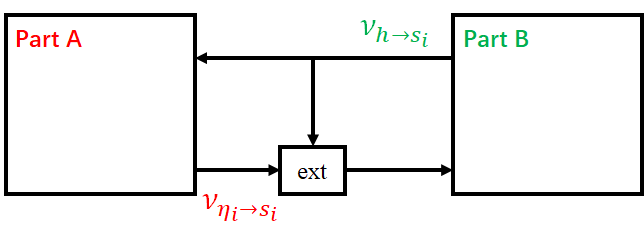
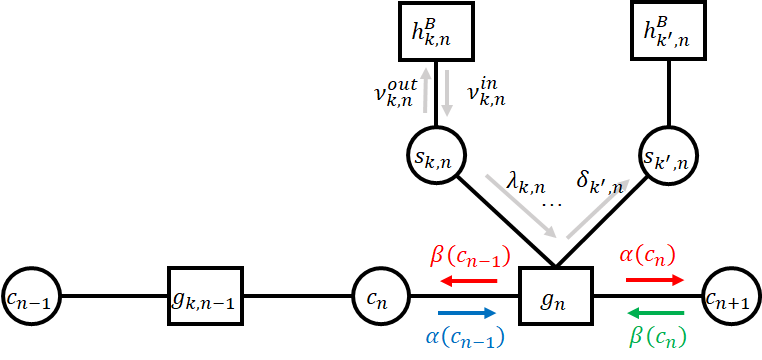
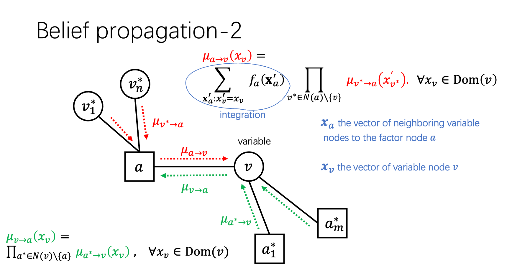

# variational bayesian 

[Variational Bayesian methods - Wikipedia](https://en.wikipedia.org/wiki/Variational_Bayesian_methods)

**Variational Bayesian methods** are a family of techniques for approximating intractable [integrals](https://en.wikipedia.org/wiki/Integral) arising in [Bayesian inference](https://en.wikipedia.org/wiki/Bayesian_inference) and [machine learning](https://en.wikipedia.org/wiki/Machine_learning). 

In the former purpose (that of approximating a posterior probability), variational Bayes is an alternative to Monte Carlo sampling methods — particularly, Markov chain Monte Carlo methods such as Gibbs sampling — for taking a fully Bayesian approach to statistical inference over complex distributions that are difficult to evaluate directly or sample. In particular, whereas Monte Carlo techniques provide a numerical approximation to the exact posterior using a set of samples, Variational Bayes provides a locally-optimal, exact analytical solution to an approximation of the posterior.

(和蒙特卡龙方法进行对比)

根据 变分：[Variational Bayesian methods - Wikipedia](https://en.wikipedia.org/wiki/Variational_Bayesian_methods)
$$
\begin{aligned}
q^*_{\boldsymbol v_i}({\boldsymbol v}_i)&=\frac{\operatorname{exp}(\int_{-{\boldsymbol v}_i}q({\boldsymbol v}) q({\boldsymbol v},{\boldsymbol y}) )  }{\int_{\boldsymbol v_i} \operatorname{exp}\Big(\int_{-{\boldsymbol v}_i}q({\boldsymbol v}) q({\boldsymbol v},{\boldsymbol y}) \Big)  } \\
	&\propto \operatorname{exp}\Bigg(\int_{-{\boldsymbol v}_i}q({\boldsymbol v}) q({\boldsymbol v},{\boldsymbol y}) \Bigg)  
\end{aligned}
$$

隐变量先验概率为：
$$
\hat{p}(\boldsymbol v)=p({\boldsymbol x} \mid {\boldsymbol \gamma})p({\boldsymbol \kappa})p({\boldsymbol \gamma} \mid {\boldsymbol s})p({\boldsymbol c}, {\boldsymbol s};{\boldsymbol \xi})
$$
隐变量后验概率，通过Mean Field approximation 分解为：
$$
q({\boldsymbol v})=q(\boldsymbol{x},\boldsymbol{\gamma}, \boldsymbol{c},\boldsymbol{s})=q(\boldsymbol{x})q(\boldsymbol{\gamma})q( \boldsymbol{c})q(\boldsymbol{s})
$$
注意不要搞混了。

## Model A and Model B

Module A 

为了加快计算和绕过带有loop的factor graph，我们将整个factor graph 分为两部分，其中：
$$
\begin{aligned}
h^A_{k,n}(s_{k,n})&\triangleq \nu^{out}_{k,n}(s_{k,n})\\
h^B_{k,n}(s_{k,n})&\triangleq \nu_{\eta_{k,n}\to s_{k,n}}(s_{k,n})
\end{aligned}
$$

Model B 中传递给module A的消息可以使用sum-product-rule[^factor]来计算：

为了更高效地利用forward/backward 方法[^factor]计算HMM中的相关性，我们利用一个综合的factor node $g_n$ 来刻画 $c_n,c_{n+1},s_{k,n}$ 的相关性：
$$
\begin{aligned}
g_n(c_{n+1},c_n, s_{1,n},\dots,s_{K,n}) & \triangleq p(c_{n+1}\mid c_n) p(s_{1,n},\dots ,s_{K,n} \mid c_n) p(c_n)\\
& = p(c_{n+1}\mid c_n )p(c_n) \prod_k^K p(s_{k,n} \mid c_n)

\end{aligned}
$$
图中 $\nu_{k,n}^{in} (s_{k,n})$ 的值相等于 model A到 model B 的消息 $h^B_{k,n}(s_{k,n})\triangleq \nu_{\eta_{k,n} \to s_{k,n}}(s_{k,n})$ ，然而 model A 为了提高算法效率，并避开带有loop的factor graph 求解，使用了 VBI，那么module A 处只能计算出 $s_{k,n}$ 的后验概率 $q(s_{k,n})$ 而不能直接得到 $\nu_{\eta_{k,n}\to s_{k,n}}(s_{k,n})$ ， 根据message 的定义：
$$
\begin{aligned}
& \nu_{\eta_{k,n}\to s_{k,n}}(s_{k,n})\cdot\nu_{h \to s_{k,n}}(s_{k,n})=p^{m}(s_{k,n}) \propto q(s_{k,n}) \\
& \Longrightarrow \nu_{k,n}^{in} (s_{k,n}) = \nu_{\eta_{k,n}\to s_{k,n}}(s_{k,n}) \propto \frac{q(s_{k,n})}{\nu_{h\to s_{k,n}}(s_{k,n})}
\end{aligned}
$$
其中，$\nu_{h\to s_{k,n}}$ 是上一次运算循环中 model B 传递给 model A的消息。

为了保证算法能够正常运行，我们需要将消息赋予一个确定的值，而不是一个正比关系，那么我们定义归一化的消息 $\bar{\nu}_{k,n}^{in} (s_{k,n})$：
$$
\bar{\nu}_{k,n}^{in} (s_{k,n})=\frac{q(s_{k.n})\cdot \nu_{h\to s_{k,n}}(s_{k,n})}{\sum_{s_{k,n}}q(s_{k.n})\cdot \nu_{h\to s_{k,n}}(s_{k,n})}
$$

接下来定义前向消息（Farward）$\alpha(c_n)$：
$$
\begin{aligned}
\alpha\left(c_{n}\right)& =\sum_{-c_{n}}\left\{g_{n}\left(c_{n+1}, c_{n}, s_{1, n}, \ldots, s_{K, n}\right) \cdot \alpha\left(c_{n-1}\right) \cdot \prod_{k} \lambda_{k, n}\left(s_{k, n}\right)\right\} \\

&\propto \sum_{-c_{n}}\left\{ p(c_{n+1}\mid c_n )p(c_n) \prod_k^K p(s_{k,n} \mid c_n)\cdot \alpha(c_{n-1}) \cdot \prod_k \bar{\nu}_{k,n}^{in}(s_{k,n}) \right\}

\end{aligned}
$$
接下来定义后向消息（Backward） $\beta(c_{n-1})$：
$$
\begin{aligned}
\beta\left(c_{n-1}\right)&=\sum_{-c_{n-1}}\left\{g_{n}\left(c_{n+1}, c_{n}, s_{1, n}, \ldots, s_{K, n}\right) \cdot \beta\left(c_{n}\right) \cdot \prod_{k} \lambda_{k, n}\left(s_{k, n}\right)\right\} \\

&\propto\sum_{-c_n} \left\{ p(c_{n+1}\mid c_n )p(c_n) \prod_k^K p(s_{k,n} \mid c_n)\cdot \beta(c_n) \cdot \prod_k \bar{\nu}_{k,n}^{in}(s_{k,n}) \right\}

\end{aligned}
$$
同样，$\alpha(c_n),\beta(c_n)$的确切值是无法求解的，但是这并不影响输出，我们定义归一化的$\bar{\alpha}(c_n),\bar{\beta}(c_n)$：
$$
\begin{aligned}
\bar{\alpha}(c_n) &=\frac{\alpha(c_n)}{\sum_{c_n}\alpha(c_n)} \\

\bar{\beta}(c_n) &=\frac{\beta(c_n)}{\sum_{c_n}\beta(c_n)}
\end{aligned}
$$
最终，Module B传递给Module A的消息 $\nu_{h\to s_{k,n}} = \nu_{k,n}^{out}$，
$$
\begin{aligned}
v_{k, n}^{o u t}&=\delta_{k, n} \triangleq v_{g_{n} \rightarrow s_{k, n}}\\

&\propto \sum_{-s_{k, n}}\left\{g_{n}\left(c_{n+1}, c_{n}, s_{1, n}, \ldots, s_{K, n}\right) \cdot \bar{\alpha}\left(c_{n-1}\right) \bar{\beta}\left(c_{n}\right) \prod_{-k} \bar{\nu}_{k,n}^{in}(s_{k,n}) \right\}

\end{aligned}
$$
同理，$\bar{\nu}_{h\to s_{k,n}} = \bar{\nu}_{k,n}^{out}$:
$$
\bar{\nu}_{k,n}^{out}(s_{k,n})=\frac{{\nu}_{k,n}^{out}(s_{k,n})}{\sum_{s_{k,n}}{\nu}_{k,n}^{out}(s_{k,n})}
$$
同时，根据Factor Graph 的定义，module B提供给A的$s_{k,n}$的先验概率可以表示为 $\delta _{k,n}(s_{k,n}) \propto \nu_{k,n}^{out}(s_{k,n})$:
$$
\pi_{k,n}=\bar{\nu}_{k,n}^{out}(s_{k,n})
$$

## Update ${\boldsymbol x}_k$

update for $q({\boldsymbol x})\triangleq \prod_{k=1}^K q_k({\boldsymbol x}_k)$
$$
q_{{\boldsymbol x}_k}({\boldsymbol x}_k) = \mathcal{CN}({\boldsymbol x}_k; {\boldsymbol \mu}_k,{\boldsymbol \Sigma}_k)
$$
那么本轮计算过后$q_{\boldsymbol {x}_k}^*({\boldsymbol {x}_k})$中的参数更新为：
$$
{\mathbf \Sigma}_k = \Bigg( \operatorname{diag}\Big( \left\langle \frac{\widetilde{a}_{k,1}}{\widetilde{b}_{k,1}},\dots,\frac{\widetilde{a}_{k,M}}{\widetilde{b}_{k,M}} \right\rangle \Big) +{\mathbf F}_k^H\operatorname{diag}(\boldsymbol{\kappa}) {\mathbf F}_k\Bigg)^{-1}
$$

$$
{\boldsymbol \mu}_k = {\mathbf \Sigma}_k{\mathbf F}_k^H\operatorname{diag}({\boldsymbol \kappa}){\boldsymbol y}_k
$$

开始证明：
$$
\begin{aligned}
q(\boldsymbol{x}_k)=
\end{aligned}
$$

## Update for ${\boldsymbol \gamma}_k$

update for $q({\boldsymbol \gamma})\triangleq \prod_{k=1}^K q({\boldsymbol \gamma}_k)$
$$
q({\boldsymbol \gamma}_k) = \prod_{m=1}^M\Gamma({\gamma}_{k,m};\widetilde{a}_{k,m},\widetilde{b}_{k,m})
$$

$$
\widetilde{a}_{k,m}=\left\langle s_{k,m} \right\rangle a_{k,m}+ \left\langle 1-s_{k,m} \right\rangle 
$$

# Appendex

$$
\boldsymbol{y}_{l, k}=\boldsymbol{\Phi}^{H} \mathbf{V}\left(\omega_{l}\right) \mathbf{D}_{M}\left(\Delta \boldsymbol{\varphi}_{k}\right) \boldsymbol{x}_{k}+\mathbf{N}_{l}, \forall l \in\{1, \ldots, L\}
$$

$\boldsymbol{\xi} \triangleq\left\{\boldsymbol{\xi}_{1}, \boldsymbol{\xi}_{2}, \boldsymbol{\xi}_{3}\right\}$
$$
\begin{aligned}
&\boldsymbol{\xi}_{1}=\left\{\omega_{1}, \ldots, \omega_{L}\right\} \\
&\boldsymbol{\xi}_{2}=\left\{\Delta \varphi_{1}, \ldots, \Delta \varphi_{M}\right\} \\
&\boldsymbol{\xi}_{3}=\left\{\lambda^{c}, p_{01}^{c}, p_{10}^{c}, \mu_{1}^{s}, \sigma_{1}^{s}, \ldots, \mu_{k}^{s}, \sigma_{k}^{s}\right\}
\end{aligned}
$$
包含隐变量的联合概率：
$$
\begin{aligned}
p(\boldsymbol{v}, \boldsymbol{y} ; \boldsymbol{\xi}) &=p(\boldsymbol{y}, \boldsymbol{x}, \boldsymbol{\gamma}, \boldsymbol{s}, \boldsymbol{c}, \boldsymbol{\kappa}) \\
&=p(\boldsymbol{y} \mid \boldsymbol{x}, \boldsymbol{\kappa} ; \boldsymbol{\xi}) p(\boldsymbol{x} \mid \boldsymbol{\gamma}) p(\boldsymbol{\kappa}) p(\boldsymbol{\gamma} \mid \boldsymbol{s}) p(\boldsymbol{c}, \boldsymbol{s} ; \boldsymbol{\xi}) \\
&=\underbrace{p(\boldsymbol{x} \mid \boldsymbol{\gamma}) p(\boldsymbol{\kappa}) p(\boldsymbol{\gamma} \mid \boldsymbol{s})}_{\text {known distribution }} \underbrace{p(\boldsymbol{y} \mid \boldsymbol{x}, \boldsymbol{\kappa} ; \boldsymbol{\xi}) p(\boldsymbol{c}, \boldsymbol{s} ; \boldsymbol{\xi})}_{\text {with unknown valuables }}
\end{aligned}
$$

条件概率：
$$
\begin{gathered}
p\left(\boldsymbol{y}_{k} \mid \boldsymbol{x}_{k} ; \boldsymbol{\xi}\right)=C N\left(\boldsymbol{y}_{k} ; \mathbf{F}_{k} \boldsymbol{x}_{k}, \operatorname{Diag}\left(\boldsymbol{\kappa}_{k}\right)^{-1}\right) \\
p(\boldsymbol{y} \mid \boldsymbol{x} ; \boldsymbol{\xi})=\prod^{K} p\left(\boldsymbol{y}_{k} \mid \boldsymbol{x}_{k} ; \boldsymbol{\xi}\right)
\end{gathered}
$$

$$
\begin{aligned}
p(\boldsymbol{c}, \boldsymbol{s} ; \boldsymbol{\xi}) &=p(\boldsymbol{c}) \prod_{k=1}^{\mathrm{n}} p\left(\boldsymbol{s}_{k} \mid \boldsymbol{c}\right) \\
&=p\left(c_{1}\right) \prod_{k=1}^{K} p\left(s_{k, 1} \mid c_{1}\right) \prod_{m=2}^{M}\left[p\left(c_{m} \mid c_{m-1}\right) \prod_{k=1}^{K} p\left(s_{k, m} \mid c_{m}\right)\right]
\end{aligned}
$$

## Factor Graph

[Factor graph - Wikipedia](https://en.wikipedia.org/wiki/Factor_graph)

A factor graph is a [bipartite graph](https://en.wikipedia.org/wiki/Bipartite_graph) representing the [factorization](https://en.wikipedia.org/wiki/Factorization) of a function. Given a factorization of a function ${\displaystyle g(X_{1},X_{2},\dots ,X_{n})}$
$$
g\left(X_{1}, X_{2}, \ldots, X_{n}\right)=\prod_{j=1}^{m} f_{j}\left(S_{j}\right)
$$
where $S_{j} \subseteq\left\{X_{1}, X_{2}, \ldots, X_{n}\right\}$, the corresponding factor graph $G=(X, F, E)$ consists of variable vertices $X=\left\{X_{1}, X_{2}, \ldots, X_{n}\right\}$, factor vertices $F=\left\{f_{1}, f_{2}, \ldots, f_{m}\right\}$, and edges $E .$ The edges depend on the factorization as follows: there is an undirected edge between factor vertex $f_{j}$ and variable vertex $X_{k}$ if $X_{k} \in S_{j}$. The function is tacitly assumed to be realvalued: $g\left(X_{1}, X_{2}, \ldots, X_{n}\right) \in \mathbb{R}$

Factor graphs can be combined with message passing algorithms to efficiently compute certain characteristics of the function $g\left(X_{1}, X_{2}, \ldots, X_{n}\right)$, such as the marginal distributions.

**message passing algorithms are usually exact for trees, but only approximate for graphs with cycles.**

## Message passing

[Variational message passing - Wikipedia](https://en.wikipedia.org/wiki/Variational_message_passing)

> **Variational message passing** (**VMP**) is an [approximate inference](https://en.wikipedia.org/wiki/Approximate_inference) technique for continuous- or discrete-valued [Bayesian networks](https://en.wikipedia.org/wiki/Bayesian_networks), with [conjugate-exponential](https://en.wikipedia.org/wiki/Conjugate_exponents) parents, developed by John Winn. VMP was developed as a means of generalizing the approximate [variational methods](https://en.wikipedia.org/wiki/Variational_Bayesian_methods) used by such techniques as [Latent Dirichlet allocation](https://en.wikipedia.org/wiki/Latent_Dirichlet_allocation) and works by updating an approximate distribution at each node through messages in the node's [Markov blanket](https://en.wikipedia.org/wiki/Markov_blanket).

定义观测变量${\boldsymbol y }$,隐变量${\boldsymbol v}$，

首先有观测变量本身的似然函数：
$$
\begin{aligned}
\operatorname{ln}p({\boldsymbol y}) &=\int_{\boldsymbol v} q({\boldsymbol v})\operatorname{ln }\Big(\frac{p({\boldsymbol v},{\boldsymbol y})}{p({\boldsymbol v} \mid {\boldsymbol y})}\Big)\\
	&=\int_{\boldsymbol v}q({\boldsymbol v})\bigg[ \operatorname{ln}\frac{p({\boldsymbol v},{\boldsymbol y})}{q({\boldsymbol v})}-\operatorname{ln}\frac{p({\boldsymbol v} \mid {\boldsymbol y})}{q({\boldsymbol v})} \bigg] \\
&= \int_{\boldsymbol v}q({\boldsymbol v})\operatorname{ln}\frac{p({\boldsymbol v},{\boldsymbol y})}{q({\boldsymbol v})}+ \underbrace{(-1) \int_{\boldsymbol v}q({\boldsymbol v})\operatorname{ln}{q({\boldsymbol v})}}_{\text{relative entropy (non-negative)}} \\
	
\end{aligned}
$$
所以有$\operatorname{ln}p({\boldsymbol y})$	的下界(ELBO)：
$$
\int_{\boldsymbol v}q({\boldsymbol v})\operatorname{ln}\frac{p({\boldsymbol v},{\boldsymbol y})}{q({\boldsymbol v})}
$$

当$q({\boldsymbol v})$ 可以被分解为：
$$
q({\boldsymbol v})= \prod_{i} q_i({\boldsymbol v}_i)
$$
where ${\boldsymbol v}_i$ is a disjoint part of the graphical model

This is the key: We can maximize ELOB, or $\mathcal{L}(q)$, by minimizing this special $\mathrm{KL}$ divergence, where we can find approximate and optimal $q_{i}^{*}\left({\boldsymbol v}_{i}\right)$, such that:
$$
\operatorname{ln}q^*_i({\boldsymbol v}_i)=E_{-{\boldsymbol v}_i}[\operatorname{ln}p({\boldsymbol v},{\boldsymbol y})]
$$

### Sum-product rule

[Belief propagation - Wikipedia](https://en.wikipedia.org/wiki/Belief_propagation)

It calculates the [marginal distribution](https://en.wikipedia.org/wiki/Marginal_distribution) for each unobserved node (or variable), conditional on any observed nodes (or variables). 

$$
p(\mathbf{x})=\prod_{a \in F} f_{a}\left(\mathbf{x}_{a}\right)
$$
The algorithm works by passing real valued functions called ***messages*** along with the edges between the hidden nodes. 

More precisely, if *v* is a variable node and *a* is a factor node connected to *v* in the factor graph, the messages from *v* to *a*, (denoted by ${\displaystyle \mu _{v\to a}}$and from *a* to *v* (${\displaystyle \mu _{a\to v}}$), are real-valued functions whose domain is Dom(*v*), the set of values that can be taken by the random variable associated with *v*. These messages contain the "influence" that one variable exerts on another. The messages are computed differently depending on whether the node receiving the message is a variable node or a factor node. Keeping the same notation:

$$
\forall x_{v} \in \operatorname{Dom}(v), \mu_{v \rightarrow a}\left(x_{v}\right)=\prod_{a^{*} \in N(v) \backslash\{a\}} \mu_{a^{*} \rightarrow v}\left(x_{v}\right)
$$

$$
\forall x_{v} \in \operatorname{Dom}(v), \mu_{a \rightarrow v}\left(x_{v}\right)=\sum_{\mathbf{x}_{a}^{\prime}: x_{v}^{\prime}=x_{v}} f_{a}\left(\mathbf{x}_{a}^{\prime}\right) \prod_{v^{*} \in N(a) \backslash\{v\}} \mu_{v^{*} \rightarrow a}\left(x_{v^{*}}^{\prime}\right)
$$

upon convergence

1. 每个v节点的发生概率有：

$$
p_{X_{v}}\left(x_{v}\right) \propto \prod_{a \in N(v)} \mu_{a \rightarrow v}\left(x_{v}\right)
$$

2. 每个函数节点的输出概率有：

$$
p_{X_{a}}\left(\mathbf{x}_{a}\right) \propto f_{a}\left(\mathbf{x}_{a}\right) \prod_{v \in N(a)} \mu_{v \rightarrow a}\left(x_{v}\right)
$$

当概率图为tree的时候，可以分部更新，但是当概率图含有loop时，就不一定收敛

## varitional bayes

$$
\operatorname{ln}p({\boldsymbol y})=\underbrace{D_{KL}(q\Vert p)}_{\text{target: minimization}}+\underbrace{\mathcal{L}(q)}_{\text{equivalence: maximization}}
$$
ELBO：
$$
{\mathcal L}(q)= \int_{\boldsymbol v}q({\boldsymbol v})\operatorname{ln}\frac{p({\boldsymbol v},{\boldsymbol y})}{q({\boldsymbol v})}
$$

### Mean field approximation

Factorize $q({\boldsymbol v})$ 
$$
q(\boldsymbol{v})=\prod_{i=1}^{\mathcal Q} q_i({\boldsymbol v}_i\mid {\boldsymbol y})
$$

$$
\operatorname{ln}q_j^*({\boldsymbol v}_j)=\operatorname{E}_{-{\boldsymbol v}_j}\big[ \operatorname{ln}p({\boldsymbol v},{\boldsymbol y}) \big] + \operatorname{constant}
$$

the expectation $\operatorname{E}_{-{\boldsymbol v}_j}\big[ \operatorname{ln}p({\boldsymbol v},{\boldsymbol y}) \big]$  can usually be simplified into a function of the fixed [hyperparameters](https://en.wikipedia.org/wiki/Hyperparameter) of the [prior distributions](https://en.wikipedia.org/wiki/Prior_distribution) over the latent variables and of expectations (and sometimes higher [moments](https://en.wikipedia.org/wiki/Moment_(mathematics)) such as the [variance](https://en.wikipedia.org/wiki/Variance)) of latent variables not in the current partition (i.e. latent variables not included in

# New basic

[The variational approximation for Bayesian inference | IEEE Journals & Magazine | IEEE Xplore](https://ieeexplore.ieee.org/abstract/document/4644060)

$$
\hat{\boldsymbol{\theta}}_{\mathrm{ML}}=\arg \max _{\boldsymbol{\theta}} p(\mathbf{x} ; \boldsymbol{\theta}) \tag{1}
$$
$p(\mathbf{x} ; \boldsymbol{\theta})$ is usually impossible to compute directly 

此时引入隐变量$\mathbf {z}$

they brought enough information for oobservations so that $p(\mathbf{x}\mid \mathbf{z})$ is easy to solve

那么，就可以通过边缘概率求解原来难以解决的$p(\mathbf{x};\mathbf{\theta})$
$$
p(\mathbf{x} ; \boldsymbol{\theta})=\int p(\mathbf{x}, \mathbf{z} ; \boldsymbol{\theta}) d \mathbf{z}=\int p(\mathbf{x} \mid \mathbf{z} ; \boldsymbol{\theta}) p(\mathbf{z} ; \boldsymbol{\theta}) d \mathbf{z} \tag{2}
$$
如果上式可以解决，那么隐变量的后验概率也可以得到：
$$
p(\mathbf{z} \mid \mathbf{x} ; \boldsymbol{\theta})=\frac{p(\mathbf{x} \mid \mathbf{z} ; \boldsymbol{\theta}) p(\mathbf{z} ; \boldsymbol{\theta})}{p(\mathbf{x} ; \boldsymbol{\theta})}\tag{3}
$$
尽管$(3)$中的形式看起来很简单，但是在一般情况下$(2)$中的积分都是不可解的。因此，接下来的目的在于绕过$(2)$中的积分

绕过的方式有两种主要的大类：

1. Monte Carlo 方法

2. deterministic approximations

3. maximum posteriori （MAP）

   is an extention of ML

VBI -> approximate posterior

## Illustration of EM algthrithm

$$
\ln p(\mathrm{x} ; \boldsymbol{\theta})=F(q, \boldsymbol{\theta})+K L(q \| p)
$$

ELBO:
$$
F(q, \boldsymbol{\theta})=\int q(\mathbf{z}) \ln \left(\frac{p(\mathbf{x}, \mathbf{z} ; \boldsymbol{\theta})}{q(\mathbf{z})}\right) d \mathbf{z}
$$
KLD:
$$
\mathrm{KL}(q \| p)=-\int q(\mathbf{z}) \ln \left(\frac{p(\mathbf{z} \mid \mathbf{x} ; \boldsymbol{\theta})}{q(\mathbf{z})}\right) d \mathbf{z}
$$
Problem formulation:
$$
\max_{q,\mathbf{\theta}}F(q,\boldsymbol{\theta})
$$
EM framework:
$$
\begin{array}{ll}
\text { E-step : } & \text { Compute } & p\left(\mathbf{z} \mid \mathbf{x} ; \boldsymbol{\theta}^{\mathrm{OLD}}\right) \\
\text { M-step : } & \text { Evaluate } & \boldsymbol{\theta}^{\mathrm{NEW}}=\underset{\boldsymbol{\theta}}{\arg \max } Q\left(\boldsymbol{\theta}, \boldsymbol{\theta}^{\mathrm{OLD}}\right)
\end{array}
$$
Obviercely, EM framework requires that the posterior $p(\mathbf{z}\mid\mathbf{x} ;\boldsymbol{\theta})$ is explicitly know or at least able to compute the integration $\langle\ln p(\mathbf{z} \mid \mathbf{x} ; \boldsymbol{\theta})\rangle_{p\left(\mathbf{z} \mid \mathbf{x} ; \boldsymbol{\theta}^{\text {OLD }}\right)}$

## Variational EM 

一般来讲，估计$q(\mathbf{z})$，需要先假设其公式已知，然后推导其参数$\boldsymbol{\omega}$，即，先写为$q(\mathbf{z};\boldsymbol{\omega})$

那么问题就化简为：
$$
\max_{\boldsymbol{\omega},\mathbf{\theta}}F(\boldsymbol{\omega},\boldsymbol{\theta})
$$
这样的变分估计有一个很成功的变种：$\text{factorized approximation}$
$$
q(\mathbf{z})=\prod_{i=1}^{M} q_{i}\left(z_{i}\right)
$$
那么将ELBO写为：
$$
\begin{aligned}
F(q,\boldsymbol{\theta})&=\int\prod_i q_i\Big[\operatorname{ln}p(\mathbf{x},\mathbf{z};\boldsymbol{\theta})-\sum_i \operatorname{ln} q_i \Big]d\mathbf{z}\\

&=\int\prod_{i} q_i \operatorname{ln} p(\mathbf{x}, \mathbf{z};\boldsymbol{\theta})\prod_i d z_i -\sum_i \int \prod_j q_j \operatorname{ln} q_i dz_i \\

& = \int q_{j}\left[\ln p\left(\mathrm{x}, \mathrm{z} ; \theta \right)\prod_{i \neq j}\left(q_{i} d z_{i}\right)\right] d z_{j} - \int q_{j} \ln q_{j} d z_{j}-\sum_{i \neq j} \int q_{i} \ln q_{i} d z_{i}\\

&= \int q_{j} \ln q_{j} d z_{j}-\sum_{i \neq j} \int q_{i} \ln q_{i} d z_{i}\\
&\quad-\sum_{i \neq j} \int q_{i} \ln q_{i} d z_{i}\\

&=-\mathrm{KL}\left(q_{j} \| \tilde{p}\right)-\sum_{i \neq j} \int q_{i} \ln q_{i} d z

\end{aligned}
$$
Where:
$$
\ln \tilde{p}\left(\mathbf{x}, z_{j} ; \boldsymbol{\theta}\right)=\langle\ln p(\mathbf{x}, \mathbf{z} ; \boldsymbol{\theta})\rangle_{i \neq j}=\int \ln p(\mathbf{x}, \mathbf{z} ; \boldsymbol{\theta}) \prod_{i \neq j}\left(q_{i} d z_{i}\right)
$$
最优情况是KLD为0:
$$
\ln q_{j}^{*}\left(z_{j}\right)=\langle\ln p(\mathbf{x}, \mathbf{z} ; \boldsymbol{\theta})\rangle_{i \neq j}+\text { const. }
$$

$$
q_{j}^{*}\left(z_{j}\right)=\frac{\exp \left(\langle\ln p(\mathbf{x}, \mathbf{z} ; \boldsymbol{\theta})\rangle_{i \neq j}\right)}{\int \exp \left(\langle\ln p(\mathbf{x}, \mathbf{z} ; \boldsymbol{\theta})\rangle_{i \neq j}\right) d z_{j}}
$$

# New basic - Factor graph

[Factor graphs and the sum-product algorithm | IEEE Journals & Magazine | IEEE Xplore](https://ieeexplore.ieee.org/document/910572/citations?tabFilter=papers)

Variables: $x_1,x_2, \dots, x_n$

domain (or alphabet) $A_1, A_2, \dots, A_n$

R-valued function $g(x_1,x_2, \dots, x_n)$

domain of function $g(x_1,x_2, \dots, x_n)$ , $S\ (\it{configuration\ space})$
$$
S=A_{1} \times A_{2} \times \cdots \times A_{n}
$$
$codomain\ R$

"not sum" concept

$g(x_1,x_2,\dots,x_n)$ Factors into a product of several $\it{local\ functions}$ 
$$
g(x_1,x_2,\dots,x_n)=\prod_{j\in \mathcal{J}} f_j(\it{X}_j)
$$
Then a $\it{factor\ graph}$ can be given to illustrate the construction of factorlization of $g$

in many cases, we are interested in computing the marginal probability $g_i(x_i)$

$\it{The\ key}:$ when a factor graph is cycle-free, the factor graph not only encodes in its structure the factorization of the global function, but also encodes arithmetic expressions by which the marginal functions associated with the global function may be computed.

$\ding{1}$ 

$\circled{1}$
$$

$$

[^factor]: Factor_graphs_and_the_sum-product_algorithm

