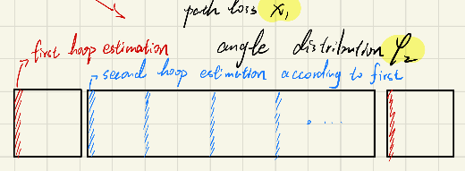

# Title:

# Abstract:

# Introduction:

# system model:

## A. System Architecture and signal model

​	考虑一个RIS辅助的多用户下行毫米波MIMO通信系统。该系统中BS装备有一个规模为$\sqrt{N} \times \sqrt{N}$的UPA天线阵列。RIS装备有规模为$\sqrt{M} \times \sqrt{M} $的UPA反射阵列。服务用户均为单天线用户。将所考虑的时间段分为不同的传输帧（frame），就像图一所示的那样

需要注意的是，为了提高信道估计的精度，尤其是第一跳（hoop）的精度，RIS在UPA中心处安放一个单天线的传感器（sensor），该天线具有和RF chain 一样的射频处理能力。

## B. RIS-asisted channel model in angle-domain

