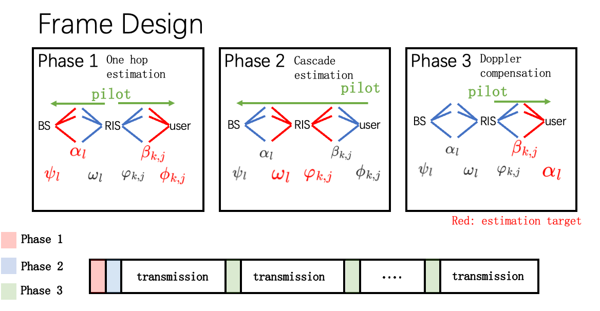
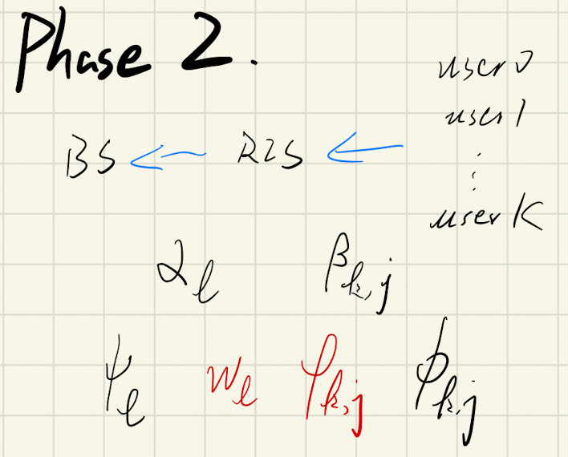
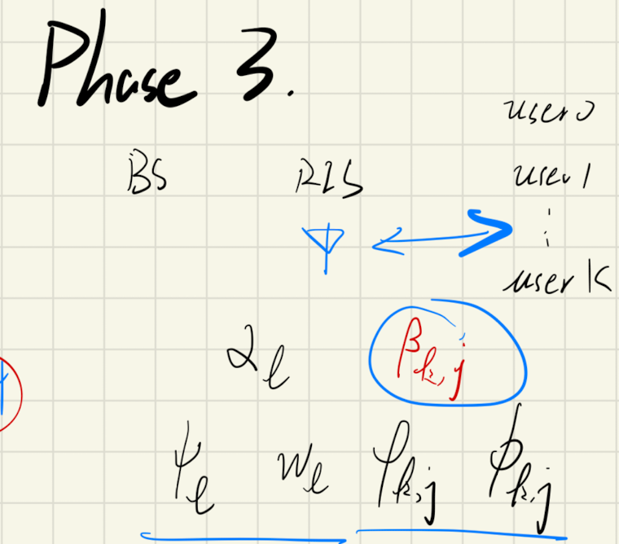
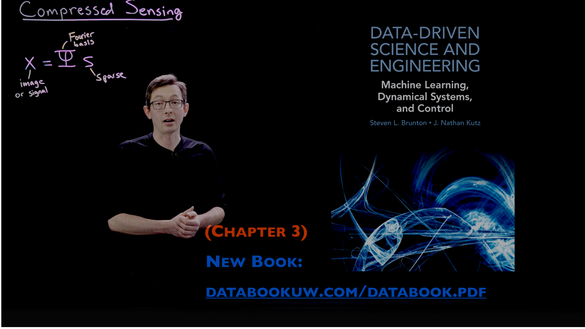
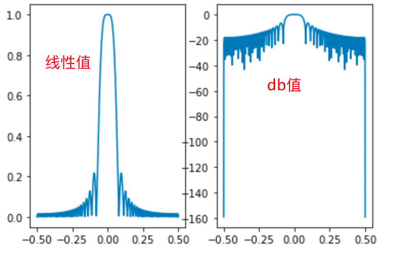

# Title:

 

# Abstract:

# Introduction:

$$
\mathbf{H}=\mathop{{\mathbf{A}_{N}}}_{(N\times L)} \mathop{\text{Diag}(\mathbf{A})}_{(L\times L)} \mathop{\mathbf{A}_{M}^{H}}_{L\times M}
$$

# system model:

## A. System Architecture and signal model

​	考虑一个RIS辅助的多用户下行毫米波MIMO通信系统。该系统中BS装备有一个规模为$\sqrt{N} \times \sqrt{N}$的UPA天线阵列。RIS装备有规模为$\sqrt{M} \times \sqrt{M} $的UPA反射阵列。服务用户均为装备有$A$个天线的ULA接收端。将所考虑的时间段分为不同的传输帧（frame），就像图一所示的那样

需要注意的是，为了提高信道估计的精度，尤其是第一跳（hoop）的精度，RIS在UPA中心处安放一个单天线的传感器（sensor），该天线具有和RF chain 一样的射频处理能力。

​	在这篇文章中，用户相对于BS和RIS高速移动，会产生Doppler 频偏，因此需要进行频繁的CSI估计；然而考虑到BS和RIS相对静止，因此第一跳（First hoop）的信道相干时间明显大于第二跳（Second hoop），即RIS-user链路的信道相干时间。为了减轻用户移动性带来的多普勒效应而产生的性能下降，并降低信道估计开销，我们提出了一种“混合RIS双时间尺度”的信道估计协议。具体来讲，首先将每个Frame分为三个阶段（phase），第一阶段和第二阶段被部署在第一个传输帧（subframe）帧头，此时位于RIS的RF chain在帧头处于发射状态，发送导频信号到BS，从而获得第一跳的AoA，该导频信号同时被K个用户接收并估计用户端AoA；紧接着在第二阶段K个用户同时向BS发送正交导频信号，在已知级联信道中部分CSI的情况下进行级联信道估计；在余下的数据帧中由于BS-RIS link的信道相干时间较长，第一跳的CSI在此后$T_{R}$个数据帧中保持一致，在每一帧帧头只需要重新进行第二跳的多普勒补偿即可。

​	令$\mathbf{h}_{k} \in \mathbb{C}^{M \times A}$，$\mathbf{H} \in \mathbb{C}^{N \times M}$， 分别表示用户k到RIS的信道和RIS到BS的信道，令$\boldsymbol{\Phi}=[\phi_{1}, \cdots, \phi_{m}, \cdots, \phi_{M}]^T \in \mathbb{C}^{M\times 1}$ and $\phi_{m}=e^{j \theta_{m}}$表示RIS反射面的相移矩阵，其幅值始终保持单位一。另外，用${\bf H}_{rb} \in \mathbb{C}^{M\times 1}$表示从RIS单天线发射端到BS的信道矩阵。则BS在第一阶段接受到的BS导频信号为：
$$
\mathbf{y}_{rb}=\mathbf{H}_{rb}\mathbf{s}_{r}+\mathbf{n}_{rb}
$$
​	其中，$\mathbf{n}_{rb}$为AWGN噪声，$\mathbf{n}_{rb} \sim \mathcal{C} \mathcal{N}\left(\mathbf{0}, \sigma_{rb}^{2} \mathbf{I}_N\right)$，$\sigma_s$为噪声标准差。$\mathbf{s}_{r}\in \mathbb{C}^{1 \times \tau_{r}}$，为RIS处发射单元在phase 1 中的导频信号其中$s_{r,i} \in \{1,0\}$，且由于系统中只有一个RIS，$\tau_{r}=1$。

​	同时每个用户也接受到了来自RIS的导频信号，令$h_{r,k}\in \mathbb{C}^{1\times A}$表示用户k到RIS处单天线发射端的信道，则第$k$个用户处的接收信号$\mathbf{y}_{r,k}\in \mathbb{C}^{A\times \tau_{r,k}}$为：
$$
\mathbf{y}_{r,k}=\mathbf{h}^{H}_{r,k}\mathbf{s}_{r}+\mathbf{n}_{r,k}
$$
​	其中$\mathbf{n}_{rb}$为AWGN噪声

​	接着，我们假设在phase 2中K个用户同时向BS发射相同长度$\tau_{k,b}$的导频信号$\mathbf{s}_{k,b}\in \mathbb{C}^{A\times \tau_{k,b}}$，为了保证信号的正交性，$\tau_{k,b}\geq K$，则BS接收到的第k个用户的导频信号为$\mathbf{y}_{k,b}\in \mathbb{C}^{N\times\tau_{k,b}}$，
$$
[\mathbf{y}_{k,b}]_{:,t} = \mathbf{H}\operatorname{Diag}({\mathbf\Phi}_t)\mathbf{h}_k\sqrt{p}[\mathbf{s}_{k,b}]_{:,t}+\mathbf{n}_{k,b}
$$
$$
{\mathbf y}_k=\mathop{{\mathbf H}}_{(N\times M)}\mathop{{\mathbf \Phi}}_{(M\times M)}\mathop{{\mathbf h}_k}_{(M\times A)}\mathop{{\mathbf s}_k}_{(A\times 1)}+{\mathbf n}_k
$$

$$
M\gg 1 \\
N \times A \gg 1
$$

级联信道信息可以表示为：${\mathbf G}_k=\{{\mathbf G}_{k,1}, {\mathbf G}_{k,2},\dots,{\mathbf G}_{k,M} \}$
$$
{\mathbf G}_{k,m}=[{\mathbf H}]_{[:,m]}[{\mathbf h}_{k}]_{[m,:]},\quad \forall m\in {1,\dots,M}
$$
从而，接收的导频信道可以进一步写为：
$$
[\mathbf{y}_{k,b}]_{:,t} =\left( \sum_{m=1}^M {\mathbf G}_{k,m}\phi_m \right) \sqrt{p}[\mathbf{s}_{k,b}]_{:,t}+\mathbf{n}_{k,b}
$$

​	在phase 3中，RIS处RF chain发射导频信号$\mathbf{s}_{d}\in\mathbb{C}^{1\times \tau_{r,k}}$，用于进行Doppler补偿。此时用户处的接收信号$\mathbf{y}_{d,k}\in \mathbb{C}^{A\times \tau_{r,k}}$为：
$$
\mathbf{y}_{d,k}=\mathbf{h}^{H}_{r,k}\mathbf{s}_{d}+\mathbf{n}_{r,k}
$$

## B. Channel model

由于BS、RIS、user均装备ULA，则构建空间毫米波信道模型[^2-2][^2-3]：
$$
\mathbf{H}=\sum_{l=1}^{L}\alpha_l\mathbf{a}_N(\psi^{\prime}_l)\mathbf{a}_M^H(\omega^{\prime}_l)\in \mathbb{C}^{N\times M}
$$

$$
\mathbf{h}_k= \sum_{j=1}^{J_k}\beta_{k,j}\mathbf{a}_M(\varphi^{\prime}_{k,j})\mathbf{a}_A^H(\phi^{\prime}_{k,j})\in \mathbb{C}^{M\times A}
$$

$$
\mathbf{H}_{rb} = \sum_{l=1}^{L}\alpha_l\mathbf{a}_N({\psi^{\prime}})\in \mathbb{C}^{N\times 1}
$$

$$
\mathbf{h}_{r,k} = \sum_{j=1}^{J_k}\beta_{k,j}\mathbf{a}_A(\phi^{\prime}_{k,j})\in \mathbb{C}^{A\times 1}
$$

其中，由于信道互易性[^1-5] ，同一链路中相同发射/接收端上行信道和下行信道中具有相同的AoA/AoD，因此定义中不再区分到达和离开，例如，上行信道中BS的AoA等于下行信道中的AoD，于是定义该角度为$\psi^{\prime}_l, \forall l \in \{1,2,\dots, L\}$。$L,J_k$分别表示信道$\mathbf{H},\mathbf{h}_k$中的多径数量。$\alpha_l,\beta_{k,j}$表示对应路径中的pathloss。$\mathbf{H}_{rb}, \mathbf{h}_{r,k}$表示当RIS发射端仅为单天线时的信道模型。需要注意的是，他们与$\mathbf{H},\mathbf{h}_k$共享同样的多径系数：$\psi^{\prime}_l, \phi_{k,j}$和对应的path loss：$\alpha_l,\beta_{k,j}$。这是因为RIS处的单天线发射端放置在RIS的几何中心，在大尺度的远场通信中和ULA的反射元件拥有相同的多径传播路径。利用该单天线的发射特性可以更加精确的估计单hop信道中的信道系数从而达到更精准的级联信道估计。

为简化阵列响应展开式，将ULA阵列响应统一写成以下形式[^2-2]:
$$
\mathbf{a}_{X}(x)=\left[1, e^{-\mathrm{i} 2 \pi x}, \ldots, e^{-\mathrm{i} 2 \pi(X-1) x}\right]^{\mathrm{T}}
$$
where $X \in\{M, N\}$ and $x \in\{\psi_l^{\prime},\omega_l^{\prime},\varphi_{k,j}^{\prime},\phi_{j,k}^{\prime} \}$, and $\varphi_{k, j}=$ $\frac{d_{\mathrm{RIS}}}{\lambda_{c}} \cos \left(\vartheta_{k, j}\right)$ are the directional cosine with $\theta_{l}$ and $\phi_{l}$ denoting the $\mathrm{AoD}$ and AoA of the $l$-th spatial path from RIS to BS, respectively, and $\vartheta_{k, j}$ as the AoA of the $j$-th spatial path from user $k$ to RIS. $\lambda_{c}$ is the carrier wavelength. It should be emphasized here that the channel gains $\alpha_{l}$

$\color{red}{x\in [-\frac{d}{\lambda},\frac{d}{\lambda})}$

$\color{red}{\frac{d}{\lambda}=0.5}$
$$
{\color{red}{N}}\times A\times {\color{red}K} & \rightarrow 10^{6} \sim10^{8}\\
{\color{red}{M}}+ {\color{red}N} & \rightarrow 10^{3} \sim10^{4}
$$

$$

$$

$\psi^{\prime}_l=\frac{d}{\lambda}\operatorname{cos}(\psi_l)$ $\omega_l$ $\varphi_{k,j}$ $\phi_{k,j}$ $J_k$ $\alpha_l$ $\beta_{k,j}$

$\color{red}\psi_{l}\ \omega_{l}\ \varphi_{k, j}\ \phi_{k, j}\ J_{k}\ \alpha_{l}\ \beta_{k, j}$ 

## C. Angular Domain Channel Expressions

根据[^1-5] 和中文-95，96，103，在MIMO mmwave系统中，

> 说明MIMO信道中存在角度域的稀疏性，相比传统的时域和频域具有更大的优势

以下写出$\mathbf{H},\mathbf{h}_k$以及$\mathbf{H}_{rb}, \mathbf{h}_{r,k}$的角域表达式
$$
{\mathbf H}={\mathbf A}_N{\mathbf {\mathbf A}{\mathbf A}_M^H}\in {\mathbb C}^{N\times M}
$$
其中：
$$
\begin{aligned}
\mathbf{A}_{N} &=\left[\mathbf{a}_{N}\left(\psi^{\prime}_{1}\right), \ldots, \mathbf{a}_{N}\left(\psi^{\prime}_{L}\right)\right] \in \mathbb{C}^{N \times L} \\
{\mathbf A} &=\operatorname{Diag}\left(\alpha_{1}, \alpha_{2}, \ldots, \alpha_{L}\right) \in \mathbb{C}^{L \times L} \\
\mathbf{A}_{M} &=\left[\mathbf{a}_{M}\left(\omega^{\prime}_{1}\right), \ldots, \mathbf{a}_{M}\left(\omega^{\prime}_{L}\right)\right] \in \mathbb{C}^{M \times L}
\end{aligned}
$$
${\mathbf h}_k$：
$$
\mathbf{h}_k = {\mathbf A}_{M,k}{ \mathbf B}_k{\mathbf A}_{A,k}^H\quad \forall k \in {\mathcal K}
$$

$$
\begin{aligned}
\mathbf{A}_{M, k} &=\left[\mathbf{a}_{M}\left(\varphi^{\prime}_{k, 1}\right), \ldots, \mathbf{a}_{M}\left(\varphi^{\prime}_{k, J_{k}}\right)\right] \in \mathbb{C}^{M \times J_{k}} \\
{\mathbf B}_{k} &=\operatorname{Diag}\left(\beta_{k, 1}, \ldots, \beta_{k, J_{k}}\right)\in \mathbb{C}^{J_{k} \times J_k}\\
\mathbf{A}_{A, k} &=\left[\mathbf{a}_{A}\left(\phi^{\prime}_{k, 1}\right), \ldots, \mathbf{a}_{A}\left(\phi^{\prime}_{k, J_{k}}\right)\right] \in \mathbb{C}^{A \times J_{k}} 

\end{aligned}
$$

$\mathbf{H}_{rb}$
$$
{\mathbf H}_{rb} ={\mathbf A}_N{\mathbf A_{rb}}\in \mathbb{C}^{N\times 1}\\
$$
where ${\mathbf A}_{rb}=[\alpha_{1}, \alpha_{2}, \ldots, \alpha_{L}]^T\in \mathbb{C}^{L\times 1}$

$\mathbf{h}_{r,k}$

$$
{\mathbf h }_{r,k}={\mathbf A}_{A,k}{\mathbf B}_{r,k}\in {\mathbb C}^{A\times 1}
$$
Where ${\mathbf B}_{r,k}=[\beta_{k,1},\dots,\beta_{k,J_k}]^T\in {\mathbb C}^{J_k \times 1}$

> 在没有进行角域分解之前，复杂度为：；角域分解之后，复杂度为：。。。

#### Lamma 1 

角域表达可以在DFT变换后显示稀疏性，离散角度阵列响应DFT的正交性

$$
\frac{d}{\lambda}\leq \frac{1}{2}
$$
且$\frac{d}{\lambda}$ 越大，角域分辨率越高，最终$\frac{d}{\lambda}= \frac{1}{2}$

且
$$
x_i\in [-0.5,0.5)
$$
$x_i\in\{ \psi^{\prime}_l,\omega^{\prime}_l,\varphi^{\prime}_{k,j},\phi^{\prime}_{k,j} \}$

#### Lamma 2 
阵列响应角度规整后，能量达到极值

rotation angle 说明.power leak [^1-1] [^2-2]

定义一组特殊的离散AoA/AoD角度系数，以BS上行AoA/下行AoD为例：$\psi^{g}_{l}\in\{ 0-0.5,\dots,\frac{n-1}{N}-0.5, \dots,\frac{N-1}{N}-0.5 \}$ 。当且仅当$\psi_l^{\prime}=\psi_l^{g}$时，
$$
[{\mathbf A}_N^D]_{n,l}=
\begin{cases}
\sqrt{N}\quad &, n = n_l \\
0 &,others
\end{cases}\quad \forall l \ \in \ \{1,\dots,L \}
$$
此时${\mathbf A}_N^D$每一列仅有一个非零元素，并且$n_l,\psi_l^g$之间的映射关系为：
$$
{\psi}_l^g=\frac{n_l-1}{N}-0.5
$$

$$
\psi_l^g = 
\begin{cases}
\frac{n_l-1}{N}\quad &,\frac{n_l-1}{N} < 0.5 \\
\frac{n_l-1}{N}-1 &, \frac{n_l-1}{N}\geq 0.5
\end{cases}
$$
同时由于是一一映射，也可以反过来写为：
$$
n_l = N(\psi^g_l+0.5)+1
$$

$$
n_l=
\begin{cases}
N\psi_l^g+1\quad &,0\leq \psi_l^g <0.5 \\
N\psi_l^g+N+1 &,-0.5\leq \psi_l^g <0

\end{cases}
$$
可以看到每一列的唯一非零元素的行索引互不相同，所以有推论：${\mathbf A}_N^D={\mathbf U}_N{\mathbf A}_N$为一个行稀疏、列满秩的矩阵，并且${\mathbf A}_N^{D}$每一列正交

#### Lamma 3 
级联估计时存在“权重畸变”效应，使得估计的显著角集合存在20dB左右的误差

结论：本文使用的分步估计具有更好的估计精度

## D. Structured Sparsity of the AoA/AoDs

# channel estimation

## A. channel estimation protical

|  |  |  |
| ------------------------------------------------------------ | ------------------------------------------------------------ | ------------------------------------------------------------ |
| Phase 1: broadcast                                           | Phase 2: cascade channel estimation                          | Phase 3: Doppler compensation                                |

Phase 1: broadcast

Phase1.1: broadcast to BS

Phase1.2: broadcast to user k

Phase 2: cascade channel estimation

Phase 3: Doppler compensation

## B. Partial Channel estimation

$$
\mathbf{y}_{rb}=\mathbf{H}_{rb}\mathbf{s}_{r}+\mathbf{n}_{rb}={\mathbf A}_N{\mathbf A}_{rb}{
\mathbf s}_{r} + {\mathbf n}_{rb}\in{\mathbb C}^{N\times 1}
$$

$$
{\mathbf U}_N{\mathbf y}_{rb}={\mathbf U}_N{\mathbf A}_N{\mathbf A}_{rb}{\mathbf s}_r +{\mathbf n}_{rb}
$$

其物理意义为$L$个path中对应的角域能量分布，其中${\mathbf A}_N=[{\mathbf a}_N(\psi^{\prime}_1),\dots,{\mathbf a}_N(\psi^{\prime}_L)]$，则：
$$
{\mathbf A}_N^{D}={\mathbf U}_N{\mathbf A}_N = [{\mathbf U}_N{\mathbf a}_N(\psi^{\prime}_1),\dots,{\mathbf U}_N{\mathbf a}_N(\psi^{\prime}_L)]
$$
根据Lamma 1,如果${\psi^{\prime}_L}$离散，且刚好分布在grid上，则${\mathbf U}_N{\mathbf a}_N(\psi^{\prime}_l)\ \forall l\in \{1,\dots,L\}$中只有一个元素

> 展开$\psi^{\prime}_L$的取值范围

因此， ${\mathbf U}_N{\mathbf A}_N\in {\mathbb C}^{N\times L}$为一个行稀疏、列满秩的矩阵。

但是，由于在实际系统当中，multi-path中的AoA/AoD分布是连续的，当$\psi^{\prime}_l$分布在离散集合之外时，此时的DFT操作会引起能量泄漏现象[^1-5][^2-2][^1-1][^2-3] 此时需要进行rotation操作，即在DFT操作之前乘以一个旋转向量${\Phi}_N({\triangle \psi^{\prime}}_l)$。
$$
\boldsymbol{\Phi}_{N}\left(\triangle \psi^{\prime}_{l}\right)=\operatorname{Diag}\left\{1, e^{\mathrm{i} \triangle \psi^{\prime}_{l}}, \ldots, e^{\mathrm{i}(N-1) \triangle \psi^{\prime}_{l}}\right\}, \forall l
$$
在进行DFT操作前先对每个阵列响应进行相位对齐(DFT and Rotation)：
$$
{\mathbf A}_N^{DR} = {\mathbf U}_N{\mathbf A}_N^R = [{\mathbf U}_N{\Phi}_N({\triangle \psi^{\prime}}_1){\mathbf a}_N(\psi^{\prime}_1),\dots,{\mathbf U}_N{\Phi}_N({\triangle \psi^{\prime}}_L){\mathbf a}_N(\psi^{\prime}_L)]
$$
Then，接收信号${\mathbf y}_{rb}$在已知$\hat{\psi^{\prime}_l}$和$\triangle \hat{\psi^{\prime}_l}$的情况下可以通过DFT和rotation变换得到${\mathbf y}_{rb}^{DR}$：
$$
{\mathbf y}_{rb}^{DR}={\mathbf A}_N^{DR}{\mathbf A}_{rb}{\mathbf s}_{r}+{\mathbf n}_{rb}\in {\mathbb C}^{N\times 1}
$$
此时，${\mathbf y}_{rb}^{DR}$就是path loss $\alpha_l$加权的${\mathbf U}_N{\Phi}_N({\triangle \psi^{\prime}}_l){\mathbf a}_N(\psi^{\prime}_l)$的线性组合，通过Lamma2 可知：
$$
[{\mathbf A}_N^{DR}]_{[:,l^{\prime}]}^H[{\mathbf A}_N^{DR}]_{[:,l]}=
\begin{cases}
N\quad ,l^{\prime}=l\\
0\quad ,others
\end{cases}
$$
进而：
$$
({\mathbf A}_N^{DR})^H{\mathbf A}_N^{DR} = N{\mathbf I}_L
$$
所以当${\mathbf s}_r=1\times \sqrt{p}\in{\mathbb R}$，即RIS处单天线发送单符号导频信号时，路损系数的估计值$\hat{{\mathbf A}}_{rb}$为：
$$
\begin{aligned}
\hat{\mathbf A}_{rb}&=\frac{1}{N\sqrt{p}}({\hat{\mathbf A}_{N}^{DR}})^{H}{\mathbf y}_{rb}^{DR}\\
&\approx \frac{1}{N\sqrt{p}}({{\mathbf A}_{N}^{DR}})^{H}{\mathbf A}_N^{DR}{\mathbf A}_{rb}{\mathbf s}_{r}\\
&={\mathbf A}_{rb}

\end{aligned}
$$

我们定义显著角集合$\Omega_N=\{n_l|\forall l\in \{1,\dots,\hat{L}\}\}$ 其中$n_l$表示第$l$个路径对应在BS处的AoA脚标，$\hat{L}$为系统在信道估计阶段取得的显著角个数，这里为了简化模型采用$\hat{L}= L$。

可以从上述过程中看到，虽然可以通过DFT和rotation两步操作将${\mathbf A}_N$分解为行稀疏列满秩矩阵。但是rotation操作需要事先得知所有${\psi^{\prime}}_l\ \forall l \in \{1,\dots ,L\}$的值，$\psi^{\prime}_l$ 的值可以通过$n_l$获知，获取$n_l$的过程被称为“显著角估计”[^1-5]。

> 目前已有在级联信道中显著角估计的方法，但是如Lamma 3所示，对级联信道直接估计显著角有“能量畸变”问题，于是我们在本文中分别估计单跳信道的显著角，这样使得估计精度增加。

具体来讲，我们通过power peak[^2-2][^2-3][^1-5] 来获知$\Omega_N$:
$$
\Omega_N = \{\Omega\ |\sum_{n_l\in \Omega}|| [{\mathbf U}_N]_{[n_l,:]}{\mathbf y}_{rb} ||^2 \geq \sum_{n_l\in\Omega^{\prime}} || [{\mathbf U}_N]_{[n_l,:]}{\mathbf y}_{rb} ||^2,\forall \Omega^{\prime}\subset{\mathcal N},|\Omega^{\prime}|=|\Omega|=L \}
$$
注意选取$n_l$时顺序排列：
$$
n_l-n_j
\begin{cases}
<0 \quad , l<j \\
>0 \quad , l>j
\end{cases}
$$
在角域表达中，每个$n_l$都对应一个离散的grid basis角$\psi_l^g$ [^1-1][^1-2][^1-3]：
$$
\psi_l^g =f(n_l)
$$
则给出$\triangle\psi^{\prime}_l$的定义：$\triangle \psi^{\prime}_l = \psi_l^g-\psi^{\prime}_l$，此时，$\psi^{\prime}_l$未知，但根据Lamma 2可知，$\psi_l^g$对应的DFT中相应频点能量最大，且$\triangle\psi^{\prime}_l$在范围$[-\pi/N,+\pi/N]$内，于是，$\triangle\psi^{\prime}_l$可由以下方法求得：
$$
\triangle \psi^{\prime}_{l}=\arg \max _{\triangle \psi^{\prime} \in\left[-\frac{\pi}{N}, \frac{\pi}{N}\right]}\left\|\left[\mathbf{U}_{N}\right]_{n_l, :} \boldsymbol{\Phi}_{N}(\triangle \psi^{\prime}) \mathbf{y}_{rb}\right\|^{2}
$$

> Algorithm 1

最终，通过在BS端接收的导频信号${\mathbf y}_{rb}$可以估计出基站侧上行AoA（or 下行AoD）$\psi^{\prime}_l$以及多径衰落系数${\mathbf A}_{rb}$ 

同理，用户侧也在接收RIS端发射的导频信号${\mathbf y}_{r,k}$，此时将k-th用户当作是BS则可以估计得到用户侧上行AoD（or 下行AoA）$\phi_{k,j}$以及多径衰落系数${\mathbf B}_{r,k}$

## C. Cascade Channel estimation

inspired by[^2-3] ,在phase 2中通过用户向BS发送的导频信号估计RIS处的上行AoD（or 下行AoA）$\omega_l$和上行AoA（or 下行AoD）$\phi_{k,j}$

BS接收到k-th用户的发送导频信号为
$$
[\mathbf{y}_{k,b}]_{:,t} =\left( \sum_{m=1}^M {\mathbf G}_{k,m}\phi_m \right) \sqrt{p}[\mathbf{s}_{k,b}]_{:,t}+\mathbf{n}_{k,b}
$$
根据[^1-5] 在设计k-th用户的导频信号${\mathbf s}_{k,b}\in {\mathbb C}^{A\times \tau_{k,b}}$时可以根据Phase 1中获知的用户端上行AoD$\phi_{k,j}$ 将发射能量集中到显著角集合$\Omega_{A,k}$中，使得RIS端接收的导频信号质量更好。

将基站接收信号写开就是一下的形式：
$$
\begin{aligned}
\left[{\mathbf y}_{k,b} \right]_{:,t} &={\mathbf A}_N{\mathbf A}{\mathbf A}_M^H{\mathbf \Phi}_t{\mathbf A}_{M,k}{\mathbf B}_k{\mathbf A}_{A,k}\sqrt{p}[{\mathbf s_{k,b}}]_{:,t}+{\mathbf n}_{k,b}\\
\frac{1}{\sqrt{p} N } \hat{{\mathbf A}}_N^H \left[{\mathbf y}_{k,b} \right]_{:,t} &\approx{\mathbf I}_L {\mathbf A}{\mathbf A}_M^H{\mathbf \Phi}_t{\mathbf A}_{M,k}{\mathbf B}_k{\mathbf A}_{A,k}[{\mathbf{s}}]_{:,t} + \frac{1}{\sqrt{p} N } \hat{{\mathbf A}}_N^H {\mathbf n}_{k,b}\\
\frac{1}{\sqrt{p} N }{\mathbf A}^{-1} \hat{{\mathbf A}}_N^H \left[{\mathbf y}_{k,b} \right]_{:,t} &\approx{\mathbf A}_M^H{\mathbf \Phi}_t{\mathbf A}_{M,k}\underbrace{{\mathbf B}_k{\mathbf A}_{A,k}^H[{\mathbf{s}}]_{:,t}}_{\text{part 1}} + \frac{1}{\sqrt{p} N } {\mathbf A}^{-1} \hat{{\mathbf A}}_N^H {\mathbf n}_{k,b}
\end{aligned}
$$
接下来介绍上行导频信号设计，从上面的公式可以看到，此时信道中的位置量已经只剩下上行信道中的RISAoD($\{ {\omega_1}, \dots,\omega_L\}$)和RIS处的AoA($\{ {\varphi}_1, \dots,\varphi_{J_k} \}$)，我们的思想是将接收信号表达式化简为只有$\{ {\varphi}_1, \dots,\varphi_{J_k} \}$和$\{ {\omega_1}, \dots,\omega_L\}$为变量的形式，即，等式右边除了${\mathbf A}_M^H$和${\mathbf A}_{M,k}$之外都是常数矩阵。因此，我们设置RIS反射阵列上的元件反射相位均为单位一，即，${\mathbf \Phi}_t = {\mathbf I}_M$，另外需要设计上式中的$\text{part}\ 1$为常矩阵：
$$
\begin{aligned}
\text{part 1} &= {\mathbf B}_k{\mathbf A}_{A,k}^H[{\mathbf{s}}_{rb}]_{:,t}\\
&=\left(
\begin{matrix}
\beta_{k,1} &  &\\
& \beta_{k,2}\\
&& \ddots \\
&&& \beta_{k,J_k}
\end{matrix}
\right)
\left(
\begin{matrix}
{\mathbf a}_{A}^H(\phi_{k,1})	\\
{\mathbf a}_{A}^H(\phi_{k,2})	\\
\vdots												\\
{\mathbf a}_{A}^H(\phi_{k,J_k})
\end{matrix}
\right)
[{\mathbf s}_{rb}]_{:,t}
\\
&=\left(
\begin{matrix}
\beta_{k,1}{\mathbf a}_{A}^H(\phi_{k,1})[{\mathbf s}_{rb}]_{:,t}	\\
\beta_{k,2}{\mathbf a}_{A}^H(\phi_{k,2})[{\mathbf s}_{rb}]_{:,t}	\\
\vdots												\\
\beta_{k,J_k}{\mathbf a}_{A}^H(\phi_{k,J_k})[{\mathbf s}_{rb}]_{:,t}
\end{matrix}
\right)

\end{aligned}
$$
正如 Lemma中提到的，$\{{\mathbf a}_A(\phi_{k,1}),\dots,{\mathbf a}_A(\phi_{k,J_k}) \}$在A非常的大时候近似正交，利用其正交性设计导频信号${\mathbf s}_{rb}$，为简化表示，令${\mathbf s}_t=[{\mathbf s}_{rb}]_{:,t}$，设计目标在于令part 1为常矩阵方便下一步估计，鉴于user处的AoD和各条路径对应path的路损已在phase 1中估计得知，则${\mathbf s}_t$可以按照以下规则设计：
$$
{\mathbf s}_t=\frac{1}{N\sqrt{||\sum_{j=1}^{J_k}\beta_{k,j}^{-1}{\mathbf a}_A(\phi_{k,j})||^2}}\cdot \sum_{j=1}^{J_k}\beta_{k,j}^{-1}{\mathbf a}_A(\phi_{k,j})
$$
则part 1中的每一项：
$$
\begin{aligned}
\left[\text{part 1}\right]_{j,:}&=\beta_{k,j}{\mathbf a}_A^H(\phi_{k,j})\frac{1}{N\sqrt{||\sum_{j=1}^{J_k}\beta_{k,j}^{-1}{\mathbf a}_A(\phi_{k,j})||^2}}\cdot \sum_{j=1}^{J_k}\beta_{k,j}^{-1}{\mathbf a}_A(\phi_{k,j})\\
&\approx \frac{{\mathbf a}_A^H(\phi_{k,j}) {\mathbf a}_A(\phi_{k,j})}{N\sqrt{||\sum_{j=1}^{J_k}\beta_{k,j}^{-1}{\mathbf a}_A(\phi_{k,j})||^2}}\\
&\equiv \frac{1}{\sqrt{||\sum_{j=1}^{J_k}\beta_{k,j}^{-1}{\mathbf a}_A(\phi_{k,j})||^2}}
\triangleq c_s
\end{aligned}
$$

因此，通过对导频信号${\mathbf s}_t$的设计，$\text{part 1}$可以被归一化：
$$
\begin{aligned}
\text{part 1} &= c_s\cdot 
\left(
\begin{matrix}
1\\
1\\
\vdots \\
1
\end{matrix}
\right)_{(J_k \times 1)}
\end{aligned}
$$
则，BS端接收的导频信号可以被进一步表示为：
$$
\begin{aligned}

\frac{1}{c_s\sqrt{p} N }{\mathbf A}^{-1} \hat{{\mathbf A}}_N^H \left[{\mathbf y}_{k,b} \right]_{:,t} &\approx{\mathbf A}_M^H{\mathbf A}_{M,k}{\mathbf v} + \frac{1}{c_s \sqrt{p} N } {\mathbf A}^{-1} \hat{{\mathbf A}}_N^H {\mathbf n}_{k,b}
\end{aligned}
$$
其中${\mathbf v}=[1,1,\dots,1]^T \in {\mathbb R}^{J_k \times 1}$，$c_s=\frac{1}{\sqrt{||\sum_{j=1}^{J_k}\beta_{k,j}^{-1}{\mathbf a}_A(\phi_{k,j})||^2}}$

接下来，为简化表示，使用${\mathbf y}_t\in L\times 1$表示$\frac{1}{c_s\sqrt{p} N }{\mathbf A}^{-1} \hat{{\mathbf A}}_N^H \left[{\mathbf y}_{k,b} \right]_{:,t} $。并且将噪声表示为：${\mathbf n}_t = \frac{1}{c_s \sqrt{p} N } {\mathbf A}^{-1} \hat{{\mathbf A}}_N^H {\mathbf n}_{k,b}$

之后，我们将其写为压缩感知的形式：
$$
\begin{aligned}
{\boldsymbol y}_t & = {\mathbf A}_M^H \operatorname{Diag}({\mathbf \Phi}_t){\mathbf A}_{M,k}{\boldsymbol v}_k+{\boldsymbol n}_t\\
& = {\mathbf A}_M^H \operatorname{Diag}({\mathbf A}_{M,k}{\boldsymbol v}_k){\mathbf \Phi}_t+{\boldsymbol n}_t
\end{aligned}
$$
我们通过共轭转置操作考虑${\boldsymbol y}_t^H \in {\mathbb C}^{1 \times L}$:
$$
{\boldsymbol y}_t^H = {\mathbf \Phi}_t^H \operatorname{Diag}({\mathbf A}^*_{M,k}{\boldsymbol v}_k^*){\mathbf A}_M + {\boldsymbol n}_t^H
$$
我们考虑其中$l-th$要素$[{\boldsymbol y}_t^H]_{:,l} \in {\mathbb C} $:
$$
\begin{aligned}
{[{\boldsymbol y}_t^H]_{:,l}} & = {\mathbf \Phi}_t^H \operatorname{Diag}({\mathbf A}^*_{M,k}{\boldsymbol v}_k^*){\mathbf a}_M(\omega_l) + [{\boldsymbol n}_t^H]_{:,l} \\
& = {\mathbf \Phi}_t^H \operatorname{Diag}({\mathbf a}_M(\omega_l)) {\mathbf A}^*_{M,k}{\boldsymbol v}_k^* + [{\boldsymbol n}_t^H]_{:,l}
\end{aligned}
$$
我们接下来考虑的压缩感知问题考虑在时域上的super sampling，所以我们接下来定义一个measurement vector ${\boldsymbol p}_l \triangleq \left[\begin{matrix} [{\boldsymbol y }_1^H]_{:,l}\\ \vdots \\ {\boldsymbol y }_\tau^H]_{:,l} \end{matrix}\right] \in {\mathbb C}^{\tau \times 1}$ 
$$
\begin{aligned}
{\boldsymbol p}_l & = {\mathbf \Phi}^H \operatorname{Diag}({\mathbf a}_M(\omega_l)) {\mathbf A}^*_{M,k}{\boldsymbol v}_k^* + \left[\begin{matrix} {\boldsymbol n}_1^H \\ \vdots \\ {\boldsymbol n}_\tau^H \end{matrix} \right]_{:,l} \\
									& = {\mathbf \Phi}^H \operatorname{Diag}({\mathbf a}_M(\omega_l)) \frac{{\mathbf U}^H_M {\mathbf U}_M}{M} {\mathbf a}_M  ({\boldsymbol \varphi}) + {\mathbf N}_l\\
									& = {\mathbf \Phi}^H {\mathbf V}({\omega_l}){\mathbf a}_M^{DFT}({\boldsymbol \varphi}) + {\mathbf N}_l\\
									& = {\mathbf \Phi}^H {\mathbf V}({\omega_l}){\mathbf D}_M({\Delta}{\boldsymbol \varphi}) {\boldsymbol x}+ {\mathbf N}_l 
\end{aligned}
$$

为了将角域信号的稀疏性剥离出来，我们采用一个DTFT矩阵将${\mathbf a}_M^{DFT}({\boldsymbol \varphi})$分解：
$$
{\mathbf a}_M^{DFT}({\boldsymbol \varphi})={\mathbf D}_M(\Delta {\boldsymbol \varphi}){\boldsymbol x}
$$
其中${\mathbf D}_M(\Delta {\boldsymbol \varphi})= [D_M(\Delta \varphi_1),\dots,D_M(\Delta \varphi_M)] \in {\mathbb C}^{M\times M}$

其每一列$D_M(\Delta {\varphi_m})$中的$m^{\prime}$-th元素的值为：
$$
D_M(\Delta {\varphi_1},m^{\prime})=
f_M({2\pi}(\frac{m^{\prime}-m} {M}+0.5+\Delta\varphi))\
$$

$$
D_M(\Delta {\varphi_1},m^{\prime})=\begin{cases}
\begin{aligned}
f_M({2\pi}(\frac{m^{\prime}-m} {M} - 1+\Delta\varphi))\ &, \frac{m^{\prime}-1}{M} < 0.5 \\
f_M({2\pi}(\frac{m^{\prime}-m} {M}+\Delta\varphi)) &, \frac{m^{\prime}-1}{M} \geq 0.5
\end{aligned}

\end{cases}
$$

$$
D_M(\Delta {\varphi_1},m^{\prime})=\begin{cases}
\begin{aligned}
f_M({2\pi}(\frac{m^{\prime}-m} {M}+\Delta\varphi))\ &, \frac{m^{\prime}-1}{M} < 0.5 \\
f_M({2\pi}(\frac{m^{\prime}-m+M} {M}+\Delta\varphi)) &, \frac{m^{\prime}-1}{M} \geq 0.5
\end{aligned}

\end{cases}
$$
where [^1-8]
$$
f_M(x) = \frac{1}{\sqrt{M}}e^{jx(M-1)/2} \frac{\operatorname{sin}(Mx/2)}{\operatorname{sin}(x/2)}
$$
此时该问题转化为了一个data matrix ${\mathbf V}(\omega_l) $含有未知参数${\omega_l}$的压缩感知问题[^1-4]，测量矩阵${\mathbf \Phi}^H \in {\mathbb C}^{\tau \times M}$可以通过调节不同时刻的RIS相位${\mathbf \Phi}_t$来进行更改，最后需要通过super Sample的${\boldsymbol p}_l \in {\mathbb C}^{\tau \times 1}$来恢复纬度较高的${\mathbf a}_M^{DFT}({\boldsymbol \varphi}) \in {\mathbb C}^{M \times 1}$。

注意到，此时的data matrix :${\mathbf V}(\omega_l)={(1/M)} \cdot \operatorname{Diag}({\mathbf a}_M(\omega_l)) \cdot {\mathbf U}_M^H $，${\mathbf V}(\omega_l)^H \cdot  {\mathbf V}(\omega_l) = (1/M)\cdot {\mathbf I}_M$，其每一列正交

对于一个标准CS问题，超采样的个数只需要$M={\mathcal O}(K{\operatorname log}N)$ [^1-8]即可（此时的$M$为超采样个数，K为稀疏个数，N为原信号维度）

注意到以上有L个${\boldsymbol y}_l$其中所有的未知量${\boldsymbol x}$均为一样的，只有$\omega_l$有L个，显然，对所有${\boldsymbol y}_l$都做一次压缩感知会显著提升计算复杂度，我们在本文中只进行一次压缩感知算法，估计出${\boldsymbol x}$和参数${\Delta \boldsymbol{\varphi}}$以及一个参照AoD ${\omega_r}$，并通过scaling的表示方法和correlation-based算法估计其他$\omega_l,\forall l\in\{1,\dots,L\}$。具体来讲，任意的$\omega_l,l\neq r$ 可以通过已知的$\omega_r$表示为：
$$
\omega_l = \omega_r + \Delta \omega_l
$$
then
$$
\begin{aligned}
{\boldsymbol y}_l & ={\mathbf \Phi}^H \operatorname{Diag}({\mathbf a}_M(\Delta\omega_l)) \operatorname{Diag}({\mathbf a}_M({\boldsymbol \varphi})) {\mathbf a_M}({\omega_r})+{\mathbf N}_l \\
				& = {\mathbf \Phi}^H \operatorname{Diag}({\hat{\boldsymbol h}}_r) {\mathbf a}_M(\Delta \omega_l)+{\mathbf N}_l\\
				& = {\mathbf z}_r(\Delta \omega_l) + {\mathbf N}_l
\end{aligned}
$$
其中，$\hat{\boldsymbol h}_r$为使用压缩感知得到的估计值，那么我们就可以用简单的correlation-based scheme 来估计$\omega_l$:
$$
\Delta\hat{\omega}_l=\text{arg} \max_{\Delta \omega \in [-1, 1]} \abs{\langle {\boldsymbol p}_l,{\boldsymbol z}_r(\Delta \omega) \rangle}
$$

> 
>
> 最后经过处理的接收信号可以写为：
> $$
> \begin{aligned}
> {\mathbf y}_t &\approx {\mathbf A}_M^H {\mathbf A}_{M,k}{\mathbf v} +{\mathbf n}_t \\
> &= {\mathbf A}_M^H{\mathbf a}_{M,k}^{\prime} + {\mathbf n}_t  \\
> &= \frac{1}{M}{\mathbf A}_M^H{\mathbf U}_{M}^H{\mathbf U}_M{\mathbf a}_M^{\prime}+{\mathbf n}_t\\
> &=\frac{1}{M}[{\mathbf A}_M^{D}]^H{\mathbf a}_M^D +{\mathbf n}_t\\
> &={\mathbf A}({\vec \omega}){\boldsymbol x}_t +{\mathbf n}_t
> \end{aligned}
> $$
> 其中, ${\boldsymbol \omega} = \{\omega_1, \dots,\omega_L\}$
> $$
> \begin{aligned}
> {\mathbf A}({\boldsymbol \omega})&=\frac{1}{M}[{\mathbf U}_M {\mathbf a}_M(\omega_1),\dots,{\mathbf U}_M{\mathbf a}_M(\omega_L) ]^H \\
> &=\frac{1}{M}[{\mathbf a}_M^D(\omega_1), \dots, {\mathbf a}_M^D(\omega_L)]^H
> \in {\mathbb C}^{L\times M}
> 
> \end{aligned}
> $$
> 可以看到，${\mathbf A}({\boldsymbol \omega})$是行稀疏的，且行满秩
> $$
> {\boldsymbol x}_t=
> [\sum_{j=1}^{J_k}{\mathbf U}_M{\mathbf a}_{M}(\varphi_{k,j})]=[\sum_{j=1}^{J_k}{\mathbf a}_M^D(\varphi_{k,j})] \in {\mathbb C}^{M\times 1}
> $$
> 可以看到，${\boldsymbol x}_t$是稀疏的，且由于mmWave信道的角度域稀疏性，其$M$个元素中只有$L$个显著元素
>
> 这样，我们的级联信道估计问题就转换成了一个标准的CS问题。${\mathbf A}({\boldsymbol \omega})$为含有未知变参数${\boldsymbol \omega}$的data matrix，${\boldsymbol x}_t$ 为需要recovery 的sparse signal，${\boldsymbol y}_t$为measurements。
>

## D. Model-based compress sensing

由上面的推导可知，对于第k个用户，上行BS接收到的信号
$$
{\boldsymbol y}_{l,k} = {\mathbf \Phi}^H {\mathbf V}({\omega_l}){\mathbf D}_M({\Delta}{\boldsymbol \varphi}_k) {\boldsymbol x}_k
+ {\mathbf N}_l ,\forall l \in \{1,\dots,L\}
$$

$$
{\boldsymbol y}_k = 
\left[
\begin{matrix}
\mathbf{\Phi}^{H} \mathbf{V}\left(\omega_{1}\right) \mathbf{D}_{M}\left(\Delta \boldsymbol{\varphi}_{k}\right) \\
 \vdots \\
 \mathbf{\Phi}^{H} \mathbf{V}\left(\omega_{L}\right) \mathbf{D}_{M}\left(\Delta \boldsymbol{\varphi}_{k}\right)
\end{matrix}
\right]_{\tau \times M}{\boldsymbol x}_k+{\mathbf N}_k
={\mathbf F}_k {\boldsymbol x}_k+{\mathbf N}_k
$$
${\boldsymbol y}=[{\boldsymbol y}_1^T,\dots,{\boldsymbol y}_K^T]^T$

 ${\boldsymbol x}=[{\boldsymbol x}_1^T,\dots,{\boldsymbol x}_K^T]^T$

由信号表达式可以得出信号${\boldsymbol y}_k$的概率分布：
$$
p({\boldsymbol y_k \mid {\boldsymbol x}_{k} ; {\boldsymbol \xi}})=CN({\boldsymbol y}_k;{\mathbf F}_k{\boldsymbol x}_k, \operatorname{Diag}({\boldsymbol \kappa}_k)^{-1})
$$

$$
p({\boldsymbol y} \mid {\boldsymbol x};{\boldsymbol \xi})=\prod_k^Kp({\boldsymbol y_k \mid {\boldsymbol x}_{k} ; {\boldsymbol \xi}})
$$

由于${\mathbf a}_M^{DFT}({\boldsymbol \varphi}_{k})$ 是$J_k$个$M$-ULA阵列响应的线性叠加之后的$M$-DFT变换得到的结果，并且我们通过增加${\mathbf D}_M(\Delta {\boldsymbol \varphi}) \in {\mathbb C}^{M\times M}$ 将DTFT的结果中的旁瓣剥离，所以最终${\boldsymbol x}_k$是一个$M$空间$J_k$稀疏的信号。那么问题就变成了通过接收信号${\boldsymbol y}_{l,k}$ 估计$J_k$稀疏的${\boldsymbol x}_{k}$。需要注意的是Data矩阵中包含未知参数${\Delta {\boldsymbol \varphi}}_k \triangleq \{ \Delta{\varphi }_{k,1},\dots, \Delta{\varphi }_{k,M}\}$。注意到由于${\boldsymbol x}_k$的$J_k$-稀疏性，${\Delta{\boldsymbol \varphi}}_k$中只有$\{\Delta \varphi_{k,m}|m=1,\dots,J_k \}$会起作用，但是在算法中所有$M$个${\Delta {\boldsymbol \varphi}}_k$中的元素会一起进行处理。

为了进一步降低算法的时间开销，我们可以利用${\boldsymbol x}_k$中的结构稀疏性提供的额外的先验信息[^1-8]对${\boldsymbol x}_k$中的子空间进行降维[^1-4][^1-1][^1-2][^1-3]。

这里我们采用HMM信道建模[^1-4] [^1-5] :
$$
\begin{aligned}
p(\boldsymbol{x} \mid \boldsymbol{\gamma})&=\prod_k^K\prod_m^Mp(x_{k,m} \mid \gamma_{k,m})

\end{aligned}
$$

其中，${\boldsymbol \gamma}$为信道精度，$p(x_{k,m} \mid \gamma_{k,m})=CN(x_{k,m};0;\gamma_{k,m}^{-1})$
$$
p({\boldsymbol \gamma} \mid {\boldsymbol s}) = \prod_k^K\prod_m^M p(\gamma_{k,m} \mid s_{k,m})
$$
其中，${\boldsymbol s}$ 为channel support：$p(\gamma_{k,m} \mid s_{k,m})= \Gamma(\gamma_{k,m};a_{k},b_{k})^{s_{k,m}}\Gamma(\gamma_{k,m};\overline{a}_{k},\overline{b}_{k})^{1-s_{k,m}}$ 

当$s_{k,m}$为1时，$\frac{a_{k}}{b_{k}}=E[\gamma_{k,m}]=PL_{k}^{-1}$,其中$PL_k$为RIS-User k的LoS链路的路损。$\overline{a}_{k,m},\overline{b}_{k,m}$

需要满足：$\frac{\overline{a}_{k,m}}{\overline{b}_{k,m}}=E[\gamma_{k,m}] \gg 1$  

在channel support的底层，我们用common support${\boldsymbol c}$的马尔可夫性质和联合概率$ p({\boldsymbol c},{\boldsymbol s};{\boldsymbol \xi})$来刻画channel support的结构化稀疏性[^1-4]：
$$
\begin{aligned}
p({\boldsymbol c}, {\boldsymbol s};{\boldsymbol \xi}) &= p({\boldsymbol c})\prod_{k=1}^Kp({\boldsymbol s}_k \mid {\boldsymbol c}) \\
	&= p(c_1)\prod_{k=1}^Kp({s}_{k,1} \mid c_1) \prod_{m=2}^M\left[ p(c_m \mid c_{m-1} ) \prod_{k=1}^K p(s_{k,m} \mid c_m) \right]
\end{aligned}
$$
为方便起见，我们定义$p_{01}^c \triangleq p(c_m=1\mid c_{m-1}=0),m=\{2,\dots M\}$

$p_{10}^c \triangleq p(c_m=0\mid c_{m-1}=1),m=\{2,\dots M\}$

则steady state distribution：$\lambda^c \triangleq p(c_1=1)=\frac{p_{01}}{p{01}+p{10}}$

针对不同用户，每个用户都会有不同的activate path在角域的概率分布密度，我们使用高斯分布对每个用户的角域activate path出现概率进行建模：

定义用户k的$\{1,\dots,M\}$个角域activate path ${p}^{s}_{k,m}$:
$$
\begin{aligned}
{p}^{s}_{k}(m)&=p(s_{k,m}=1 \mid c_m=1)\\
	&= \frac{1}{\sqrt{2 \pi} {\sigma}^s_{k}} \exp \left(-\frac{(m-\mu^s_{k})^{2}}{2 {\sigma^{s}_k}^{2}}\right)
\end{aligned}
$$
注意到根据common path 和user activate path之间的关系有：
$$
p(s_{k,m}=1 \mid c_m=0)=0
$$

则common path 和 user path 的联合概率可以由$\{\lambda^c,p^c_{01}, p^c_{10}, \mu^s_1,\sigma^s_1,\dots, \mu^s_k,\sigma^s_k\}$确定

# Turbo-VBI-EM

首先可以定义该问题中的未知参数${\boldsymbol \xi} \triangleq \{{\boldsymbol \xi}_1,{\boldsymbol \xi}_2,{\boldsymbol \xi}_3 \}$，

${\boldsymbol \xi}_1 = \{\omega_1,\dots,\omega_L \}$

${\boldsymbol \xi}_2=\{\Delta\varphi_1, \dots,\Delta \varphi_M \}$

${\boldsymbol \xi}_3 =\{\lambda^c,p^c_{01}, p^c_{10}, \mu^s_1,\sigma^s_1,\dots, \mu^s_k,\sigma^s_k\}$

## A. M-step

 从以上的推导可以看出，该问题是一个Spectral Compress Sensing 问题[^1-8]，我们在本文中使用Redundancy DFT提高估计精度。
$$
\begin{aligned}
u(\boldsymbol{\xi} ; \dot{\boldsymbol{\xi}}) & \leq \ln p(\boldsymbol{y}, \dot{\boldsymbol{\xi}}), \quad \forall \boldsymbol{\xi} \\
u(\dot{\boldsymbol{\xi}} ; \dot{\boldsymbol{\xi}}) &=\ln p(\boldsymbol{y}, \dot{\boldsymbol{\xi}}) \\
\left.\frac{\partial u(\boldsymbol{\xi} ; \dot{\boldsymbol{\xi}})}{\partial \boldsymbol{\xi}}\right|_{\boldsymbol{\xi}=\dot{\boldsymbol{\xi}}} &=\left.\frac{\partial \ln p(\boldsymbol{y}, \boldsymbol{\xi})}{\partial \boldsymbol{\xi}}\right|_{\boldsymbol{\xi}=\dot{\boldsymbol{\xi}}}
\end{aligned}
$$

$$
\boldsymbol{\xi}_{j}^{(i+1)}=\underset{\boldsymbol{\xi}_{j}}{\operatorname{argmax}} u\left(\boldsymbol{\xi}_{j}, \boldsymbol{\xi}_{-j}^{(i)} ; \boldsymbol{\xi}_{j}^{(i)}, \boldsymbol{\xi}_{-j}^{(i)}\right)
$$

$$
\boldsymbol{\xi}_{j}^{(i+1)}=\boldsymbol{\xi}_{j}^{(i)}+\left.\gamma^{(i)} \frac{\partial u\left(\boldsymbol{\xi}_{j}, \boldsymbol{\xi}_{-j}^{(i)} ; \boldsymbol{\xi}_{j}^{(i)}, \boldsymbol{\xi}_{-j}^{(i)}\right)}{\partial \boldsymbol{\xi}_{j}}\right|_{\boldsymbol{\xi}_{j}=\boldsymbol{\xi}_{j}^{(i)}}
$$

代理函数设计：
$$
u(\boldsymbol{\xi} ; \dot{\boldsymbol{\xi}})=u^{\mathrm{EM}}(\boldsymbol{\xi} ; \dot{\boldsymbol{\xi}})+\sum_{j \in \mathcal{J}_{c}^{1}} \tau_{j}\left\|\boldsymbol{\xi}_{j}-\dot{\boldsymbol{\xi}}_{j}\right\|^{2}
$$
其中，
$$
\begin{aligned}
u^{\mathrm{EM}}(\boldsymbol{\xi} ; \dot{\boldsymbol{\xi}})&=\int p(\boldsymbol{v} \mid \boldsymbol{y}; \dot{\boldsymbol{\xi}}) \ln \frac{p(\boldsymbol{v}, \boldsymbol{y}; \boldsymbol{\xi})}{p(\boldsymbol{v} \mid \boldsymbol{y}; \dot{\boldsymbol{\xi}})} d \boldsymbol{v} \\
	&\approx \int q(\boldsymbol{v} ; \dot{\boldsymbol{\xi}}) \ln \frac{p(\boldsymbol{v}, \boldsymbol{y}; \boldsymbol{\xi})}{q(\boldsymbol{v} ; \dot{\boldsymbol{\xi}})} d \boldsymbol{v}
	
\end{aligned}
$$

定义$p(\boldsymbol{x} \mid \boldsymbol{y}; \hat{\boldsymbol{\xi}}) \approx q(\boldsymbol{x} ; \hat{\boldsymbol{\xi}}) \text { and } p\left(s_{i} \mid \boldsymbol{y}, \hat{\boldsymbol{\xi}}\right) \approx q\left(s_{i} ; \hat{\boldsymbol{\xi}}\right)$

其中，后验概率采用VBI近似，同时，联合概率${p(\boldsymbol{v}, \boldsymbol{y}, \boldsymbol{\xi})}$有以下表达形式：
$$
\begin{aligned}
p({\boldsymbol v}, {\boldsymbol y};{\boldsymbol \xi}) & = p({\boldsymbol y}, {\boldsymbol x}, {\boldsymbol \gamma}, {\boldsymbol s}, {\boldsymbol c},{\boldsymbol \kappa})\\
	&=p({\boldsymbol y} | {\boldsymbol x, \boldsymbol \kappa};{\boldsymbol \xi})p({\boldsymbol x} | {\boldsymbol \gamma}) p({\boldsymbol \kappa})p({\boldsymbol \gamma}|{\boldsymbol s})p({\boldsymbol c}, {\boldsymbol s};{\boldsymbol \xi})\\
	&=\underbrace{p({\boldsymbol x} | {\boldsymbol \gamma}) p({\boldsymbol \kappa})p({\boldsymbol \gamma}|{\boldsymbol s})}_{\text{known distribution}} \ \ \underbrace{p({\boldsymbol y} | {\boldsymbol x, \boldsymbol \kappa};{\boldsymbol \xi})p({\boldsymbol c}, {\boldsymbol s};{\boldsymbol \xi})}_{\text{with unknown valuables}}

\end{aligned}
$$

## B. E-step

定义近似的先验信息：
$$
\begin{aligned}
\hat{p}(\boldsymbol{x}, \boldsymbol{\rho}, \boldsymbol{s}) &=\hat{p}(\boldsymbol{s}) p(\boldsymbol{\rho} \mid \boldsymbol{s}) p(\boldsymbol{x} \mid \boldsymbol{\rho}) \\
\hat{p}(\boldsymbol{s}) &=\prod\left(\pi_{i}\right)^{s_{i}}\left(1-\pi_{i}\right)^{1-s_{i}}
\end{aligned}
$$

$$
\mathscr{A}_{\mathrm{VBI}}: q^{*}(\boldsymbol{v} ; \boldsymbol{\xi})=\arg \min _{q(\boldsymbol{v} ; \boldsymbol{\xi})} \int q(\boldsymbol{v} ; \boldsymbol{\xi}) \ln \frac{q(\boldsymbol{v} ; \boldsymbol{\xi})}{\hat{p}(\boldsymbol{v} \mid \boldsymbol{y}, \boldsymbol{\xi})} d \boldsymbol{v}
$$

 

definition 1 (stationary solution): $q^{*}(\boldsymbol{v})=\prod_{k \in \mathcal{H}} q^{*}\left(\boldsymbol{v}^{k}\right)$

$$
\begin{aligned}
&q^{*}\left(\boldsymbol{v}^{k}\right) \\
&\quad=\arg \min _{q\left(\boldsymbol{v}^{k}\right)} \int \prod_{l \neq k} q^{*}\left(\boldsymbol{v}^{l}\right) q\left(\boldsymbol{v}^{k}\right) \ln \frac{\prod_{l \neq k} q^{*}\left(\boldsymbol{v}^{l}\right) q\left(\boldsymbol{v}^{k}\right)}{\hat{p}(\boldsymbol{v} \mid \boldsymbol{y}, \boldsymbol{\xi})}
\end{aligned}
$$
$\langle f(x)\rangle_{q(x)}=\int f(x) q(x) d x$ 

 Initialization of Sparse VBI: 

## . Computational Complexity

### 

# Simulation

基站天线数量：$N=64$

RIS元素数量：$M=64$

用户天线数量：$A=32$

BS到RIS的多径数量$L=4$

用户到RIS的多径数量：$J_k = 4,\forall k\in \{1,\dots,K\}$

系统工作频段$f_c=28e9\ \text{Hz} = 28\ \text{GHz}$

BS处和RIS处天线间隔满足：$\frac{d_{bs}}{\lambda_c}=\frac{d_{ris}}{\lambda_c}=0.5$

RIS到BS的衰落系数：$\sigma_{br}=2.2$

用户到RIS的衰落系数[^3gpp]：$\sigma_{r,k}=2.8,\forall k\in \{1,\dots,K\}$

噪声功率：$\delta^2_{n}=-114 \mathrm{dBm}$

$\alpha_{l} \sim \operatorname{CN}\left(0,10^{-3} d_{\mathrm{BR}}^{\sigma_{rb}}\right)$ and $\beta_{k, j} \sim \operatorname{CN}\left(0,10^{-3} d_{\mathrm{RU}}^{\sigma_{rk}}\right)$

# Conclusion

# Appendix

## Appendix A

## Appendix B

## Appendix C

目前已经有工作对于RIS辅助mmwave通信系统的角域级联信道估计[^2-2][^2-3]。但是在级联信道中估计BS端显著角的过程中，使用power peak的估计方式会带来“显著角权重畸变”效应。For simplicity， 我们在证明畸变效应时采用单天线用户，且发送序列长度为1，i.e.,$s\in {\mathbb C}$，并且RIS反射原件上的反射系数均为单位一，i.e.，${\mathbf \Phi }={\mathbf I}_M $，即k-th用户到RIS的上行信道${\mathbf h}_{k}^{s}$为：
$$
{\mathbf h}_{k}^{s}={\mathbf A}_{M,k}{\mathbf B}_k
$$
where ${\mathbf A}_{M,k} = [{\mathbf a}_M(\phi_{l}^{\prime})]$

具体来讲，在phase2中BS端接收到的导频信号为：
$$
{\mathbf y}_{k,b}^s=\underbrace{{\mathbf A}_N}_{\mathrm{part}\ 1 }{\mathbf A}\underbrace{{\mathbf A}_{M}^H \operatorname{Diag}({\mathbf A}_{M,k}{\mathbf B}_{k}){\mathbf I}_M{s}}_{\text{part}\ 2}+{\mathbf n}
$$
令${\mathbf \Delta_k}\in {\mathbb C}^{L\times 1}$表示part 2：
$$
\begin{aligned}
{\mathbf \Delta}_k&={\mathbf A}_M^H \operatorname{Diag}({\mathbf A}_{M,k}{\mathbf B}_{k}){\mathbf I}_M{s} \\
&={\mathbf A}_M^H{\mathbf A}_{M,k}{\mathbf B}_k\\
&=
\left[
\begin{matrix}
{\mathbf a}_M^H(\omega^{\prime}_1)\\
\vdots\\
{\mathbf a}_M^H(\omega^{\prime}_L)
\end{matrix}
\right]
\cdot

\underbrace{\left[
\sum_{j=1}^{J_k}\beta_j{\mathbf a}_N(\varphi^{\prime}_{k,j})
\right]}_{\text {part} \ 3}

\end{aligned}
$$
令${\mathbf a}_M^{\prime}\in {\mathbb C}^{M\times 1}$表示$\text{part}\ 3$：
$$
{\mathbf \Delta}_k=
\left[
\begin{matrix}
{\mathbf a}_M^H(\omega_1)\cdot{\mathbf a}_M^{\prime}\\
\vdots \\
{\mathbf a}_M^H(\omega_L)\cdot{\mathbf a}_M^{\prime}
\end{matrix}
\right]
$$
可以看到，${\mathbf \Delta}_k$中的第l个元素${\mathbf \Delta}_{k,l}={\mathbf a}_M^H(\omega_l)\cdot{\mathbf a}_M^{\prime}\in {\mathbb C}$ 。所以，最终在BS端接收到第用户发射导频信号${\mathbf y}_{k,b}^s$可以被写为：
$$
\begin{aligned}
{\mathbf y}_{k,b}^s&={\mathbf A}_N{\mathbf A}{\mathbf \Delta}_k+{\mathbf n}\\
&=\sum_{l=1}^L\alpha_l{\Delta}_{k,l}{\mathbf a}_N(\psi_l)
\end{aligned}
$$
可以很清楚的看到，原本l-th path的幅度权重$\alpha_l$变成了经过畸变的$\alpha_l{\Delta}_{{k,l}}$，进而在进行级联信道的显著角估计时，会错误估计能量最集中的角度分量，所估计出的$\hat{\Omega}_{N}(\psi)$不准确。

接下来我们分析级联信道中能量畸变的数量级；具体来讲，${\mathbf \Delta}_{k,l}$可以近似看作是两个不同角的$M$天线阵列响应内积，下图展示了$M=64$时${\mathbf \Delta}_{k,l}$的值随着两个角度误差${\delta}$的变化而变化的趋势

可以看到，在级联信道当中，$\alpha_l/\alpha_{l^{\prime}}$和$\frac{\alpha_l{\Delta}_{{k,l}}}{\alpha_{l^{\prime}}{\Delta}_{{k,{l}^{\prime}}}}$之间存在着0~40db左右的误差，所以在利用power peak 的方式寻找显著角集合的时候有很大的可能会将本不是显著角的角度判断为显著角。

# Reference

[^1-1]: Angular-domain selective channel tracking and doppler compensation for high-mobility mmWave massive MIMO
[^1-2]: Cloud-Assisted Cooperative Localization for Vehicle Platoons: A Turbo Approach
[^1-3]: FDD Massive MIMO Channel Estimation With Arbitrary 2D-Array Geometry
[^1-4]: Robust Recovery of Structured Sparse Signals WithUncertain Sensing Matrix: A Turbo-VBI Approach
[^1-5]: Virtual Angular-Domain Channel Estimation for FDD Based Massive MIMO Systems With

Partial Orthogonal Pilot Design

[^1-8]: [1-8] Spectral compressive sensing
[^2-3]: Channel Estimation for IRS-Assisted Millimeter-Wave MIMO Systems：Sparsity-Inspired Approaches
[^2-2]: Channel Estimation for RIS-Aided Multiuser Millimeter-Wave Massive MIMO Systems

[^3gpp]: 3GPP, “Study on channel model for frequencies from 0.5 to 100 GHz,” 3rd Generation Partnership Project (3GPP), Technical Specification (TS) 38.901, 01 2020, version 16.1.0.

[(67条消息) 智能反射面| 用户多天线MIMO系统的信道估计：平行因子分解与Khatri-Rao积_B417科研笔记-CSDN博客](https://zhuyulab.blog.csdn.net/article/details/104448759)

