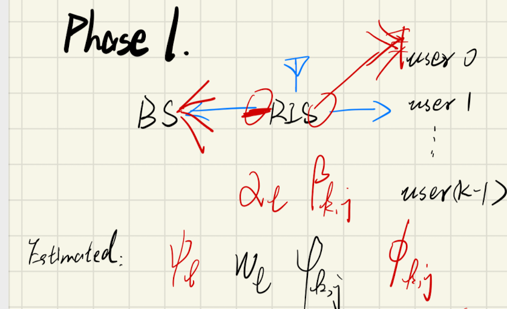

# Title:

# Abstract:

# Introduction:

# system model:

## A. System Architecture and signal model

​	考虑一个RIS辅助的多用户下行毫米波MIMO通信系统。该系统中BS装备有一个规模为$\sqrt{N} \times \sqrt{N}$的UPA天线阵列。RIS装备有规模为$\sqrt{M} \times \sqrt{M} $的UPA反射阵列。服务用户均为装备有$A$个天线的ULA接收端。将所考虑的时间段分为不同的传输帧（frame），就像图一所示的那样

需要注意的是，为了提高信道估计的精度，尤其是第一跳（hoop）的精度，RIS在UPA中心处安放一个单天线的传感器（sensor），该天线具有和RF chain 一样的射频处理能力。

​	在这篇文章中，用户相对于BS和RIS高速移动，会产生Doppler 频偏，因此需要进行频繁的CSI估计；然而考虑到BS和RIS相对静止，因此第一跳（First hoop）的信道相干时间明显大于第二跳（Second hoop），即RIS-user链路的信道相干时间。为了减轻用户移动性带来的多普勒效应而产生的性能下降，并降低信道估计开销，我们提出了一种“混合RIS双时间尺度”的信道估计协议。具体来讲，首先将每个Frame分为三个阶段（phase），第一阶段和第二阶段被部署在第一个传输帧（subframe）帧头，此时位于RIS的RF chain在帧头处于发射状态，发送导频信号到BS，从而获得第一跳的AoA，该导频信号同时被K个用户接收并估计用户端AoA；紧接着在第二阶段K个用户同时向BS发送正交导频信号，在已知级联信道中部分CSI的情况下进行级联信道估计；在余下的数据帧中由于BS-RIS link的信道相干时间较长，第一跳的CSI在此后$T_{R}$个数据帧中保持一致，在每一帧帧头只需要重新进行第二跳的多普勒补偿即可。

​	令$\mathbf{h}_{k} \in \mathbb{C}^{M \times A}$，$\mathbf{H} \in \mathbb{C}^{N \times M}$， 分别表示用户k到RIS的信道和RIS到BS的信道，令$\boldsymbol{\Phi}=[\phi_{1}, \cdots, \phi_{m}, \cdots, \phi_{M}]^T \in \mathbb{C}^{M\times 1}$ and $\phi_{m}=e^{j \theta_{m}}$表示RIS反射面的相移矩阵，其幅值始终保持单位一。另外，用${\bf H}_{rb} \in \mathbb{C}^{M\times 1}$表示从RIS单天线发射端到BS的信道矩阵。则BS在第一阶段接受到的BS导频信号为：
$$
\mathbf{y}_{rb}=\mathbf{H}_{rb}\mathbf{s}_{r}+\mathbf{n}_{rb}
$$
​	其中，$\mathbf{n}_{rb}$为AWGN噪声，$\mathbf{n}_{rb} \sim \mathcal{C} \mathcal{N}\left(\mathbf{0}, \sigma_{rb}^{2} \mathbf{I}_N\right)$，$\sigma_s$为噪声标准差。$\mathbf{s}_{r}\in \mathbb{C}^{1 \times \tau_{r}}$，为RIS处发射单元在phase 1 中的导频信号其中$s_{r,i} \in \{1,0\}$，且由于系统中只有一个RIS，$\tau_{r}=1$。

​	同时每个用户也接受到了来自RIS的导频信号，令$h_{r,k}\in \mathbb{C}^{1\times A}$表示用户k到RIS处单天线发射端的信道，则第$k$个用户处的接收信号$\mathbf{y}_{r,k}\in \mathbb{C}^{A\times \tau_{r,k}}$为：
$$
\mathbf{y}_{r,k}=\mathbf{h}^{H}_{r,k}\mathbf{s}_{r}+\mathbf{n}_{r,k}
$$
​	其中$\mathbf{n}_{rb}$为AWGN噪声

​	接着，我们假设在phase 2中K个用户同时向BS发射相同长度$\tau_{k,b}$的导频信号$\mathbf{s}_{k,b}\in \mathbb{C}^{A\times \tau_{k,b}}$，为了保证信号的正交性，$\tau_{k,b}\geq K$，则BS接收到的第k个用户的导频信号为$\mathbf{y}_{k,b}\in \mathbb{C}^{N\times\tau_{k,b}}$，
$$
[\mathbf{y}_{k,b}]_{:,t} = \mathbf{H}\operatorname{Diag}({\mathbf\Phi}_t)\mathbf{h}_k\sqrt{p}[\mathbf{s}_{k,b}]_{:,t}+\mathbf{n}_{k,b}
$$
​	级联信道信息可以表示为：${\mathbf G}_k=\{{\mathbf G}_{k,1}, {\mathbf G}_{k,2},\dots,{\mathbf G}_{k,M} \}$
$$
{\mathbf G}_{k,m}=[{\mathbf H}]_{[:,m]}[{\mathbf h}_{k}]_{[m,:]},\quad \forall m\in {1,\dots,M}
$$
从而，接收的导频信道可以进一步写为：
$$
[\mathbf{y}_{k,b}]_{:,t} =\left( \sum_{m=1}^M {\mathbf G}_{k,m}\phi_m \right) \sqrt{p}[\mathbf{s}_{k,b}]_{:,t}+\mathbf{n}_{k,b}
$$

​	在phase 3中，RIS处RF chain发射导频信号$\mathbf{s}_{d}\in\mathbb{C}^{1\times \tau_{r,k}}$，用于进行Doppler补偿。此时用户处的接收信号$\mathbf{y}_{d,k}\in \mathbb{C}^{A\times \tau_{r,k}}$为：
$$
\mathbf{y}_{d,k}=\mathbf{h}^{H}_{r,k}\mathbf{s}_{d}+\mathbf{n}_{r,k}
$$

## B. Channel model

由于BS、RIS、user均装备ULA，则构建空间毫米波信道模型[^2-2][^2-3]：
$$
\mathbf{H}=\sum_{l=1}^{L}\alpha_l\mathbf{a}_N(\psi^{\prime}_l)\mathbf{a}_M^H(\omega^{\prime}_l)\in \mathbb{C}^{N\times M}
$$

$$
\mathbf{h}_k= \sum_{j=1}^{J_k}\beta_{k,j}\mathbf{a}_M(\varphi^{\prime}_{k,j})\mathbf{a}_A^H(\phi^{\prime}_{k,j})\in \mathbb{C}^{M\times A}
$$

$$
\mathbf{H}_{rb} = \sum_{l=1}^{L}\alpha_l\mathbf{a}_N({\psi^{\prime}})\in \mathbb{C}^{N\times 1}
$$

$$
\mathbf{h}_{r,k} = \sum_{j=1}^{J_k}\beta_{k,j}\mathbf{a}_A(\phi^{\prime}_{k,j})\in \mathbb{C}^{A\times 1}
$$

其中，由于信道互易性[^1-5] ，同一链路中相同发射/接收端上行信道和下行信道中具有相同的AoA/AoD，因此定义中不再区分到达和离开，例如，上行信道中BS的AoA等于下行信道中的AoD，于是定义该角度为$\psi^{\prime}_l, \forall l \in \{1,2,\dots, L\}$。$L,J_k$分别表示信道$\mathbf{H},\mathbf{h}_k$中的多径数量。$\alpha_l,\beta_{k,j}$表示对应路径中的pathloss。$\mathbf{H}_{rb}, \mathbf{h}_{r,k}$表示当RIS发射端仅为单天线时的信道模型。需要注意的是，他们与$\mathbf{H},\mathbf{h}_k$共享同样的多径系数：$\psi^{\prime}_l, \phi_{k,j}$和对应的path loss：$\alpha_l,\beta_{k,j}$。这是因为RIS处的单天线发射端放置在RIS的几何中心，在大尺度的远场通信中和ULA的反射元件拥有相同的多径传播路径。利用该单天线的发射特性可以更加精确的估计单hop信道中的信道系数从而达到更精准的级联信道估计。

为简化阵列响应展开式，将ULA阵列响应统一写成以下形式[^2-2]:
$$
\mathbf{a}_{X}(x)=\left[1, e^{-\mathrm{i} 2 \pi x}, \ldots, e^{-\mathrm{i} 2 \pi(X-1) x}\right]^{\mathrm{T}}
$$
where $X \in\{M, N\}$ and $x \in\left\{\omega_{l}, \psi^{\prime}_{l}, \varphi_{k, j}\right\} . \omega_{l}=\frac{d_{\mathrm{RIS}}}{\lambda_{c}} \cos \left(\theta_{l}\right), \psi^{\prime}_{l}=\frac{d_{\mathrm{BS}}}{\lambda_{c}} \cos \left(\phi_{l}\right)$, and $\varphi_{k, j}=$ $\frac{d_{\mathrm{RIS}}}{\lambda_{c}} \cos \left(\vartheta_{k, j}\right)$ are the directional cosine with $\theta_{l}$ and $\phi_{l}$ denoting the $\mathrm{AoD}$ and AoA of the $l$-th spatial path from RIS to BS, respectively, and $\vartheta_{k, j}$ as the AoA of the $j$-th spatial path from user $k$ to RIS. $\lambda_{c}$ is the carrier wavelength. It should be emphasized here that the channel gains $\alpha_{l}$

$\psi_l$ $\omega_l$ $\varphi_{k,j}$ $\phi_{k,j}$ $J_k$ $\alpha_l$ $\beta_{k,j}$

$\color{red}\psi_{l}\ \omega_{l}\ \varphi_{k, j}\ \phi_{k, j}\ J_{k}\ \alpha_{l}\ \beta_{k, j}$ 

## C. Angular Domain Channel Expressions

根据[^1-5] 和中文-95，96，103，在MIMO mmwave系统中，

> 说明MIMO信道中存在角度域的稀疏性，相比传统的时域和频域具有更大的优势

以下写出$\mathbf{H},\mathbf{h}_k$以及$\mathbf{H}_{rb}, \mathbf{h}_{r,k}$的角域表达式
$$
{\mathbf H}={\mathbf A}_N{\mathbf {\mathbf A}{\mathbf A}_M^H}\in {\mathbb C}^{N\times M}
$$
其中：
$$
\begin{aligned}
\mathbf{A}_{N} &=\left[\mathbf{a}_{N}\left(\psi^{\prime}_{1}\right), \ldots, \mathbf{a}_{N}\left(\psi^{\prime}_{L}\right)\right] \in \mathbb{C}^{N \times L} \\
{\mathbf A} &=\operatorname{Diag}\left(\alpha_{1}, \alpha_{2}, \ldots, \alpha_{L}\right) \in \mathbb{C}^{L \times L} \\
\mathbf{A}_{M} &=\left[\mathbf{a}_{M}\left(\omega^{\prime}_{1}\right), \ldots, \mathbf{a}_{M}\left(\omega^{\prime}_{L}\right)\right] \in \mathbb{C}^{M \times L}
\end{aligned}
$$
${\mathbf h}_k$：
$$
\mathbf{h}_k = {\mathbf A}_{M,k}{ \mathbf B}_k{\mathbf A}_{A,k}^H\quad \forall k \in {\mathcal K}
$$

$$
\begin{aligned}
\mathbf{A}_{M, k} &=\left[\mathbf{a}_{M}\left(\varphi^{\prime}_{k, 1}\right), \ldots, \mathbf{a}_{M}\left(\varphi^{\prime}_{k, J_{k}}\right)\right] \in \mathbb{C}^{M \times J_{k}} \\
{\mathbf B}_{k} &=\operatorname{Diag}\left(\beta_{k, 1}, \ldots, \beta_{k, J_{k}}\right)\in \mathbb{C}^{J_{k} \times J_k}\\
\mathbf{A}_{A, k} &=\left[\mathbf{a}_{A}\left(\phi^{\prime}_{k, 1}\right), \ldots, \mathbf{a}_{A}\left(\phi^{\prime}_{k, J_{k}}\right)\right] \in \mathbb{C}^{A \times J_{k}} 

\end{aligned}
$$

$\mathbf{H}_{rb}$
$$
{\mathbf H}_{rb} ={\mathbf A}_N{\mathbf A_{rb}}\in \mathbb{C}^{N\times 1}\\
$$
where ${\mathbf A}_{rb}=[\alpha_{1}, \alpha_{2}, \ldots, \alpha_{L}]^T\in \mathbb{C}^{L\times 1}$

$\mathbf{h}_{r,k}$

$$
{\mathbf h }_{r,k}={\mathbf A}_{A,k}{\mathbf B}_{r,k}\in {\mathbb C}^{A\times 1}
$$
Where ${\mathbf B}_{r,k}=[\beta_{k,1},\dots,\beta_{k,J_k}]^T\in {\mathbb C}^{J_k \times 1}$

> 在没有进行角域分解之前，复杂度为：；角域分解之后，复杂度为：。。。

#### Lamma 1 

角域表达可以在DFT变换后显示稀疏性，离散角度阵列响应DFT的正交性

$$
\frac{d}{\lambda}\leq \frac{1}{2}
$$
且$\frac{d}{\lambda}$ 越大，角域分辨率越高，最终$\frac{d}{\lambda}= \frac{1}{2}$

且
$$
x_i\in [-0.5,0.5)\ 
$$
$x_i\in\{ \psi^{\prime}_l,\omega^{\prime}_l,\varphi^{\prime}_{k,j},\phi^{\prime}_{k,j} \}$

#### Lamma 2 
阵列响应角度规整后，能量达到极值

rotation angle 说明.power leak [^1-1] [^2-2]

定义一组特殊的离散AoA/AoD角度系数，以BS上行AoA/下行AoD为例：$\psi^{g}_{l}\in\{ 0-0.5,\dots,\frac{n-1}{N}-0.5, \dots,\frac{N-1}{N}-0.5 \}$ 。当且仅当$\psi_l^{\prime}=\psi_l^{g}$时，
$$
[{\mathbf A}_N^D]_{n,l}=
\begin{cases}
\sqrt{N}\quad &, n = n_l \\
0 &,others
\end{cases}\quad \forall l \ \in \ \{1,\dots,L \}
$$
此时${\mathbf A}_N^D$每一列仅有一个非零元素，并且$n_l,\psi_l^g$之间的映射关系为：
$$
\psi_l^g = 
\begin{cases}
\frac{n_l-1}{N}\quad &,\frac{n_l-1}{N} < 0.5 \\
\frac{n_l-1}{N}-1 &, \frac{n_l-1}{N}\geq 0.5
\end{cases}
$$
同时由于是一一映射，也可以反过来写为：
$$
n_l=
\begin{cases}
N\psi_l^g+1\quad &,0\leq \psi_l^g <0.5 \\
N\psi_l^g+N+1 &,-0.5\leq \psi_l^g <0

\end{cases}
$$
可以看到每一列的唯一非零元素的行索引互不相同，所以有推论：${\mathbf A}_N^D={\mathbf U}_N{\mathbf A}_N$为一个行稀疏、列满秩的矩阵，并且${\mathbf A}_N^{D}$每一列正交

#### Lamma 3 
级联估计时存在“权重畸变”效应，使得估计的显著角集合存在20dB左右的误差

结论：本文使用的分步估计具有更好的估计精度

# channel estimation

## A. channel estimation protical

|  |  |  |
| ------------------------------------------------------------ | ------------------------------------------------------------ | ------------------------------------------------------------ |
| Phase 1: broadcast                                           | Phase 2: cascade channel estimation                          | Phase 3: Doppler compensation                                |

Phase 1: broadcast

Phase1.1: broadcast to BS

Phase1.2: broadcast to user k

Phase 2: cascade channel estimation

Phase 3: Doppler compensation

## B. Partial Channel estimation

$$
\mathbf{y}_{rb}=\mathbf{H}_{rb}\mathbf{s}_{r}+\mathbf{n}_{rb}={\mathbf A}_N{\mathbf A}_{rb}{
\mathbf s}_{r} + {\mathbf n}_{rb}\in{\mathbb C}^{N\times 1}
$$

$$
{\mathbf U}_N{\mathbf y}_{rb}={\mathbf U}_N{\mathbf A}_N{\mathbf A}_{rb}{\mathbf s}_r +{\mathbf n}_{rb}
$$

其物理意义为$L$个path中对应的角域能量分布，其中${\mathbf A}_N=[{\mathbf a}_N(\psi^{\prime}_1),\dots,{\mathbf a}_N(\psi^{\prime}_L)]$，则：
$$
{\mathbf A}_N^{D}={\mathbf U}_N{\mathbf A}_N = [{\mathbf U}_N{\mathbf a}_N(\psi^{\prime}_1),\dots,{\mathbf U}_N{\mathbf a}_N(\psi^{\prime}_L)]
$$
根据Lamma 1,如果${\psi^{\prime}_L}$离散，且刚好分布在grid上，则${\mathbf U}_N{\mathbf a}_N(\psi^{\prime}_l)\ \forall l\in \{1,\dots,L\}$中只有一个元素

> 展开$\psi^{\prime}_L$的取值范围

因此， ${\mathbf U}_N{\mathbf A}_N\in {\mathbb C}^{N\times L}$为一个行稀疏、列满秩的矩阵。

但是，由于在实际系统当中，multi-path中的AoA/AoD分布是连续的，当$\psi^{\prime}_l$分布在离散集合之外时，此时的DFT操作会引起能量泄漏现象[^1-5][^2-2][^1-1][^2-3] 此时需要进行rotation操作，即在DFT操作之前乘以一个旋转向量${\Phi}_N({\triangle \psi^{\prime}}_l)$。
$$
\boldsymbol{\Phi}_{N}\left(\triangle \psi^{\prime}_{l}\right)=\operatorname{Diag}\left\{1, e^{\mathrm{i} \triangle \psi^{\prime}_{l}}, \ldots, e^{\mathrm{i}(N-1) \triangle \psi^{\prime}_{l}}\right\}, \forall l
$$
在进行DFT操作前先对每个阵列响应进行相位对齐(DFT and Rotation)：
$$
{\mathbf A}_N^{DR} = {\mathbf U}_N{\mathbf A}_N^R = [{\mathbf U}_N{\Phi}_N({\triangle \psi^{\prime}}_1){\mathbf a}_N(\psi^{\prime}_1),\dots,{\mathbf U}_N{\Phi}_N({\triangle \psi^{\prime}}_L){\mathbf a}_N(\psi^{\prime}_L)]
$$
Then，接收信号${\mathbf y}_{rb}$在已知$\hat{\psi^{\prime}_l}$和$\triangle \hat{\psi^{\prime}_l}$的情况下可以通过DFT和rotation变换得到${\mathbf y}_{rb}^{DR}$：
$$
{\mathbf y}_{rb}^{DR}={\mathbf A}_N^{DR}{\mathbf A}_{rb}{\mathbf s}_{r}+{\mathbf n}_{rb}\in {\mathbb C}^{N\times 1}
$$
此时，${\mathbf y}_{rb}^{DR}$就是path loss $\alpha_l$加权的${\mathbf U}_N{\Phi}_N({\triangle \psi^{\prime}}_l){\mathbf a}_N(\psi^{\prime}_l)$的线性组合，通过Lamma2 可知：
$$
[{\mathbf A}_N^{DR}]_{[:,l^{\prime}]}^H[{\mathbf A}_N^{DR}]_{[:,l]}=
\begin{cases}
N\quad ,l^{\prime}=l\\
0\quad ,others
\end{cases}
$$
进而：
$$
({\mathbf A}_N^{DR})^H{\mathbf A}_N^{DR} = N{\mathbf I}_L
$$
所以当${\mathbf s}_r=1\times \sqrt{p}\in{\mathbb R}$，即RIS处单天线发送单符号导频信号时，路损系数的估计值$\hat{{\mathbf A}}_{rb}$为：
$$
\begin{aligned}
\hat{\mathbf A}_{rb}&=\frac{1}{N\sqrt{p}}({\hat{\mathbf A}_{N}^{DR}})^{H}{\mathbf y}_{rb}^{DR}\\
&\approx \frac{1}{N\sqrt{p}}({{\mathbf A}_{N}^{DR}})^{H}{\mathbf A}_N^{DR}{\mathbf A}_{rb}{\mathbf s}_{r}\\
&={\mathbf A}_{rb}

\end{aligned}
$$

我们定义显著角集合$\Omega_N=\{n_l|\forall l\in \{1,\dots,\hat{L}\}\}$ 其中$n_l$表示第$l$个路径对应在BS处的AoA脚标，$\hat{L}$为系统在信道估计阶段取得的显著角个数，这里为了简化模型采用$\hat{L}= L$。

可以从上述过程中看到，虽然可以通过DFT和rotation两步操作将${\mathbf A}_N$分解为行稀疏列满秩矩阵。但是rotation操作需要事先得知所有${\psi^{\prime}}_l\ \forall l \in \{1,\dots ,L\}$的值，$\psi^{\prime}_l$ 的值可以通过$n_l$获知，获取$n_l$的过程被称为“显著角估计”[^1-5]。

> 目前已有在级联信道中显著角估计的方法，但是如Lamma 3所示，对级联信道直接估计显著角有“能量畸变”问题，于是我们在本文中分别估计单跳信道的显著角，这样使得估计精度增加。

具体来讲，我们通过power peak[^2-2][^2-3][^1-5] 来获知$\Omega_N$:
$$
\Omega_N = \{\Omega\ |\sum_{n_l\in \Omega}|| [{\mathbf U}_N]_{[n_l,:]}{\mathbf y}_{rb} ||^2 \geq \sum_{n_l\in\Omega^{\prime}} || [{\mathbf U}_N]_{[n_l,:]}{\mathbf y}_{rb} ||^2,\forall \Omega^{\prime}\subset{\mathcal N},|\Omega^{\prime}|=|\Omega|=L \}
$$
注意选取$n_l$时顺序排列：
$$
n_l-n_j
\begin{cases}
<0 \quad , l<j \\
>0 \quad , l>j
\end{cases}
$$
在角域表达中，每个$n_l$都对应一个离散的grid basis角$\psi_l^g$ [^1-1][^1-2][^1-3]：
$$
\psi_l^g =f(n_l)
$$
则给出$\triangle\psi^{\prime}_l$的定义：$\triangle \psi^{\prime}_l = \psi_l^g-\psi^{\prime}_l$，此时，$\psi^{\prime}_l$未知，但根据Lamma 2可知，$\psi_l^g$对应的DFT中相应频点能量最大，且$\triangle\psi^{\prime}_l$在范围$[-\pi/N,+\pi/N]$内，于是，$\triangle\psi^{\prime}_l$可由以下方法求得：
$$
\triangle \psi^{\prime}_{l}=\arg \max _{\triangle \psi^{\prime} \in\left[-\frac{\pi}{N}, \frac{\pi}{N}\right]}\left\|\left[\mathbf{U}_{N}\right]_{n_l, :} \boldsymbol{\Phi}_{N}(\triangle \psi^{\prime}) \mathbf{y}_{rb}\right\|^{2}
$$

> Algorithm 1

最终，通过在BS端接收的导频信号${\mathbf y}_{rb}$可以估计出基站侧上行AoA（or 下行AoD）$\psi^{\prime}_l$以及多径衰落系数${\mathbf A}_{rb}$ 

同理，用户侧也在接收RIS端发射的导频信号${\mathbf y}_{r,k}$，此时将k-th用户当作是BS则可以估计得到用户侧上行AoD（or 下行AoA）$\phi_{k,j}$以及多径衰落系数${\mathbf B}_{r,k}$

## C. Cascade Channel estimation

inspired by[^2-3] ,在phase 2中通过用户向BS发送的导频信号估计RIS处的上行AoD（or 下行AoA）$\omega_l$和上行AoA（or 下行AoD）$\phi_{k,j}$

BS接收到k-th用户的发送导频信号为
$$
[\mathbf{y}_{k,b}]_{:,t} =\left( \sum_{m=1}^M {\mathbf G}_{k,m}\phi_m \right) \sqrt{p}[\mathbf{s}_{k,b}]_{:,t}+\mathbf{n}_{k,b}
$$
根据[^1-5] 在设计k-th用户的导频信号${\mathbf s}_{k,b}\in {\mathbb C}^{A\times \tau_{k,b}}$时可以根据Phase 1中获知的用户端上行AoD$\phi_{k,j}$ 将发射能量集中到显著角集合$\Omega_{A,k}$中，使得RIS端接收的导频信号质量更好。

## D. Doppler compensation for the second hoop

# Simulation

# Conclusion

# Appendix

## Appendix A

## Appendix B

## Appendix C

目前已经有工作对于RIS辅助mmwave通信系统的角域级联信道估计[^2-2][^2-3]。但是在级联信道中估计BS端显著角的过程中，使用power peak的估计方式会带来“显著角权重畸变”效应。For simplicity， 我们在证明畸变效应时采用单天线用户，且发送序列长度为1，i.e.,$s\in {\mathbb C}$，并且RIS反射原件上的反射系数均为单位一，i.e.，${\mathbf \Phi }={\mathbf I}_M $，即k-th用户到RIS的上行信道${\mathbf h}_{k}^{s}$为：
$$
{\mathbf h}_{k}^{s}={\mathbf A}_{M,k}{\mathbf B}_k
$$
where ${\mathbf A}_{M,k} = [{\mathbf a}_M(\phi_{l}^{\prime})]$

具体来讲，在phase2中BS端接收到的导频信号为：
$$
{\mathbf y}_{k,b}^s=\underbrace{{\mathbf A}_N}_{\mathrm{part}\ 1 }{\mathbf A}\underbrace{{\mathbf A}_{M}^H \operatorname{Diag}({\mathbf A}_{M,k}{\mathbf B}_{k}){\mathbf I}_M{s}}_{\text{part}\ 2}+{\mathbf n}
$$
令${\mathbf \Delta_k}\in {\mathbb C}^{L\times 1}$表示part 2：
$$
\begin{aligned}
{\mathbf \Delta}_k&={\mathbf A}_M^H \operatorname{Diag}({\mathbf A}_{M,k}{\mathbf B}_{k}){\mathbf I}_M{s} \\
&={\mathbf A}_M^H{\mathbf A}_{M,k}{\mathbf B}_k\\
&=
\left[
\begin{matrix}
{\mathbf a}_M^H(\omega^{\prime}_1)\\
\vdots\\
{\mathbf a}_M^H(\omega^{\prime}_L)
\end{matrix}
\right]
\cdot

\underbrace{\left[
\sum_{j=1}^{J_k}\beta_j{\mathbf a}_N(\varphi^{\prime}_{k,j})
\right]}_{\text {part} \ 3}

\end{aligned}
$$
令${\mathbf a}_M^{\prime}\in {\mathbb C}^{M\times 1}$表示$\text{part}\ 3$：
$$
{\mathbf \Delta}_k=
\left[
\begin{matrix}
{\mathbf a}_M^H(\omega_1)\cdot{\mathbf a}_M^{\prime}\\
\vdots \\
{\mathbf a}_M^H(\omega_L)\cdot{\mathbf a}_M^{\prime}
\end{matrix}
\right]
$$
可以看到，${\mathbf \Delta}_k$中的第l个元素${\mathbf \Delta}_{k,l}={\mathbf a}_M^H(\omega_l)\cdot{\mathbf a}_M^{\prime}\in {\mathbb C}$ 。所以，最终在BS端接收到第用户发射导频信号${\mathbf y}_{k,b}^s$可以被写为：
$$
\begin{aligned}
{\mathbf y}_{k,b}^s&={\mathbf A}_N{\mathbf A}{\mathbf \Delta}_k+{\mathbf n}\\
&=\sum_{l=1}^L\alpha_l{\Delta}_{k,l}{\mathbf a}_N(\psi_l)
\end{aligned}
$$
可以很清楚的看到，原本l-th path的幅度权重$\alpha_l$变成了经过畸变的$\alpha_l{\Delta}_{{k,l}}$，进而在进行级联信道的显著角估计时，会错误估计能量最集中的角度分量，所估计出的$\hat{\Omega}_{N}(\psi)$不准确。

接下来我们分析级联信道中能量畸变的数量级；具体来讲，${\mathbf \Delta}_{k,l}$可以近似看作是两个不同角的$M$天线阵列响应内积，下图展示了$M=64$时${\mathbf \Delta}_{k,l}$的值随着两个角度误差${\delta}$的变化而变化的趋势

可以看到，在级联信道当中，$\alpha_l/\alpha_{l^{\prime}}$和$\frac{\alpha_l{\Delta}_{{k,l}}}{\alpha_{l^{\prime}}{\Delta}_{{k,{l}^{\prime}}}}$之间存在着0~40db左右的误差，

# Reference

[^1-1]: Angular-domain selective channel tracking and doppler compensation for high-mobility mmWave massive MIMO
[^1-2]: Cloud-Assisted Cooperative Localization for Vehicle Platoons: A Turbo Approach
[^1-3]: FDD Massive MIMO Channel Estimation With Arbitrary 2D-Array Geometry
[^1-5]: Virtual Angular-Domain Channel Estimation for FDD Based Massive MIMO Systems With
Partial Orthogonal Pilot Design

[^2-3]: Channel Estimation for IRS-Assisted Millimeter-Wave MIMO Systems：Sparsity-Inspired Approaches
[^2-2]: Channel Estimation for RIS-Aided Multiuser Millimeter-Wave Massive MIMO Systems

