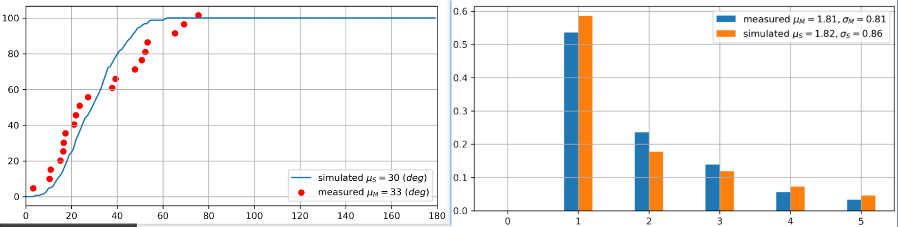

# Title: Turbo-VBI-based Channel Acquization in Single-Antanna assisted RIS system

# Abstract:

提出一种新的硬件架构：单天线辅助的可重构智能表面（Single-Antanna assisted Reconfigurable Intelligent Surface, SA-RIS）。

设计了针对SA-RIS的信道信息获取协议。

采用角域信道建模，对协议各个阶段进行分析。

提出了一种适用于SA-RIS系统中基于VBI和MP的低复杂度信道估计算法。

# Part 1: Introduction:

> 介绍背景
>
> 1. RIS发展背景
> 2. 传统RIS中的信道估计问题

> 介绍RIS信道估计
>
> 1. active RIS信道估计
>    1. 优点：估计精度高，协议设计简单
>    2. 缺点：需要在RIS上安装大量射频链路，与RIS的设计初衷违背
> 2. passive RIS信道估计
>    1. 优点：硬件结构简单
>    2. 缺点：算法设计复杂，计算复杂度较高，估计精度较差

针对上述两种RIS架构，我们提出了一种综合两种优势的SA-RIS架构

通过单天线广播，在开始时可以获知很多级联信道中的信道信息[^AngularEstimation]，

> 介绍算法背景
>
> 1. 传统算法
>    1. 单纯的MP[^pure-MP][^pure-MP-2]
>    2. OMP[^PanCunhua]
> 2. 新型算法(还没有在RIS系统中得到应用)
>    1. T-VBI
>       1. ChannelTracking-[^AngularDomain] [^RobustRecovery][^DynamicSparsity]
>    2. Factor Graph
>       1. basic[^FactorGraph]
>    3. Three layer HMM隐马尔可夫模型
>       1. proposed[^RobustRecovery]

为了达到更高的估计精度，我们将角域中的AoA/AoD基于Grid的角偏移量通过DFT公示纳入考虑[^SpectralCS]

## Contribution:

1. 提出一种新的架构：SA-RIS
2. 针对SA-RIS提出适合的信道估计协议
3. 针对级联信道估计问题设计SA-RIS中的低复杂度信道估计算法

# Part 2: SYSTEM MODEL

Fig. 1

## A. SA-RIS-Assisted Multiuser MIMO system

​    考虑一个RIS辅助的多用户上行毫米波MIMO通信系统，如图1所示。该系统中BS装备有一个规模为$N \times 1$的ULA天线阵列。RIS装备有规模为$M\times 1$的UPA反射阵列。服务用户均为装备有$A$个天线的ULA接收端。

​     目前已经有许多工作研究在RIS上部署RF阵列【】或是直接在RIS的每个反射原件之后连接一个射频处理模块【】以进行BS-RIS link 以及RIS-user link的更好的估计。但是，这和RIS诞生之初减少能耗、降低成本的初衷相违背。因此，在RIS上部署大规模射频链路和信号处理单元在实际中并不可行。同时，许多工作对pure passive RIS辅助的级联信道估计的算法都具有较高的复杂度[^pure-MP][^PanCunhua][^pure-MP-2]。

​    因此，本文提出了一种在不显著提高硬件和能耗成本的前提下，显著降低RIS辅助无线通信系统级联信道估计难度的hardware-boost 框架——SA-RIS

​	SA-RIS在RIS阵列的几何中心处安放一个单天线发射机。该发射机可以向BS和所有用户进行广播。同时由于该天线所处位置为RIS阵列几何中心，由SA-RIS发出的到达收端的信号可以看作是经历了级联信道中相同的传播路径和多径条件。因此可以通过适当的帧结构设计，通过第一阶段广播通过角域信道估计手段[^AngularEstimation]得知部分级联信道中的信息（component），从而降低级联信道估计维度，提高估计精度。

​	显然，和【】中提出的active RIS相比，由于只有一个射频链路，SA-RIS的硬件成本大大降低。同时，和pure passive RIS相比，由于可以在级联信道估计阶段之前就提前预知一部分信道信息，估计算法的复杂度得以降低，同时估计精度得到提升。

​	令$\mathbf{h}_{k} \in \mathbb{C}^{M \times A}$，$\mathbf{H} \in \mathbb{C}^{N \times M}$， 分别表示用户k到RIS的信道和RIS到BS的信道，令$\boldsymbol{\Phi}=[\phi_{1}, \cdots, \phi_{m}, \cdots, \phi_{M}]^T \in \mathbb{C}^{M\times 1}$ and $\phi_{m}=e^{j \theta_{m}}$表示RIS反射面的相移矩阵，其幅值始终保持单位一。另外，用${\bf H}_{rb} \in \mathbb{C}^{M\times 1}$表示从RIS单天线发射端到BS的信道矩阵。则BS接受到的来自RIS的导频信号$\mathbf{y}_{rb}$为：
$$
\mathbf{y}_{rb}=\mathbf{H}_{rb}\mathbf{s}_{r}+\mathbf{n}_{rb}
$$
​	其中，$\mathbf{n}_{rb}$为AWGN噪声，$\mathbf{n}_{rb} \sim \mathcal{C} \mathcal{N}\left(\mathbf{0}, \sigma_{rb}^{2} \mathbf{I}_N\right)$，$\sigma_s$为噪声标准差。$\mathbf{s}_{r}\in \mathbb{C}^{1 \times \tau_{r}}$，为RIS处发射单元在phase 1 中的导频信号其中$s_{r,i} \in \{1,0\}$，且由于系统中只有一个RIS，$\tau_{r}=1$。

​	同时，令$h_{r,k}\in \mathbb{C}^{1\times A}$表示用户k到SA-RIS处单天线发射端的信道，表示，则第$k$个用户处的接收信号$\mathbf{y}_{r,k}\in \mathbb{C}^{A\times \tau_{r,k}}$为：
$$
\mathbf{y}_{r,k}=\mathbf{h}^{H}_{r,k}\mathbf{s}_{r}+\mathbf{n}_{r,k}
$$
​	其中$\mathbf{n}_{rb}$为AWGN噪声

​	接着，我们假设个用户依次向BS发射相同长度$\tau_{k,b}$的导频信号$\mathbf{s}_{k,b}\in \mathbb{C}^{A\times \tau_{k,b}}$，则BS接收到的第k个用户的导频信号为$\mathbf{y}_{k,b}\in \mathbb{C}^{N\times\tau_{k,b}}$，
$$
[\mathbf{y}_{k,b}]_{:,t} = \mathbf{H}\operatorname{Diag}({\mathbf\Phi}_t)\mathbf{h}_k\sqrt{p}[\mathbf{s}_{k,b}]_{:,t}+\mathbf{n}_{k,b}
$$

## B. Channel model

根据3-D SV模型，构建毫米波信道模型[^PanCunhua-2][^PanCunhua]:
$$
\begin{aligned}
\mathbf{H}=\sum_{l=1}^{L}\alpha_l\mathbf{a}_N(\psi^{\prime}_l)\mathbf{a}_M^H(\omega^{\prime}_l)\in \mathbb{C}^{N\times M} \\

\mathbf{h}_k= \sum_{j=1}^{J_k}\beta_{k,j}\mathbf{a}_M(\varphi^{\prime}_{k,j})\mathbf{a}_A^H(\phi^{\prime}_{k,j})\in \mathbb{C}^{M\times A}\\

\mathbf{H}_{rb} = \sum_{l=1}^{L}\alpha_l\mathbf{a}_N({\psi^{\prime}})\in \mathbb{C}^{N\times 1}\\

\mathbf{h}_{r,k} = \sum_{j=1}^{J_k}\beta_{k,j}\mathbf{a}_A(\phi^{\prime}_{k,j})\in \mathbb{C}^{A\times 1}
\end{aligned}
$$
根据信道互异性[^AngularEstimation]，同一链路中相同发射/接收端上行信道和下行信道中具有相同的AoA/AoD，因此定义中不再区分到达和离开，例如，上行信道中BS的AoA等于下行信道中的AoD，于是定义该角度为$\psi^{\prime}_l, \forall l \in \{1,2,\dots, L\}$。$L,J_k$分别表示信道$\mathbf{H},\mathbf{h}_k$中的多径数量。$\alpha_l,\beta_{k,j}$表示对应路径中的pathloss。$\mathbf{H}_{rb}, \mathbf{h}_{r,k}$表示当RIS发射端仅为单天线时的信道模型。需要注意的是，他们与$\mathbf{H},\mathbf{h}_k$共享同样的多径系数：$\psi^{\prime}_l, \phi^{\prime}_{k,j}$和对应的path loss：$\alpha_l,\beta_{k,j}$。这是因为RIS处的单天线发射端放置在RIS的几何中心，在大尺度的远场通信中和ULA的反射元件拥有相同的多径传播路径。利用该单天线的发射特性可以更加精确的估计单hop信道中的信道系数从而达到更精准的级联信道估计。

为简化阵列响应展开式，将ULA阵列响应统一写成以下形式[^PanCunhua]:
$$
\mathbf{a}_{X}(x)=\left[1, e^{-\mathrm{i} 2 \pi x}, \ldots, e^{-\mathrm{i} 2 \pi(X-1) x}\right]^{\mathrm{T}}
$$
where $X \in\{M, N\}$ and $x \in\{\psi_l,\omega_l,\varphi_{k,j},\phi_{j,k} \}$, $\psi_l = \frac{d_\text{RIS}}{\lambda_c}\operatorname{cos}(\psi_l^{\prime})$.and $\varphi_{k, j}=$ $\frac{d_{\mathrm{RIS}}}{\lambda_{c}} \cos \left(\vartheta_{k, j}\right)$ are the directional cosine with $\theta_{l}$ and $\phi_{l}$ denoting the $\mathrm{AoD}$ and AoA of the $l$-th spatial path from RIS to BS, respectively, and $\vartheta_{k, j}$ as the AoA of the $j$-th spatial path from user $k$ to RIS. $\lambda_{c}$ is the carrier wavelength. It should be emphasized here that the channel gains $\alpha_{l}$

## C. Angular Domain Channel Expressions

根据[^AngularEstimation] 和文中-95，96，103，在MIMO mmwave系统中，信道中存在角度域的稀疏性，相比传统的时域和频域具有更大的优势。

> 基于角度域稀疏性的大规模MIMO系统关键技术研究-清华大学-赵培尧
>
> 1.1.3 大规模MIMO系统无线信道角度域稀疏性
>
> 大规模MIMO系统所面临的训练开销过大、复杂度与功耗过高等技术挑战主要源于基站配备的大规模天线阵列。现有研究表明，无论是传统低频频段还是毫米波频段，大规模MIMO系统无线信道在角度域均具有较强的稀疏
>
> 8
>
> √
>
> *N N*cl ray
>
> 第1章 引言
>
> 性[68,82,95–100]。大规模MIMO系统无线信道角度域稀疏性使得信道的有效自由度远小于天线维度，因而能够大大降低信号处理的复杂度与开销。目前这一特性已被 应用在信道估计[97,98]和信道反馈[99,100]等领域，其中大部分工作均基于压缩感知 (Compressive Sensing，CS)理论框架。

以下写出$\mathbf{H},\mathbf{h}_k$以及$\mathbf{H}_{rb}, \mathbf{h}_{r,k}$的角域表达式：
$$
\begin{aligned}
{\mathbf H}&={\mathbf A}_N{\mathbf {\mathbf A}{\mathbf A}_M^H}\in {\mathbb C}^{N\times M}\\

\mathbf{h}_k &= {\mathbf A}_{M,k}{ \mathbf B}_k{\mathbf A}_{A,k}^H\in \mathbb{C}^{1\times A}\quad \forall k \in {\mathcal K}\\

{\mathbf H}_{rb} &={\mathbf A}_N{\mathbf A_{rb}}\in \mathbb{C}^{N\times 1}\\

{\mathbf h }_{r,k} &={\mathbf A}_{A,k}{\mathbf B}_{r,k}\in {\mathbb C}^{A\times 1}
\end{aligned}
$$
其中
$$
\begin{aligned}
\mathbf{A}_{N} &=\left[\mathbf{a}_{N}\left(\psi^{\prime}_{1}\right), \ldots, \mathbf{a}_{N}\left(\psi^{\prime}_{L}\right)\right] \in \mathbb{C}^{N \times L} \\
{\mathbf A} &=\operatorname{Diag}\left(\alpha_{1}, \alpha_{2}, \ldots, \alpha_{L}\right) \in \mathbb{C}^{L \times L} \\
\mathbf{A}_{M} &=\left[\mathbf{a}_{M}\left(\omega^{\prime}_{1}\right), \ldots, \mathbf{a}_{M}\left(\omega^{\prime}_{L}\right)\right] \in \mathbb{C}^{M \times L}
\end{aligned}
$$

$$
\begin{aligned}
\mathbf{A}_{M, k} &=\left[\mathbf{a}_{M}\left(\varphi^{\prime}_{k, 1}\right), \ldots, \mathbf{a}_{M}\left(\varphi^{\prime}_{k, J_{k}}\right)\right] \in \mathbb{C}^{M \times J_{k}} \\
{\mathbf B}_{k} &=\operatorname{Diag}\left(\beta_{k, 1}, \ldots, \beta_{k, J_{k}}\right)\in \mathbb{C}^{J_{k} \times J_k}\\
\mathbf{A}_{A, k} &=\left[\mathbf{a}_{A}\left(\phi^{\prime}_{k, 1}\right), \ldots, \mathbf{a}_{A}\left(\phi^{\prime}_{k, J_{k}}\right)\right] \in \mathbb{C}^{A \times J_{k}} 

\end{aligned}
$$

where ${\mathbf A}_{rb}=[\alpha_{1}, \alpha_{2}, \ldots, \alpha_{L}]^T\in \mathbb{C}^{L\times 1}$, ${\mathbf B}_{r,k}=[\beta_{k,1},\dots,\beta_{k,J_k}]^T\in {\mathbb C}^{J_k \times 1}$

在没有进行角域分解之前，复杂度为：；角域分解之后，复杂度为：。。。

#### Remark 1 

角域表达可以在DFT变换后显示稀疏性，离散角度阵列响应DFT的正交性

$$
\frac{d}{\lambda}\leq \frac{1}{2}
$$
且$\frac{d}{\lambda}$ 越大，角域分辨率越高，最终$\frac{d}{\lambda}= \frac{1}{2}$

且
$$
x_i\in [-0.5,0.5)
$$
$x_i\in\{ \psi^{\prime}_l,\omega^{\prime}_l,\varphi^{\prime}_{k,j},\phi^{\prime}_{k,j} \}$

#### Remark 2 

阵列响应角度规整后，能量达到极值

rotation angle 说明.power leak [^AngularDomain] [^PanCunhua]

定义一组特殊的离散AoA/AoD角度系数，以BS上行AoA/下行AoD为例：$\psi^{g}_{l}\in\{ 0-0.5,\dots,\frac{n-1}{N}-0.5, \dots,\frac{N-1}{N}-0.5 \}$ 。当且仅当$\psi_l^{\prime}=\psi_l^{g}$时，
$$
[{\mathbf A}_N^D]_{n,l}=
\begin{cases}
\sqrt{N}\quad &, n = n_l \\
0 &,others
\end{cases}\quad \forall l \ \in \ \{1,\dots,L \}
$$
此时${\mathbf A}_N^D$每一列仅有一个非零元素，并且$n_l,\psi_l^g$之间的映射关系为：
$$
{\psi}_l^g=\frac{n_l-1}{N}-0.5
$$

$$
\psi_l^g = 
\begin{cases}
\frac{n_l-1}{N}\quad &,\frac{n_l-1}{N} < 0.5 \\
\frac{n_l-1}{N}-1 &, \frac{n_l-1}{N}\geq 0.5
\end{cases}
$$

同时由于是一一映射，也可以反过来写为：
$$
n_l = N(\psi^g_l+0.5)+1
$$

$$
n_l=
\begin{cases}
N\psi_l^g+1\quad &,0\leq \psi_l^g <0.5 \\
N\psi_l^g+N+1 &,-0.5\leq \psi_l^g <0

\end{cases}
$$
可以看到每一列的唯一非零元素的行索引互不相同，所以有推论：${\mathbf A}_N^D={\mathbf U}_N{\mathbf A}_N$为一个行稀疏、列满秩的矩阵，并且${\mathbf A}_N^{D}$每一列正交

#### Remark 3 

级联估计时存在“权重畸变”效应，使得估计的显著角集合存在20dB左右的误差

结论：本文使用的分步估计具有更好的估计精度

# Part 3: Channel Estimation

## A. channel estimation Frame Design

Fig. 2

​	BS和RIS一般部署在建筑物表面，收遮挡不明显，且无相对移动，所以信道相关时间较长[^pure-MP][^pure-MP-2]。然而，RIS-User链路受到遮挡和用户移动性影响较大，改变幅度较大，改变速度较快。针对本文提出的SA-RIS，我们提出了一种混合时间尺度的帧结构设计，以充分利用BS-RIS的慢衰落特性。具体来讲，该帧结构设计分为三个阶段：第一阶段的广播（Broadcast）、第二阶段的级联信道估计和第三阶段的RIS-User信道校准。

（a）Phase 1: Broadcast

​	第一阶段的广播中，RIS向所有用户（包括BS）发射导频信号$\mathbf{s}_{r}\in \mathbb{C}^{1 \times \tau_{r}}$,其中$s_{r,i} \in \{1,0\}$。通过Part 3 B[^AngularEstimation] 中的角域信道估计方法，可以直接得到BS处上行AoA显著角以及对应显著角的Path loss，从而得到$\mathbf{A}_N,\mathbf{A}_{A,k},\forall k \in \mathcal{K}$和$\mathbf{A}, \mathbf{B}_k,\forall k \in \mathcal{K}$，注意到，该阶段只在每个Frame的开头进行估计。

（b）Phase 2：Cascade Channel Estimation

​    由于SA-RIS只具备单天线，所以通过正常手段无法估计出上行信道中RIS的AoA $\boldsymbol{\omega}$和AoD $\boldsymbol{\varphi}$。然而，根据Phase1中所得到的Partial CSI我们可以将问题formulate为一个参数未知的压缩感知问题[^RobustRecovery]。但是，传统压缩感知问题无法。。。【】所以我们提出了双时间尺度的VBI-EM算法。在Phase 2 完成之后，系统就可以获得本时刻的瞬时CSI。

（c）Phase 3：Channel Tracking

​	考虑到在Phase 2 中已经获得了全部的信道信息，并且BS-RIS衰落较慢，则本部分的Channel Tracking只针对RIS-User链路的未知信道信息。由于BS-RIS链路信息已知，本部分算法复杂度将会极低。

## B. Partial Channel estimation

​	该部分考虑Phase1中的部分信道信息估计，利用SA-RIS处部署的单天线设备，可以精准获知$\mathbf{A}_N,\mathbf{A}_{A,k},\forall k \in \mathcal{K}$和$\mathbf{A}, \mathbf{B}_k,\forall k \in \mathcal{K}$ 。

​	RIS处发射导频信号，并被基站接收到，其信号模型可被表示为：
$$
\mathbf{y}_{rb}=\mathbf{H}_{rb}\mathbf{s}_{r}+\mathbf{n}_{rb}={\mathbf A}_N{\mathbf A}_{rb}{
\mathbf s}_{r} + {\mathbf n}_{rb}\in{\mathbb C}^{N\times 1}
$$
​	对其两边同时做DFT变换可以得到：
$$
{\mathbf U}_N{\mathbf y}_{rb}={\mathbf U}_N{\mathbf A}_N{\mathbf A}_{rb}{\mathbf s}_r +{\mathbf U}_N{\mathbf n}_{rb}
$$
​	其物理意义为$L$个path中对应的角域能量分布，其中${\mathbf A}_N=[{\mathbf a}_N(\psi_1),\dots,{\mathbf a}_N(\psi_L)]$，则：
$$
{\mathbf A}_N^{D}={\mathbf U}_N{\mathbf A}_N = [{\mathbf U}_N{\mathbf a}_N(\psi_1),\dots,{\mathbf U}_N{\mathbf a}_N(\psi_L)]
$$
​	我们定义显著角集合$\Omega_N=\{n_l|\forall l\in \{1,\dots,\hat{L}\}\}$ 其中$n_l$表示第$l$个路径对应在BS处的AoA脚标，$\hat{L}$为系统在信道估计阶段取得的显著角个数，这里为了简化模型采用$\hat{L}= L$。可以从上述过程中看到，虽然可以通过DFT和rotation两步操作将${\mathbf A}_N$分解为行稀疏列满秩矩阵。但是rotation操作需要事先得知所有${\psi^{\prime}}_l\ \forall l \in \{1,\dots ,L\}$的值，$\psi^{\prime}_l$ 的值可以通过$n_l$获知，获取$n_l$的过程被称为“显著角估计”[^AngularEstimation]

> 目前已有在级联信道中显著角估计的方法，但是如Lamma 3所示，对级联信道直接估计显著角有“显著角畸变”问题，于是我们在本文中分别估计单跳信道的显著角，这样使得估计精度增加。

​	具体来讲，我们通过寻找power peak[^PanCunhua-2][^PanCunhua-2][^AngularEstimation] 来获知$\Omega_N$:
$$
\Omega_N = \{\Omega\ |\sum_{n_l\in \Omega}|| [{\mathbf U}_N]_{[n_l,:]}{\mathbf y}_{rb} ||^2 \geq \sum_{n_l\in\Omega^{\prime}} || [{\mathbf U}_N]_{[n_l,:]}{\mathbf y}_{rb} ||^2,\forall \Omega^{\prime}\subset{\mathcal N},|\Omega^{\prime}|=|\Omega|=L \}
$$
注意选取$n_l$时的顺序排列：
$$
n_l-n_j
\begin{cases}
<0 \quad , l<j \\
>0 \quad , l>j
\end{cases}
$$
在角域表达中，每个$n_l$都对应一个离散的grid basis角$\psi_l^g$ [^AngularDomain][^CLoudAssisted][^FDD]：
$$
\psi_l^g =f(n_l)
$$
​	但是，由于在实际系统当中，multi-path中的AoA/AoD分布是连续的，当$\psi^{\prime}_l$分布在离散集合之外时，此时的DFT操作会引起能量泄漏现象[^AngularEstimation][^PanCunhua][^AngularDomain][^PanCunhua-2]。所以需要定义rotation angle 以描述真实角度与grid偏离的角度。

​	则给出$\triangle\psi^{\prime}_l$的定义：$\triangle \psi_l = \psi_l^g-\psi_l$，此时，$\psi$未知，但根据Lamma 2可知，$\psi_l^g$对应的DFT中相应频点能量最大，且$\triangle\psi_l$在范围$[-\pi/N,+\pi/N]$内，于是，$\triangle\psi^{\prime}_l$可由以下方法求得：
$$
\triangle \hat{\psi}_{l}=\arg \max _{\triangle \psi \in\left[-\frac{\pi}{N}, \frac{\pi}{N}\right]}\left\|\left[\mathbf{U}_{N}\right]_{n_l, :} \boldsymbol{\Phi}_{N}(\triangle \psi) \mathbf{y}_{rb}\right\|^{2}
$$
​	由此，结合显著角估计，可以得到上行BS处AoA估计$\hat{\psi}_l = \psi_l^g+\Delta \hat{\psi}_l$ 其中，$\mathbf{\Phi}_N \in \mathbb{C}^{N\times N}$ 为rotation矩阵：
$$
\boldsymbol{\Phi}_{N}\left(\triangle \psi\right)=\operatorname{Diag}\left\{1, e^{\mathrm{i} \triangle \psi}, \ldots, e^{\mathrm{i}(N-1) \triangle \psi}\right\}
$$
​	当${\mathbf s}_r=1\times \sqrt{p}\in{\mathbb R}$，即RIS处单天线发送单符号导频信号时，路损系数的估计值$\hat{{\mathbf A}}_{rb}$为：
$$
\begin{aligned}
\hat{\mathbf A}_{rb}&=\frac{1}{N\sqrt{p}}({\hat{\mathbf A}_{N}^{D}})^{H}{\mathbf y}_{rb}^{D}\\
&= \frac{1}{N\sqrt{p}}({{\mathbf A}_{N}^{D}})^{H}{\mathbf A}_N^{D}{\mathbf A}_{rb}{\mathbf s}_{r}\\

&\approx \frac{1}{N\sqrt{p}}N\mathbf{I}_N\mathbf{A}_{rb}\sqrt{p}\\
&={\mathbf A}_{rb}

\end{aligned}
$$
最终，通过在BS端接收的导频信号${\mathbf y}_{rb}$可以估计出基站侧上行AoA（or 下行AoD）$\psi_l$以及多径衰落系数${\mathbf A}_{rb}$ 

同理，用户侧也在接收RIS端发射的导频信号${\mathbf y}_{r,k}$，此时将k-th用户当作是BS则可以估计得到用户侧上行AoD（or 下行AoA）$\phi_{k,j}$以及多径衰落系数${\mathbf B}_{r,k}$

## C. Cascade Channel estimation

在phase 2中通过用户向BS发送的导频信号估计RIS处的上行AoD（or 下行AoA）$\omega_l$和上行AoA（or 下行AoD）$\varphi_{k,j}$，所有用户依次向BS发送上行导频信号，则BS端接收到$k$-th用户发送的$t$-th导频信号的信号表达为：
$$
\left[{\mathbf y}_{k,b} \right]_{:,t} ={\mathbf A}_N{\mathbf A}{\mathbf A}_M^H{\mathbf \Phi}_t{\mathbf A}_{M,k}{\mathbf B}_k{\mathbf A}_{A,k}^H\sqrt{p}[{\mathbf s_{k,b}}]_{:,t}+{\mathbf n}^b_{k,t}
$$
根据[^AngularEstimation][^AngularDomain]，在设计$k$-th用户的导频信号${\mathbf s}_{k,b}\in {\mathbb C}^{A\times \tau_{k,b}}$时，可以根据Phase 1中获知的用户端上行AoD$\phi_{k,j}$ 将发射能量集中到显著角集合$\Omega_{A,k}$中，使得RIS端接收的导频信号质量更好。

​	通过使用Phase1中获知的Partial CSI，可以将接收信号表达式化简为：
$$
\begin{aligned}
\frac{1}{\sqrt{p} N } \hat{{\mathbf A}}_N^H \left[{\mathbf y}_{k,b} \right]_{:,t} &\approx{\mathbf I}_L {\mathbf A}{\mathbf A}_M^H{\mathbf \Phi}_t{\mathbf A}_{M,k}{\mathbf B}_k{\mathbf A}_{A,k}^H[{\mathbf{s}_{k,b}}]_{:,t} + \frac{1}{\sqrt{p} N } \hat{{\mathbf A}}_N^H {\mathbf n}^b_{k,t}\\
\frac{1}{\sqrt{p} N }{\mathbf A}^{-1} \hat{{\mathbf A}}_N^H \left[{\mathbf y}_{k,b} \right]_{:,t} &\approx{\mathbf A}_M^H{\mathbf \Phi}_t{\mathbf A}_{M,k}\underbrace{{\mathbf B}_k{\mathbf A}_{A,k}^H[{\mathbf{s}_{k,b}}]_{:,t}}_{\text{part 1}} + \frac{1}{\sqrt{p} N } {\mathbf A}^{-1} \hat{{\mathbf A}}_N^H {\mathbf n}^b_{k,t}
\end{aligned}
$$
​	接下来介绍上行导频信号设计，从上面的公式可以看到，此时信道中的未知量已经只剩下上行信道中的RISAoD($\{ {\omega_1}, \dots,\omega_L\}$)和RIS处的AoA($\{ {\varphi}_1, \dots,\varphi_{J_k} \}$)。需要注意的是，虽然理论上$\{\beta_{k,j},\forall k\in\mathcal{K},\forall j \in \mathcal{J}_k \}$，可以在phase1在用户处得到，但是BS端无法获知，如果使用backhaul链路，则要占用更多的导频开销，所以此时$\{\beta_{k,j},\forall k\in\mathcal{K},\forall j \in \mathcal{J}_k \}$也是未知量。我们的思想是将接收信号表达式化简为只有$\{ {\varphi}_1, \dots,\varphi_{J_k} \}$和$\{ {\omega_1}, \dots,\omega_L\}$以及$\{\beta_{k,j},\forall k\in\mathcal{K},\forall j \in \mathcal{J}_k \}$为变量的形式，即，等式右边除了${\mathbf A}_M^H$和${\mathbf A}_{M,k}$以及$\mathbf{B}_k$之外都是常数矩阵。

​		所以需要设计上式中的$\text{part}\ 1$：
$$
\begin{aligned}
\text{part 1} &= {\mathbf B}_k{\mathbf A}_{A,k}^H[{\mathbf{s}}_{rb}]_{:,t}\\
&=\left(
\begin{matrix}
\beta_{k,1} &  &\\
& \beta_{k,2}\\
&& \ddots \\
&&& \beta_{k,J_k}
\end{matrix}
\right)
\left(
\begin{matrix}
{\mathbf a}_{A}^H(\phi_{k,1})	\\
{\mathbf a}_{A}^H(\phi_{k,2})	\\
\vdots												\\
{\mathbf a}_{A}^H(\phi_{k,J_k})
\end{matrix}
\right)
[{\mathbf s}_{rb}]_{:,t}
\\
&=\left(
\begin{matrix}
\beta_{k,1}{\mathbf a}_{A}^H(\phi_{k,1})[{\mathbf s}_{rb}]_{:,t}	\\
\beta_{k,2}{\mathbf a}_{A}^H(\phi_{k,2})[{\mathbf s}_{rb}]_{:,t}	\\
\vdots												\\
\beta_{k,J_k}{\mathbf a}_{A}^H(\phi_{k,J_k})[{\mathbf s}_{rb}]_{:,t}
\end{matrix}
\right)

\end{aligned}
$$
正如 Lemma中提到的，$\{{\mathbf a}_A(\phi_{k,1}),\dots,{\mathbf a}_A(\phi_{k,J_k}) \}$在A非常的大时候近似正交[^PanCunhua][^AngularDomain]，利用其正交性设计导频信号${\mathbf s}_{rb}$，为简化表示，令${\mathbf s}_t=[{\mathbf s}_{rb}]_{:,t}$，设计目标在于令part 1为常矩阵方便下一步估计，则${\mathbf s}_t$可以按照以下规则设计：
$$
{\mathbf s}_t=\frac{1}{A\sqrt{||\sum_{j=1}^{J_k}{\mathbf a}_A(\phi_{k,j})||^2}}\cdot \sum_{j=1}^{J_k}{\mathbf a}_A(\phi_{k,j}),\quad \forall t \in \{1,\dots,\tau\}
$$
则part 1中的每一项：
$$
\begin{aligned}
\left[\text{part 1}\right]_{j,:}&=\beta_{k,j}{\mathbf a}_A^H(\phi_{k,j})\frac{1}{A\sqrt{||\sum_{j=1}^{J_k}{\mathbf a}_A(\phi_{k,j})||^2}}\cdot \sum_{j=1}^{J_k}{\mathbf a}_A(\phi_{k,j})\\
&\approx \beta_{k,j}\frac{{\mathbf a}_A^H(\phi_{k,j}) {\mathbf a}_A(\phi_{k,j})}{A\sqrt{||\sum_{j=1}^{J_k}{\mathbf a}_A(\phi_{k,j})||^2}}\\
&= \beta_{k,j}\frac{1}{\sqrt{||\sum_{j=1}^{J_k}{\mathbf a}_A(\phi_{k,j})||^2}}
\triangleq\beta_{k,j}\cdot c_s
\end{aligned}
$$

​	因此，通过对导频信号${\mathbf s}_t$的设计，$\text{part 1}$可以被写为：
$$
\begin{aligned}
\text{part 1} &= c_s\cdot 
\left(
\begin{matrix}
\beta_{k,1}\\
\beta_{k,2}\\
\vdots \\
\beta_{k,J_k}
\end{matrix}
\right)_{(J_k \times 1)}
\end{aligned}
$$
​	则，BS端接收的导频信号可以被进一步表示为：
$$
\begin{aligned}

\frac{1}{c_s\sqrt{p} N }{\mathbf A}^{-1} \hat{{\mathbf A}}_N^H \left[{\mathbf y}_{k,b} \right]_{:,t} &\approx{\mathbf A}_M^H{\mathbf A}_{M,k}{\mathbf v}_k + \frac{1}{c_s \sqrt{p} N } {\mathbf A}^{-1} \hat{{\mathbf A}}_N^H {\mathbf n}^b_{k,t}
\end{aligned}
$$
​	其中${\mathbf v}_k=[\beta_{k,1},\beta_{k,2},\dots,\beta_{k,J_k}]^T \in {\mathbb C}^{J_k \times 1}$，$c_s=\frac{1}{\sqrt{||\sum_{j=1}^{J_k}\beta_{k,j}^{-1}{\mathbf a}_A(\phi_{k,j})||^2}}$

​	接下来，为简化表示，使用${\mathbf y}_t\in \mathbb{C}^{L\times 1}$表示$\frac{1}{c_s\sqrt{p} N }{\mathbf A}^{-1} \hat{{\mathbf A}}_N^H \left[{\mathbf y}_{k,b} \right]_{:,t} $。并且将噪声表示为：${\mathbf n}_t = \frac{1}{c_s \sqrt{p} N } {\mathbf A}^{-1} \hat{{\mathbf A}}_N^H {\mathbf n}^b_{k,t}$

​	之后，我们将其写为：
$$
\begin{aligned}
{\mathbf y}_t & = {\mathbf A}_M^H \operatorname{Diag}({\mathbf \Phi}_t){\mathbf A}_{M,k}{\mathbf v}_k+{\mathbf n}_t\\
& = {\mathbf A}_M^H \operatorname{Diag}({\mathbf A}_{M,k}{\mathbf v}_k){\mathbf \Phi}_t+{\mathbf n}_t
\end{aligned}
$$
​	我们通过共轭转置操作考虑${\mathbf y}_t^H \in {\mathbb C}^{1 \times L}$:
$$
{\mathbf y}_t^H = {\mathbf \Phi}_t^H \operatorname{Diag}({\mathbf A}^*_{M,k}{\mathbf v}_k^*){\mathbf A}_M + {\mathbf n}_t^H
$$
​	我们考虑其中$l-th$要素$[{\mathbf y}_t^H]_{:,l} \in {\mathbb C} $:
$$
\begin{aligned}
{[{\mathbf y}_t^H]_{:,l}} & = {\mathbf \Phi}_t^H \operatorname{Diag}({\mathbf A}^*_{M,k}{\mathbf x}_k^*){\mathbf a}_M(\omega_l) + [{\boldsymbol n}_t^H]_{:,l} \\
& = {\mathbf \Phi}_t^H \operatorname{Diag}({\mathbf a}_M(\omega_l)) {\mathbf A}^*_{M,k}{\mathbf v}_k^* + [{\boldsymbol n}_t^H]_{:,l}
\end{aligned}
$$
​	我们接下来考虑的压缩感知问题考虑在时域上的super sampling，所以我们接下来定义一个measurement vector ${\mathbf Y}_{k,l} \triangleq \left[\begin{matrix} [{\mathbf y }_1^H]_{:,l}\\ \vdots \\ {\mathbf y }_\tau^H]_{:,l} \end{matrix}\right] \in {\mathbb C}^{\tau \times 1}$ 
$$
\begin{aligned}
{\mathbf Y}_{k,l} & = {\mathbf \Phi}^H \operatorname{Diag}({\mathbf a}_M(\omega_l)) {\mathbf A}^*_{M,k}{\mathbf v}_k^* + \left[\begin{matrix} {\mathbf n}_1^H \\ \vdots \\ {\mathbf n}_\tau^H \end{matrix} \right]_{:,l} \\
&={\mathbf \Phi}^H \operatorname{Diag}({\mathbf a}_M(\omega_l)) \mathbf{a}_M({\boldsymbol \varphi}_k) + \mathbf{N}_l
\end{aligned}
$$
​	为了将角域稀疏性提取出来，我们首先采用DFT变换将$\mathbf{a}_M({\boldsymbol \varphi}_k)$变换到角度域，并通过DFT偏转角公式将$\Delta{\boldsymbol \varphi}_k$提取出来：
$$
\begin{aligned}
{\mathbf Y}_{k,l} & = {\mathbf \Phi}^H \operatorname{Diag}({\mathbf a}_M(\omega_l)) \frac{{\mathbf U}^H_M {\mathbf U}_M}{M} {\mathbf a}_M  ({\boldsymbol \varphi}_k) + {\mathbf N}_l\\
									& = {\mathbf \Phi}^H {\mathbf V}({\omega_l}){\mathbf a}_M^{DFT}({\boldsymbol \varphi}_k) + {\mathbf N}_l\\
									& = {\mathbf \Phi}^H {\mathbf V}({\omega_l}){\mathbf D}_M({\Delta}{\boldsymbol \varphi}_k) {\mathbf x}_k+ {\mathbf N}_l 

\end{aligned}
$$
其中${\mathbf V}({\omega_l}) = \operatorname{Diag}({\mathbf{a}_M({\omega_l})}) {\mathbf U}_M^H$; ${\mathbf D}_M(\Delta {\boldsymbol \varphi}_k)= [D_M(\Delta \varphi_{k,1}),\dots,D_M(\Delta \varphi_{k,M})] \in {\mathbb C}^{M\times M}$。${\mathbf x}_k\in \mathbb{C}^{M\times 1}$ 为一个$J_k-$稀疏的vector

其每一列$D_M(\Delta {\varphi_{k,m}})$中的$m^{\prime}$-th元素的值为：
$$
D_M(\Delta {\varphi_{k,m}},m^{\prime})=\begin{cases}
\begin{aligned}
f_M({2\pi}(\frac{m^{\prime}-m} {M}+\Delta\varphi_{k,m}))\ &, \frac{m-1}{M} < 0.5 \\
f_M({2\pi}(\frac{m^{\prime}-m+M} {M}+\Delta\varphi_{k,m})) &, \frac{m-1}{M} \geq 0.5
\end{aligned}

\end{cases}
$$
其中[^SpectralCS]：
$$
f_M(x) = \frac{1}{\sqrt{M}}e^{jx(M-1)/2} \frac{\operatorname{sin}(Mx/2)}{\operatorname{sin}(x/2)}
$$

### HMM Model

${\boldsymbol x}_k$中的结构稀疏性提供的额外的先验信息[^SpectralCS]对${\boldsymbol x}_k$中的子空间进行降维[^RobustRecovery][^AngularDomain][^CloudAssisted][^FDD]。

这里我们采用HMM信道建模[^RobustRecovery] [^AngularEstimation] :
$$
p({\boldsymbol x}, {\boldsymbol \gamma}, {\boldsymbol c}, {\boldsymbol s})=\underbrace{p({\boldsymbol x}\mid {\boldsymbol \gamma})}_{\text{Sparse signal}} \underbrace{p({\boldsymbol \gamma}\mid {\boldsymbol s})}_{\text{Precision}} \underbrace{p({\boldsymbol c}, {\boldsymbol s})}_{\text {Structured sparse surpport}}
$$
为了捕获more complicated structured sparsity that may occur in practice，我们基于3LHS model 构建适用于多用户SA-RIS通信系统的三层模型，
$$
\begin{aligned}
p(\boldsymbol{x} \mid \boldsymbol{\gamma})&=\prod_k^K\prod_m^Mp(x_{k,m} \mid \gamma_{k,m})

\end{aligned}
$$

其中，${\boldsymbol \gamma}$为信道精度，$p(x_{k,m} \mid \gamma_{k,m})=CN(x_{k,m};0;\gamma_{k,m}^{-1})$
$$
p({\boldsymbol \gamma} \mid {\boldsymbol s}) = \prod_k^K\prod_m^M p(\gamma_{k,m} \mid s_{k,m})
$$
其中，${\boldsymbol s}$ 为channel support：$p(\gamma_{k,m} \mid s_{k,m})= \Gamma(\gamma_{k,m};a_{k},b_{k})^{s_{k,m}}\Gamma(\gamma_{k,m};\overline{a}_{k},\overline{b}_{k})^{1-s_{k,m}}$ 

当$s_{k,m}$为1时，$\frac{a_{k}}{b_{k}}=E[\gamma_{k,m}]=PL_{k}^{-1}$,其中$PL_k$为RIS-User k的LoS链路的路损。$\overline{a}_{k,m},\overline{b}_{k,m}$

需要满足：$\frac{\overline{a}_{k,m}}{\overline{b}_{k,m}}=E[\gamma_{k,m}] \gg 1$  

在channel support的底层，我们用common support${\boldsymbol c}$的马尔可夫性质[^Downlink]和联合概率$ p({\boldsymbol c},{\boldsymbol s};{\boldsymbol \xi})$来刻画channel support的结构化稀疏性[^RobustRecovery],
$$
\begin{aligned}
p({\boldsymbol c}, {\boldsymbol s};{\boldsymbol \xi}) &= p({\boldsymbol c})\prod_{k=1}^Kp({\boldsymbol s}_k \mid {\boldsymbol c}) \\
	&= p(c_1)\prod_{k=1}^Kp({s}_{k,1} \mid c_1) \prod_{m=2}^M\left[ p(c_m \mid c_{m-1} ) \prod_{k=1}^K p(s_{k,m} \mid c_m) \right]
\end{aligned}
$$
为方便起见，我们定义$p_{01}^c \triangleq p(c_m=1\mid c_{m-1}=0),m=\{2,\dots M\}$

$p_{10}^c \triangleq p(c_m=0\mid c_{m-1}=1),m=\{2,\dots M\}$

则steady state distribution：$\lambda^c \triangleq p(c_1=1)=\frac{p_{01}}{p{01}+p{10}}$

针对不同用户，每个用户都会有不同的activate path在角域的概率分布密度，我们使用高斯分布对每个用户的角域activate path出现概率进行建模：

定义用户k的$\{1,\dots,M\}$个角域activate path ${p}^{s}_{k,m}$:
$$
\begin{aligned}
{p}^{s}_{k}(m)&=p(s_{k,m}=1 \mid c_m=1)\\
	&= \frac{1}{\sqrt{2 \pi} {\sigma}^s_{k}} \exp \left(-\frac{(m-\mu^s_{k})^{2}}{2 {\sigma^{s}_k}^{2}}\right)
\end{aligned}
$$

$$
p(s_{k,m}=1 \mid c_m=0)=0
$$

则common path 和 user path 的联合概率可以由$\{\lambda^c,p^c_{01}, p^c_{10}, \mu^s_1,\sigma^s_1,\dots, \mu^s_k,\sigma^s_k\}$确定

​	 进一步的，我们定义三层模型中的隐变量集合${\boldsymbol v} = \{{\boldsymbol x},{\boldsymbol \gamma},{\boldsymbol c}, {\boldsymbol s}, {\boldsymbol \kappa} \}$，那么隐变量的先验概率可以定义为：
$$
\hat{p}(\boldsymbol v)=p({\boldsymbol x} \mid {\boldsymbol \gamma})p({\boldsymbol \kappa})p({\boldsymbol \gamma} \mid {\boldsymbol s})p({\boldsymbol c}, {\boldsymbol s};{\boldsymbol \xi})
$$
​	同时，我们写出联合概率分布：
$$
\begin{aligned}
p(\boldsymbol{v}, \boldsymbol{y} ; \boldsymbol{\xi}) &=p(\boldsymbol{y}, \boldsymbol{x}, \boldsymbol{\gamma}, \boldsymbol{s}, \boldsymbol{c}, \boldsymbol{\kappa}) \\
&=p(\boldsymbol{y} \mid \boldsymbol{x}, \boldsymbol{\kappa} ; \boldsymbol{\xi}) p(\boldsymbol{x} \mid \boldsymbol{\gamma}) p(\boldsymbol{\kappa}) p(\boldsymbol{\gamma} \mid \boldsymbol{s}) p(\boldsymbol{c}, \boldsymbol{s} ; \boldsymbol{\xi}) \\
&=\underbrace{p(\boldsymbol{x} \mid \boldsymbol{\gamma}) p(\boldsymbol{\kappa}) p(\boldsymbol{\gamma} \mid \boldsymbol{s})}_{\text {known distribution }} \underbrace{p(\boldsymbol{y} \mid \boldsymbol{x}, \boldsymbol{\kappa} ; \boldsymbol{\xi}) p(\boldsymbol{c}, \boldsymbol{s} ; \boldsymbol{\xi})}_{\text {with unknown valuables }}
\end{aligned}
$$

### Problem Formulation

由上面的推导可知，对于第k个用户，上行BS接收到的信号
$$
{\mathbf Y}_{k,l} = {\mathbf \Phi}^H {\mathbf V}({\omega_l}){\mathbf D}_M({\Delta}{\boldsymbol \varphi}_k) {\mathbf x}_k
$$

则$k$-th用户的接收信号可以重新写为：
$$
{\mathbf Y}_k = 
\left[
\begin{matrix}
\mathbf{\Phi}^{H} \mathbf{V}\left(\omega_{1}\right) \mathbf{D}_{M}\left(\Delta \boldsymbol{\varphi}_{k}\right) \\
 \vdots \\
 \mathbf{\Phi}^{H} \mathbf{V}\left(\omega_{L}\right) \mathbf{D}_{M}\left(\Delta \boldsymbol{\varphi}_{k}\right)
\end{matrix}
\right]_{\tau L \times M}{\mathbf x}_k+{\mathbf N}_k
={\mathbf F}_k({\boldsymbol \omega}, \Delta {\boldsymbol \varphi}_k) {\mathbf x}_k+{\mathbf N}_k
$$
我们定义${\mathbf F}_{k,l} \triangleq {\mathbf \Phi}^H {\mathbf V}(\omega_l){\mathbf D}_M(\Delta {\boldsymbol \varphi_k})$ and ${\mathbf F}_{k,l,t} \triangleq [{{\mathbf F}_{k,l}}]_{t,:}$ 。${\boldsymbol y}=[{\mathbf  y}_1^T,\dots,{\mathbf y}_K^T]^T$。${\boldsymbol x}=[{\boldsymbol x}_1^T,\dots,{\mathbf x}_K^T]^T$

​	那么，最终问题化简为了一个参数${\boldsymbol \xi} = \{{\boldsymbol \omega},{\boldsymbol \Delta{\boldsymbol \varphi}_k} ,\forall k \in \mathcal{K} \}$未知的压缩感知问题。但是联合求解参数${\boldsymbol \xi}$和系数信号${\boldsymbol x} $ 是非常challenging的。因此，我们拟利用EM算法框架设计AO算法。 

​	首先，给定参数${\boldsymbol \xi}$ ，我们希望求解边缘后验分布$p({\boldsymbol x}\mid {\boldsymbol y};{\boldsymbol \xi})$ 和 $p({s}_{k,m} \mid {\boldsymbol y};{\boldsymbol \xi})\ \forall k \in \mathcal{K};\forall m \in \mathcal{M}$ ,i.e., 进行贝叶斯推断其中：
$$
\begin{aligned}
p({\boldsymbol x}\mid {\boldsymbol y};{\boldsymbol \xi}) & \propto \int_{-{\boldsymbol x}} p({\boldsymbol y},{\boldsymbol v};{\boldsymbol \xi}) \\

p({s}_{k,m} \mid {\boldsymbol y};{\boldsymbol \xi}) & \propto \int_{-s_{k,m}}p({\boldsymbol y},{\boldsymbol v};{\boldsymbol \xi})

\end{aligned}
$$
​	其次，在求解未知参数${\boldsymbol \xi} $ 时，采用MAP准则，那么最优参数的求解可以表示为：
$$
{\boldsymbol \xi}^*={\operatorname{argmax}}_{\boldsymbol \xi} \operatorname{ln}p({\boldsymbol \xi}\mid {\boldsymbol y})={\operatorname{argmax}}_{\boldsymbol \xi} \operatorname{ln} p({\boldsymbol y},{\boldsymbol v}, {\boldsymbol \xi})
$$
注意到上式中的$p({\boldsymbol \xi}\mid {\boldsymbol y}) \propto \int_{-{\boldsymbol \xi}} p({\boldsymbol y}, {\boldsymbol v}, {\boldsymbol \xi})$。

​	想要求解上述问题是十分困难的，由于求解边缘后验分布时需要的大量的积分操作，这是几乎不可能的。因此，我们使用Turbo-VBI作为一种求解后验分布的估计手段[^RobustRecovery] 

### Probobility based estimation

由信号表达式可以得出信号${\mathbf y}_k$的概率分布：
$$
p({\mathbf  y_{k,l} \mid {\mathbf  x}_{k} ; {\boldsymbol \xi}})=\prod_{t=1}^\tau CN({\mathbf  y}_{k,l,t};[{{\mathbf F}_{k,l}}]_{t,:} {\mathbf  x}_k, { \kappa}_{k,t}^{-1})
$$

$$
\begin{aligned}
p({\boldsymbol y} \mid {\boldsymbol x};{\boldsymbol \xi})&=\prod_k^Kp({\mathbf  y_k \mid {\mathbf  x}_{k} ; {\boldsymbol \xi}})\\
&=\prod_{k=1}^K \prod_{l=1}^L p({\mathbf  y_{k,l} \mid {\mathbf  x}_{k} ; {\boldsymbol \xi}}) \\
&=\prod_{k=1}^K \prod_{l=1}^L \prod_{t=1}^\tau CN({ y}_{k,l,t};[{{\mathbf F}_{k,l}}]_{t,:} {\mathbf  x}_k, { \kappa}_{k,t}^{-1})
\end{aligned}
$$

由于${\mathbf a}_M^{DFT}({\boldsymbol \varphi}_{k})$ 是$J_k$个$M$-ULA阵列响应的线性叠加之后的$M$-DFT变换得到的结果，并且我们通过增加${\mathbf D}_M(\Delta {\boldsymbol \varphi}_k) \in {\mathbb C}^{M\times M}$ 将DTFT的结果中的旁瓣剥离，所以最终${\mathbf x}_k$是一个$M$空间$J_k$稀疏的信号。那么问题就变成了通过接收信号${\mathbf y}_{l,k}$ 估计$J_k$稀疏的${\mathbf x}_{k}$。需要注意的是Data矩阵中包含未知参数${\Delta {\boldsymbol \varphi}}_k \triangleq \{ \Delta{\varphi }_{k,1},\dots, \Delta{\varphi }_{k,M}\}$。注意到由于${\boldsymbol x}_k$的$J_k$-稀疏性，${\Delta{\boldsymbol \varphi}}_k$中只有$\{\Delta \varphi_{k,m}|m=1,\dots,J_k \}$会起作用，但是在算法中所有$M$个${\Delta {\boldsymbol \varphi}}_k$中的元素会一起进行处理。

## D. Channel Tracking

​	在phase3中，如Fig. 2所示，此时BS-RIS已经在Phase2中完全确定，只需要定期更新RIS-User链路的信息。首先和Phase1中的步骤一样，首先利用RIS向所有用户广播信号以确定上行链路中用户处AoD。随后，和Phase2中的步骤一样，用户使用估计得到的AoD显著角集合，设计并向BS发射上行Pilot signal。此时由于BS-RIS链路中的参数已经确定，为题可以formulate为：
$$
{\mathbf Y}_k = 
{\mathbf F}_k(\Delta {\boldsymbol \varphi}_k) {\mathbf x}_k+{\mathbf N}_k
$$
此时的问题和Phase2中的类似，依然为一个Data Matrix 中包含未知参数的压缩感知问题，但是问题中的未知参数${\boldsymbol \omega}$ 现在已知。

​	同样的，我们使用Part4中提出的Turbo-EM算法对参数和HMM中的隐变量进行估计

# Part 4: Structure Sparsity boost Hybrid EM

本文提出的算法基于EM算法框架，在M中使用MM算法[^MM]对参数进行优化，在E-step中使用VBI和Factor graph相结合的方式[^RobustRecovery][^AngularDomain]对后验概率函数进行估计。

* SSH-E Step：已有工作利用VBI的方式【】求解估计的后验概率，但是其方法求解难度大；同时也有工作通过message passing的方法进行后验分布的求解[^pure-MP] 但是其计算复杂度较高，同时在包含loop的factor graph中难以处理，所以我们通过借鉴[^RobustRecovery]中的Turbo-VBI架构，结合message passing和VBI进行后验概率求解。
* SSH-M Step：通过E步骤中求解得出的“近似”后验概率，我们通过MM算法的思想[^MM]通过一个代理函数$u({\boldsymbol \xi};\dot{{\boldsymbol \xi}})$ 来近似单步迭代内的目标函数$\operatorname{ln}p({\boldsymbol y},{\boldsymbol \xi})$。我们将重点放在RIS处AoA和AoD角度的获取上$\{{\boldsymbol \omega},\Delta {\boldsymbol \varphi}_k \forall k \in \mathcal{K}\}$。需要注意的是每一个frame内只有在帧头的Phase2需要进行$\{{\boldsymbol \omega},\Delta {\boldsymbol \varphi}_k \forall k \in \mathcal{K}\}$的联合考虑，在剩余的若干Phase3中只需要考虑$\{\Delta {\boldsymbol \varphi}_k\ , \forall k \in \mathcal{K}\}$的优化。

​	需要注意的是，我们在所提出的多用户RIS辅助MIMO通信系统当中考虑到了每个用户对上行RIS AoA共享同一个概率分布。利用这一点，我们建模了common path ${\boldsymbol c}$ 这一变量，注意到不同用户的channel support ${\boldsymbol s}_k$ 实际上是建立在${\boldsymbol c}$之上的。具体来讲对于$k$-th 用户的$m$-th AoA ${\varphi}_{k,m}$，当${c}_m=0$时，${\varphi}_{k,m}$所对应的$m$-th AoA一定是inactive的；当${c}_m=1$时，${\varphi}_{k,m}$所对应的$m$-th AoA会有一定概率为activate。通过这样的底层Structured Sparsity建模，我们可以在保留真实信道特征的前提下缩减大量稀疏空间[^SpectralCS] ，因此我们将算法命名为Structure Sparsity boost Hybrid EM算法。

## A. SSH-M step

​	M步骤的目的是根据E步骤所计算得出$\operatorname{ln}p({\boldsymbol y},{\boldsymbol \xi})$的后验概率分布，找出使得$\operatorname{ln}p({\boldsymbol y},{\boldsymbol \xi})$最大化的参数${\boldsymbol \xi }$。但是正如前文提到的，目标函数的求解过程包含大量积分，无法正常求解。为了使其可解，在SSH-M step里面我们首先按照参数的不同属性将其分块：${\boldsymbol \xi}_1 = \left\{ \omega_1,\dots,\omega_L  \right\}, {\boldsymbol \xi}_2= \left\{ \Delta\varphi_{k,1}, \dots,\Delta \varphi_{k,M} \right\}, {\boldsymbol \xi}_3 =\left\{\lambda^c,p^c_{01}, p^c_{10}, \mu^s_1,\sigma^s_1,\dots, \mu^s_k,\sigma^s_k\right\},\ \forall k \in \mathcal{K}$。由于我们将重点放在AoA/AoD的估计上，所以我们只考虑${\boldsymbol \xi}_1,{\boldsymbol \xi}_2 $ 的迭代。

​	根据MM算法的思想[^MM]，我们通过构建$\operatorname{ln}p({\boldsymbol y},{\boldsymbol \xi})$的替代函数$u({\boldsymbol \xi};\dot{{\boldsymbol \xi}})$来逐步迭代${\boldsymbol \xi}_1,{\boldsymbol \xi}_2 $，则问题转化为：
$$
\boldsymbol{\xi}_{j}^{(i+1)}=\underset{\boldsymbol{\xi}_{j}}{\operatorname{argmax}} u\left(\boldsymbol{\xi}_{j}, \boldsymbol{\xi}_{-j}^{(i)} ; \boldsymbol{\xi}_{j}^{(i)}, \boldsymbol{\xi}_{-j}^{(i)}\right)
$$
​	为了使参数最右，我们采用梯度上升：
$$
\boldsymbol{\xi}_{j}^{(i+1)}=\boldsymbol{\xi}_{j}^{(i)}+\left.\gamma^{(i)} \frac{\partial u\left(\boldsymbol{\xi}_{j}, \boldsymbol{\xi}_{-j}^{(i)} ; \boldsymbol{\xi}_{j}^{(i)}, \boldsymbol{\xi}_{-j}^{(i)}\right)}{\partial \boldsymbol{\xi}_{j}}\right|_{\boldsymbol{\xi}_{j}=\boldsymbol{\xi}_{j}^{(i)}}
$$

### Surrogate Function Design

​	为了能够在交替优化算法中收敛，根据[^MM][^RobustRecovery] 代理函数需要满足以下条件：
$$
\begin{aligned}
u(\boldsymbol{\xi} ; \dot{\boldsymbol{\xi}}) & \leq \ln p(\boldsymbol{y}, \dot{\boldsymbol{\xi}}), \quad \forall \boldsymbol{\xi}, \\
u(\dot{\boldsymbol{\xi}} ; \dot{\boldsymbol{\xi}}) &=\ln p(\boldsymbol{y}, \dot{\boldsymbol{\xi}}), \\
\left.\frac{\partial u(\boldsymbol{\xi} ; \dot{\boldsymbol{\xi}})}{\partial \boldsymbol{\xi}}\right|_{\boldsymbol{\xi}=\dot{\boldsymbol{\xi}}} &=\left.\frac{\partial \ln p(\mathbf{y}, \boldsymbol{\xi})}{\partial \boldsymbol{\xi}}\right|_{\boldsymbol{\xi}=\dot{\boldsymbol{\xi}}} .
\end{aligned}
$$
​	在典型EM算法中，代理函数可以设计为$\int p(\boldsymbol{v} \mid \boldsymbol{y}, \dot{\boldsymbol{\xi}}) \ln \frac{p(\boldsymbol{v}, \boldsymbol{y}, \boldsymbol{\xi})}{p(\boldsymbol{v} \mid \boldsymbol{y}, \dot{\xi})} d \boldsymbol{v}$ 
$$
\begin{aligned}
u^{\mathrm{EM}}(\boldsymbol{\xi} ; \dot{\boldsymbol{\xi}})&=\int p(\boldsymbol{v} \mid \boldsymbol{p}, \dot{\boldsymbol{\xi}}) \ln \frac{p(\boldsymbol{v}, \boldsymbol{p}, \boldsymbol{\xi})}{p(\boldsymbol{v} \mid \boldsymbol{p}, \dot{\boldsymbol{\xi}})} d \boldsymbol{v} \\
	&\approx \int q(\boldsymbol{v} ; \dot{\boldsymbol{\xi}}) \ln \frac{p(\boldsymbol{v}, \boldsymbol{p}, \boldsymbol{\xi})}{q(\boldsymbol{v} ; \dot{\boldsymbol{\xi}})} d \boldsymbol{v}
	
\end{aligned}
$$
​	其中，$q({\boldsymbol v};\dot{\boldsymbol \xi})\approx p({\boldsymbol v}\mid {\boldsymbol y};\dot{\boldsymbol \xi})$ 为E step中估计得出的隐含变量后验概率分布。我们进一步的将偏导写为：
$$
\begin{aligned}
\frac{\partial}{\partial \boldsymbol{\xi}_{j}} \hat{u}^{E M}&\left(\boldsymbol{\xi}_{j}, \boldsymbol{\xi}_{-j}^{(i)} ; \boldsymbol{\xi}_{j}^{(i)}, \boldsymbol{\xi}_{-j}^{(i)}\right) =\\ &\int q({\boldsymbol x};{\boldsymbol \xi}_j^{(i)},{\boldsymbol \xi}_{-j}^{(i)})\frac{\partial}{\partial {\boldsymbol \xi}_j}\operatorname{ln}p(\boldsymbol{y} \mid \boldsymbol{x}, \boldsymbol{\kappa} ; \boldsymbol{\xi}_{1,2})d{\boldsymbol x} ,\ j\in \left\{1,2\right\}

\end{aligned}
$$

> 详细推倒可在附录中看到

​	我们想要优化两方面变量，对于${\boldsymbol \xi}_1$ 中的参数${\omega}_l $而言，其代理函数$u_l(\omega_l,\Delta \dot{\boldsymbol \varphi}  ; \dot{\omega}_l, \Delta \dot{\boldsymbol \varphi})$可以写为：
$$
\begin{aligned}
&u_l(\omega_l,\Delta \dot{\boldsymbol \varphi}  ; \dot{\omega}_l, \Delta \dot{\boldsymbol \varphi}) \triangleq \\
&\int q(\boldsymbol{x};\dot{\omega}_l, \Delta \dot{\boldsymbol \varphi}) \Bigg\{\sum_{k=1}^{K} \sum_{t=1}^{\tau} \ln \left[\mathcal{C N}\left(y_{k, l, t} ; \mathbf{F}_{k, l, t}(\omega_l,\Delta \dot{\boldsymbol \varphi} ) \boldsymbol{x}_{k}, \kappa_{k, t}^{-1}\right)\right]\Bigg\} d \boldsymbol{x}

\end{aligned}
$$
​	对于${\boldsymbol \xi}_2$ 中的参数${\Delta { \varphi}_{m}} $而言，其代理函数$u_l(\omega_l,\Delta \dot{\boldsymbol \varphi}  ; \dot{\omega}_l, \Delta \dot{\boldsymbol \varphi})$可以写为：

### ${\boldsymbol \xi}_1$ , i.e., ${\boldsymbol \omega}$ Estimation & Calibration

​	需要指出的是，代理函数在${\omega}_m,\ \forall m \in \mathcal{M}$的值域内均不是光滑且凸的，需要在迭代计算之前找到一个在凸范围之内的初始值。为了实现这个估计过程，我们在每一个Frame的末尾添加了一个Phase3的估计，通过该阶段的估计可以得出一个接近真实值的 $\hat{\boldsymbol \xi}^{(i-1)}_2$, i.e., $\Delta{\boldsymbol \varphi}_k, \forall k \in \mathcal{K}$ 。通过该已知参数估计出${\omega}_m$的显著角集合$$
$$
\omega^\text{init}_l = \text{argmax}_{\omega} u_l(\omega;\hat{\boldsymbol \xi}^{(i-1)}_2)
$$
​	calibration: 

### ${\boldsymbol \xi}_2$ , i.e., $\Delta{\boldsymbol \varphi}_k, \forall k \in \mathcal{K}$  Estimation

​	和${\boldsymbol \xi}_1$类似，其也可以大致分为估计和校准两步骤。在估计这一步首先要确定其对应的channel support有哪些是active的，从而确定其迭代操作之前的初始值。但是在估计上，由于多用户复用角域稀疏性的结构系数性，我们不能直接简单的利用MAP对其channel support进行估计，而是通过E step中的VBI进行channel supprt的估计。这会在之后提到。

​	calibration：

​	

[^pure-MP]: H. Liu, X. Yuan and Y. -J. A. Zhang, "Matrix-Calibration-Based Cascaded Channel Estimation for Reconfigurable Intelligent Surface Assisted Multiuser MIMO," in *IEEE Journal on Selected Areas in Communications*, vol. 38, no. 11, pp. 2621-2636, Nov. 2020, doi: 10.1109/JSAC.2020.3007057.
[^pure-MP-2]: H. Liu, X. Yuan and Y. -J. A. Zhang, "Message-Passing Based Channel Estimation for Reconfigurable Intelligent Surface Assisted MIMO," *2020 IEEE International Symposium on Information Theory (ISIT)*, 2020, pp. 2983-2988, doi: 10.1109/ISIT44484.2020.9173987.
[^PanCunhua-2]:  Channel Estimation for IRS-Assisted Millimeter-Wave MIMO Systems：Sparsity-Inspired Approaches
[^PanCunhua]:  Zhou, Gui, et al. "Channel estimation for RIS-aided multiuser millimeter-wave systems." *arXiv preprint arXiv:2106.14792* (2021).
[^FDD]: J. Dai, A. Liu and V. K. N. Lau, "FDD Massive MIMO Channel Estimation With Arbitrary 2D-Array Geometry," in IEEE Transactions on Signal Processing, vol. 66, no. 10, pp. 2584-2599, 15 May15, 2018, doi: 10.1109/TSP.2018.2807390.
[^CloudAssisted]: A. Liu, L. Lian, V. Lau, G. Liu and M. Zhao, "Cloud-Assisted Cooperative Localization for Vehicle Platoons: A Turbo Approach," in IEEE Transactions on Signal Processing, vol. 68, pp. 605-620, 2020, doi: 10.1109/TSP.2020.2964198.
[^Downlink]: A. Liu, L. Lian, V. K. N. Lau and X. Yuan, "Downlink Channel Estimation in Multiuser Massive MIMO With Hidden Markovian Sparsity," in IEEE Transactions on Signal Processing, vol. 66, no. 18, pp. 4796-4810, 15 Sept.15, 2018, doi: 10.1109/TSP.2018.2862420. 
[^AngularDomain]: G. Liu, A. Liu, R. Zhang and M. Zhao, "Angular-Domain Selective Channel Tracking and Doppler Compensation for High-Mobility mmWave Massive MIMO," in IEEE Transactions on Wireless Communications, vol. 20, no. 5, pp. 2902-2916, May 2021, doi: 10.1109/TWC.2020.3045272.
[^FactorGraph]: F. R. Kschischang, B. J. Frey and H. -. Loeliger, "Factor graphs and the sum-product algorithm," in *IEEE Transactions on Information Theory*, vol. 47, no. 2, pp. 498-519, Feb 2001, doi: 10.1109/18.910572.
[^RobustRecovery]: A. Liu, G. Liu, L. Lian, V. K. N. Lau and M. Zhao, "Robust Recovery of Structured Sparse Signals With Uncertain Sensing Matrix: A Turbo-VBI Approach," in IEEE Transactions on Wireless Communications, vol. 19, no. 5, pp. 3185-3198, May 2020, doi: 10.1109/TWC.2020.2971193.
[^DynamicSparsity]: L. Lian, A. Liu and V. K. N. Lau, "Exploiting Dynamic Sparsity for Downlink FDD-Massive MIMO Channel Tracking," in IEEE Transactions on Signal Processing, vol. 67, no. 8, pp. 2007-2021, 15 April15, 2019, doi: 10.1109/TSP.2019.2896179.
[^SpectralCS]: Duarte, Marco F., and Richard G. Baraniuk. "Spectral compressive sensing." *Applied and Computational Harmonic Analysis* 35.1 (2013): 111-129.
[^AngularEstimation]: P. Zhao, K. Ma, Z. Wang and S. Chen, "Virtual Angular-Domain Channel Estimation for FDD Based Massive MIMO Systems With Partial Orthogonal Pilot Design," in IEEE Transactions on Vehicular Technology, vol. 69, no. 5, pp. 5164-5178, May 2020, doi: 10.1109/TVT.2020.2979916.

[^MM]: Y. Sun, P. Babu and D. P. Palomar, "Majorization-Minimization Algorithms in Signal Processing, Communications, and Machine Learning," in IEEE Transactions on Signal Processing, vol. 65, no. 3, pp. 794-816, 1 Feb.1, 2017, doi: 10.1109/TSP.2016.2601299.

